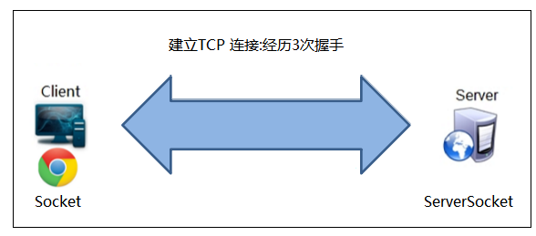

# HTTP

HTTP协议（HyperText Transfer Protocol，超文本传输协议）是因特网上应用最为广泛的一种网络传输协议，所有的WWW文件都必须遵守这个标准。

HTTP是一个基于TCP/IP通信协议来传递数据（HTML 文件, 图片文件, 查询结果等）。


## HTTP通信过程
### 建立TCP连接
> 在 HTTP 工作开始之前，Web 浏览器首先要通过网络与 Web 服务器建立连接，该连接是通过TCP来完成的，该协议与 IP 协议共同构建 Internet，即著名的 TCP/IP 协议，因此 Internet 又被称作是TCP/IP网络。HTTP 是比 TCP 更高层次的应用层协议，根据规则，只有低层协议建立之后才能进行更高层协议的连接，因此，首先要建立 TCP 连接，一般TCP连接的端口号是80。建立TCP连接需要找到连接主机，所以需要先解析域名得到 IP 再找到主机进行3 次握手建立TCP连接（两台电脑之间建立一个通信桥梁）
    
    
    
* 其中比较重要的字段有：
      - 序号（sequence number）：Seq序号，占32位，用来标识从TCP源端向目的端发送的字节流，发起方发送数据时对此进行标记。
      - 确认号（acknowledgement number）：Ack序号，占32位，只有ACK标志位为1时，确认序号字段才有效，Ack=Seq+1。
      - 标志位（Flags）：共6个，即URG、ACK、PSH、RST、SYN、FIN等。具体含义如下：
            > 不要将确认序号Ack与标志位中的ACK搞混了。确认方Ack=发起方Seq+1，两端配对。
            + URG：紧急指针（urgent pointer）有效。
            + ACK：确认序号有效。
            + PSH：接收方应该尽快将这个报文交给应用层。
            + RST：重置连接。
            + SYN：发起一个新连接。
            + FIN：释放一个连接
* 三次握手
（1）首先客户端向服务器端发送一段TCP报文，其中：
    ```
    标记位为SYN，表示“请求建立新连接”;
    序号为Seq=X（X一般为1）；
    随后客户端进入SYN-SENT阶段。
    ```
（2）服务器端接收到来自客户端的TCP报文之后，结束LISTEN阶段。并返回一段TCP报文，其中：
    ```
    标志位为SYN和ACK，表示“确认客户端的报文Seq序号有效，服务器能正常接收客户端发送的数据，并同意创建新连接”（即告诉客户端，服务器收到了你的数据）；
    序号为Seq=y；
    确认号为Ack=x+1，表示收到客户端的序号Seq并将其值加1作为自己确认号Ack的值；随后服务器端进入SYN-RCVD阶段。
    ```
（3）客户端接收到来自服务器端的确认收到数据的TCP报文之后，明确了从客户端到服务器的数据传输是正常的，结束SYN-SENT阶段。并返回最后一段TCP报文。其中：
    ```
    标志位为ACK，表示“确认收到服务器端同意连接的信号”（即告诉服务器，我知道你收到我发的数据了）；
    序号为Seq=x+1，表示收到服务器端的确认号Ack，并将其值作为自己的序号值；
    确认号为Ack=y+1，表示收到服务器端序号Seq，并将其值加1作为自己的确认号Ack的值；
    随后客户端进入ESTABLISHED阶段。
    服务器收到来自客户端的“确认收到服务器数据”的TCP报文之后，明确了从服务器到客户端的数据传输是正常的。结束SYN-SENT阶段，进入ESTABLISHED阶段。
    在客户端与服务器端传输的TCP报文中，双方的确认号Ack和序号Seq的值，都是在彼此Ack和Seq值的基础上进行计算的，这样做保证了TCP报文传输的连贯性。一旦出现某一方发出的TCP报文丢失，便无法继续"握手"，以此确保了"三次握手"的顺利完成。
    ```
此后客户端和服务器端进行正常的数据传输。这就是“三次握手”的过程。
* 为何要进行三次握手
> 为了防止服务器端开启一些无用的连接增加服务器开销以及防止已失效的连接请求报文段突然又传送到了服务端，因而产生错误由于网络传输是有延时的(要通过网络光纤和各种中间代理服务器)，在传输的过程中，比如客户端发起了SYN=1创建连接的请求(第一次握手)。
  如果服务器端就直接创建了这个连接并返回包含SYN、ACK和Seq等内容的数据包给客户端，这个数据包因为网络传输的原因丢失了，丢失之后客户端就一直没有接收到服务器返回的数据包。
  客户端可能设置了一个超时时间，时间到了就关闭了连接创建的请求。再重新发出创建连接的请求，而服务器端是不知道的，如果没有第三次握手告诉服务器端客户端收的到服务器端传输的数据的话，
  服务器端是不知道客户端有没有接收到服务器端返回的信息的。这样没有给服务器端一个创建还是关闭连接端口的请求，服务器端的端口就一直开着，等到客户端因超时重新发出请求时，服务器就会重新开启一个端口连接。那么服务器端上没有接收到请求数据的上一个端口就一直开着，长此以往，这样的端口多了，就会造成服务器端开销的严重浪费。                        
  还有一种情况是已经失效的客户端发出的请求信息，由于某种原因传输到了服务器端，服务器端以为是客户端发出的有效请求，接收后产生错误。
  所以我们需要“第三次握手”来确认这个过程，让客户端和服务器端能够及时地察觉到因为网络等一些问题导致的连接创建失败，这样服务器端的端口就可以关闭了不用一直等待。
  也可以这样理解：“第三次握手”是客户端向服务器端发送数据，这个数据就是要告诉服务器，客户端有没有收到服务器“第二次握手”时传过去的数据。若发送的这个数据是“收到了”的信息，接收后服务器就正常建立TCP连接，否则建立TCP连接失败，服务器关闭连接端口。由此减少服务器开销和接收到失效请求发生的错误。

* 四次挥手
所谓的四次挥手即TCP连接的释放(解除)。连接的释放必须是一方主动释放，另一方被动释放。以下为客户端主动发起释放连接的图解：

    - 首先客户端想要释放连接，向服务器端发送一段TCP报文，其中：
    ```
    标记位为FIN，表示“请求释放连接“；
    序号为Seq=U；
    随后客户端进入FIN-WAIT-1阶段，即半关闭阶段。并且停止在客户端到服务器端方向上发送数据，但是客户端仍然能接收从服务器端传输过来的数据。
    注意：这里不发送的是正常连接时传输的数据(非确认报文)，而不是一切数据，所以客户端仍然能发送ACK确认报文。
    ```
    - 服务器端接收到从客户端发出的TCP报文之后，确认了客户端想要释放连接，随后服务器端结束ESTABLISHED阶段，进入CLOSE-WAIT阶段（半关闭状态）并返回一段TCP报文，其中：
    ```
    标记位为ACK，表示“接收到客户端发送的释放连接的请求”；
    序号为Seq=V；
    确认号为Ack=U+1，表示是在收到客户端报文的基础上，将其序号Seq值加1作为本段报文确认号Ack的值；
    随后服务器端开始准备释放服务器端到客户端方向上的连接。
    客户端收到从服务器端发出的TCP报文之后，确认了服务器收到了客户端发出的释放连接请求，随后客户端结束FIN-WAIT-1阶段，进入FIN-WAIT-2阶段
    前"两次挥手"既让服务器端知道了客户端想要释放连接，也让客户端知道了服务器端了解了自己想要释放连接的请求。于是，可以确认关闭客户端到服务器端方向上的连接了
    ```
    - 服务器端自从发出ACK确认报文之后，经过CLOSED-WAIT阶段，做好了释放服务器端到客户端方向上的连接准备，再次向客户端发出一段TCP报文，其中：
    ```
    标记位为FIN，ACK，表示“已经准备好释放连接了”。注意：这里的ACK并不是确认收到服务器端报文的确认报文。
    序号为Seq=W；
    确认号为Ack=U+1；表示是在收到客户端报文的基础上，将其序号Seq值加1作为本段报文确认号Ack的值。
    随后服务器端结束CLOSE-WAIT阶段，进入LAST-ACK阶段。并且停止在服务器端到客户端的方向上发送数据，但是服务器端仍然能够接收从客户端传输过来的数据。
    ```
    - 客户端收到从服务器端发出的TCP报文，确认了服务器端已做好释放连接的准备，结束FIN-WAIT-2阶段，进入TIME-WAIT阶段，并向服务器端发送一段报文，其中：
    ```
    标记位为ACK，表示“接收到服务器准备好释放连接的信号”。
    序号为Seq=U+1；表示是在收到了服务器端报文的基础上，将其确认号Ack值作为本段报文序号的值。
    确认号为Ack=W+1；表示是在收到了服务器端报文的基础上，将其序号Seq值作为本段报文确认号的值。
    随后客户端开始在TIME-WAIT阶段等待2MSL
    为什么要客户端要等待2MSL呢？见后文。
    服务器端收到从客户端发出的TCP报文之后结束LAST-ACK阶段，进入CLOSED阶段。由此正式确认关闭服务器端到客户端方向上的连接。
    客户端等待完2MSL之后，结束TIME-WAIT阶段，进入CLOSED阶段，由此完成“四次挥手”。
    ```
> 后“两次挥手”既让客户端知道了服务器端准备好释放连接了，也让服务器端知道了客户端了解了自己准备好释放连接了。于是，可以确认关闭服务器端到客户端方向上的连接了，由此完成“四次挥手”。
与“三次挥手”一样，在客户端与服务器端传输的TCP报文中，双方的确认号Ack和序号Seq的值，都是在彼此Ack和Seq值的基础上进行计算的，这样做保证了TCP报文传输的连贯性，一旦出现某一方发出的TCP报文丢失，便无法继续"挥手"，以此确保了"四次挥手"的顺利完成。

* 为什么“握手”是三次，“挥手”却要四次？
    - TCP建立连接时之所以只需要"三次握手"，是因为在第二次"握手"过程中，服务器端发送给客户端的TCP报文是以SYN与ACK作为标志位的。SYN是请求连接标志，表示服务器端同意建立连接；ACK是确认报文，表示告诉客户端，服务器端收到了它的请求报文。
    即SYN建立连接报文与ACK确认接收报文是在同一次"握手"当中传输的，所以"三次握手"不多也不少，正好让双方明确彼此信息互通。
    - TCP释放连接时之所以需要“四次挥手”,是因为FIN释放连接报文与ACK确认接收报文是分别由第二次和第三次"握手"传输的。为何建立连接时一起传输，释放连接时却要分开传输？
    > 建立连接时，被动方服务器端结束CLOSED阶段进入“握手”阶段并不需要任何准备，可以直接返回SYN和ACK报文，开始建立连接。
      释放连接时，被动方服务器，突然收到主动方客户端释放连接的请求时并不能立即释放连接，因为还有必要的数据需要处理，所以服务器先返回ACK确认收到报文，经过CLOSE-WAIT阶段准备好释放连接之后，才能返回FIN释放连接报文
* 为什么客户端在TIME-WAIT阶段要等2MSL
    > 为的是确认服务器端是否收到客户端发出的ACK确认报文
    当客户端发出最后的ACK确认报文时，并不能确定服务器端能够收到该段报文。所以客户端在发送完ACK确认报文之后，会设置一个时长为2MSL的计时器。MSL指的是Maximum Segment Lifetime：一段TCP报文在传输过程中的最大生命周期。2MSL即是服务器端发出为FIN报文和客户端发出的ACK确认报文所能保持有效的最大时长。
    服务器端在1MSL内没有收到客户端发出的ACK确认报文，就会再次向客户端发出FIN报文；
    如果客户端在2MSL内，再次收到了来自服务器端的FIN报文，说明服务器端由于各种原因没有接收到客户端发出的ACK确认报文。客户端再次向服务器端发出ACK确认报文，计时器重置，重新开始2MSL的计时；
    否则客户端在2MSL内没有再次收到来自服务器端的FIN报文，说明服务器端正常接收了ACK确认报文，客户端可以进入CLOSED阶段，完成“四次挥手”。
    
    所以，客户端要经历时长为2SML的TIME-WAIT阶段；这也是为什么客户端比服务器端晚进入CLOSED阶段的原因
### Web浏览器向Web服务器发送请求命令
> 一旦建立了 TCP 连接，Web 浏览器就会向 Web 服务器发送请求命令。例如：GET/hello/index.jsp HTTP/1.1。浏览器发送其请求命令之后，还要以头信息的形式向Web服务器发送一些别的信息(例：Accept ,User-Agent 等?)，之后浏览器发送了一空白行来通知服务器，它已经结束了该头信息的发送。
### Web服务器应答
> 客户机向服务器发出请求后，服务器会客户机进行应答，应答内容包括：协议的版本号和应答状态码 ：HTTP/1.1 200 OK，响应头信息来记录服务器自己的数据，被请求的文档内容。最后发送一个空白行来表示头信息的发送到此为结束，接着以Content-Type响应头信息所描述的格式发送用户所请求的实际数据。
### Web服务器关闭TCP连接
> 一般情况下，一旦 Web 服务器向浏览器发送了请求的数据，它就要关闭 TCP 连接，但是如果浏览器或者服务器在其头信息加入了这行代码：Connection:keep-alive
     TCP连接在发送后将仍然保持打开状态，于是，浏览器可以继续通过相同的连接发送请求。保持连接节省了为每个请求建立新连接所需的时间，还节约了网络带宽。
### 浏览器接受到服务器响应的数据
> 浏览器接受服务器应答回来的 html 代码和css，和js代码再进行页面的渲染或者接受到应答的文件进行保存等操作


**本文摘录自[百度百科](https://baijiahao.baidu.com/s?id=1654225744653405133&wfr=spider&for=pc)**
