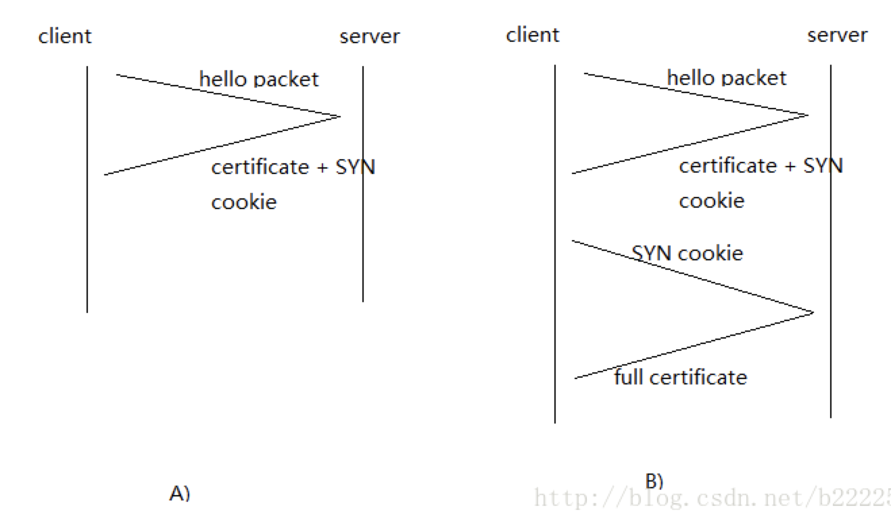

#HTTP3.0
Google搞了一个基于UDP协议的QUIC协议，并且使用在了HTTP/3上， HTTP/3之前的名称为HTTP-over-QUIC。早期Quic协议，存在IETF和Google两个版本，直到它被证实命名为HTTP3.0

## QUIC协议相比HTTP2.0的优势

* 零RTT建立连接
    > RTT: 一个连接的往返时间，即数据发送时刻到接收到确认的时刻的差值
    - 目前TCP与SSL/TLS(1.0,1.1,1.2)每次建连需要TCP三次握手+安全握手，需要4~5个RRT
    - 先前已连接过一个服务器的客户端可能缓存来自该连接的某些参数，并在之后与该服务器建立一个无需等待握手完成就可以立即传输信息的0-RTT连接，从而减少建立新连接所必需的时间。
    - 第一次连接
    
        + 客户端之前没有连接个此服务器，那么他会发送一个Hello Packet。服务器接到之后，会回复一个数据包。里面包含了安全证书和对此客户端唯一的SYN cookie。客户端接到包之后，首先要做的就是解码，保存好SYN cookie。SYN cookie 类似于令牌，能够验证客户端身份。它的生存周期较短，防止被盗用。这样建立连接只需要1个RTT。
        + 当客户端接到服务器发来的第一个数据包，没有正确解码，那么它会再次发送一个包要求服务器从新发送它的安全证书，并将SYN cookie附加到这个请求包中，以便让服务器验证请求的正确性和有效性。此时，建立连接需要2个RTT。
    - 重复连接
        + 因为客户端之前已经成功和服务器通信。自然保留了一份服务器的安全证书。当再次想要连接服务器的时候，客户端假设这个安全证书没有过期，还是有效的。加密一个Hello Packet并发送之后。接着不用等回复就可以直接加密其他的数据包并发送。Hello Packet 里面包括一些协商信息和对自己掌握着Client IP的证明等。因为不用等待确认，为了预防丢包等问题，Hello Packet可能会隔一段时间被重传多次，保证减少丢包造成的延迟。比如，先发一个Hello包，之后发送数据包，再发送一个Hello包。
        + 服务器接到Hello包之后，用自己现有的秘钥解码，如果解码不成功，将把客户端的连接当做第一次连接，重发安全证书等信息。同上介绍的一样。此时，通常会有2个RTT，极端情况下是3个RTT。
        + 服务器成功解码之后，验证了客户端的安全性之后，就可以继续处理接下来收到的数据包。此时延时是0个RTT。

* 对线头阻塞(HOL)问题的解决更为彻底
    > 基于TCP的HTTP/2，尽管从逻辑上来说，不同的流之间相互独立，不会相互影响，但在实际传输方面，数据还是要一帧一帧的发送和接收，一旦某一个流的数据有丢包，则同样会阻塞在它之后传输的其它与它毫不相干的流的数据的传输。而基于UDP的QUIC协议则可以更为彻底地解决这样的问题，让不同的流之间真正的实现相互独立传输，互不干扰
* 切换网络时的连接保持
    > 普通基于tcp的连接，是基于两端的ip和端口和协议来建立的。在网络切换场景，例如手机端切换了无线网，使用4G网络，会改变本身的ip，这就导致tcp连接必须重新创建。而QUIC协议使用特有的UUID来标记每一次连接，在网络环境发生变化的时候，只要UUID不变，就能不需要握手，继续传输数据
* 安全
    > 前向安全。即使被人抓包存储起来，在未来某个时间点秘钥被破解后仍然不能解密。置的加密模块，支持SNI，因此支持一个IP部署多个证书，默认打开，相比TLS更高效的向前加密。
    
    
    
    
**本文参考[简书文档](https://www.jianshu.com/p/bb3eeb36b479)**
