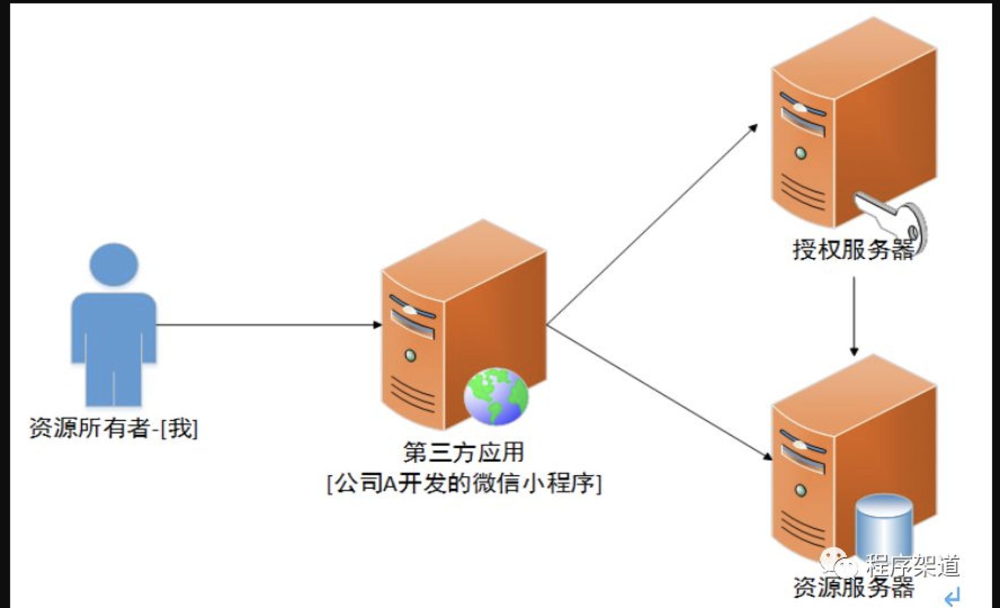
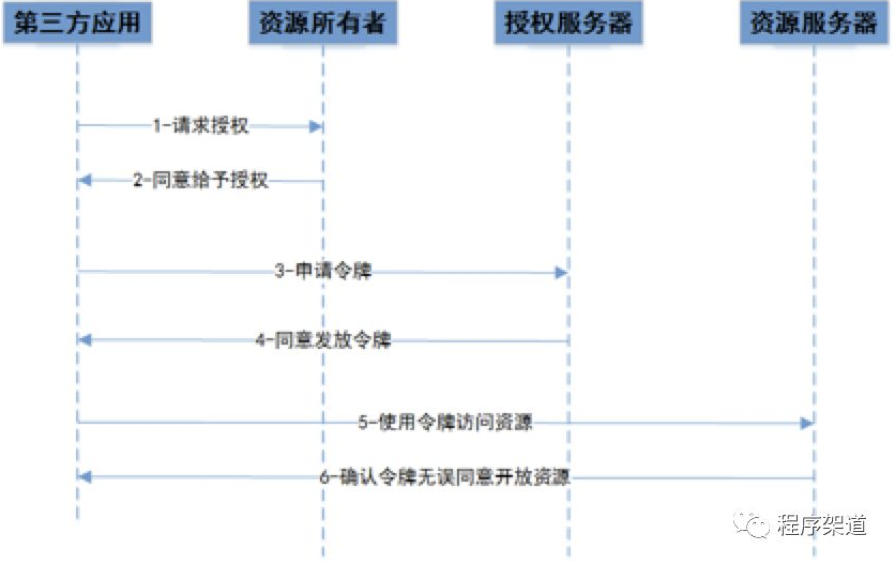

# OAuth2.0
OAuth 2.0 是目前最流行的授权机制，用来授权第三方应用，获取用户数据。

简单说，OAuth 就是一种授权机制。数据的所有者告诉系统，同意授权第三方应用进入系统，获取这些数据。系统从而产生一个短期的进入令牌（token），用来代替密码，供第三方应用使用。

## 令牌和密码
令牌（token）与密码（password）的作用是一样的，都可以进入系统，但是有三点差异。

* 令牌是短期的，到期会自动失效，用户自己无法修改。密码一般长期有效，用户不修改，就不会发生变化。

* 令牌可以被数据所有者撤销，会立即失效。以上例而言，屋主可以随时取消快递员的令牌。密码一般不允许被他人撤销。

* 令牌有权限范围（scope），比如只能进小区的二号门。对于网络服务来说，只读令牌就比读写令牌更安全。密码一般是完整权限。

上面这些设计，保证了令牌既可以让第三方应用获得权限，同时又随时可控，不会危及系统安全。这就是 OAuth 2.0 的优点。
> 注意，只要知道了令牌，就能进入系统。系统一般不会再次确认身份，所以令牌必须保密，泄漏令牌与泄漏密码的后果是一样的。 这也是为什么令牌的有效期，一般都设置得很短的原因。
  
## RFC 6749
OAuth 2.0 的标准是 RFC 6749 文件。该文件先解释了 OAuth 是什么。
> OAuth 引入了一个授权层，用来分离两种不同的角色：客户端和资源所有者。......资源所有者同意以后，资源服务器可以向客户端颁发令牌。客户端通过令牌，去请求数据。
  
  OAuth 的核心就是向第三方应用颁发令牌

## 令牌的四种授权方式
> 注意，不管哪一种授权方式，第三方应用申请令牌之前，都必须先到系统备案，说明自己的身份，然后会拿到两个身份识别码：客户端 ID（client ID）和客户端密钥（client secret）。这是为了防止令牌被滥用，没有备案过的第三方应用，是不会拿到令牌的。

  * 授权码（authorization-code）
  * 隐藏式（implicit）
  * 密码式（password）：
  * 客户端凭证（client credentials）

### 授权码

* A 网站提供一个链接，用户点击后就会跳转到 B 网站，授权用户数据给 A 网站使用。下面就是 A 网站跳转 B 网站的一个示意链接。
```
https://b.com/oauth/authorize?
  response_type=code& // 表示要求返回授权码
  client_id=CLIENT_ID& // 让 B 知道是谁在请求，
  redirect_uri=CALLBACK_URL& // 是 B 接受或拒绝请求后的跳转网址
  scope=read // 表示要求的授权范围（这里是只读）
```
* 用户跳转后，B 网站会要求用户登录，然后询问是否同意给予 A 网站授权。用户表示同意，这时 B 网站就会跳回redirect_uri参数指定的网址。跳转时，会传回一个授权码，就像下面这样
```
https://a.com/callback?code=AUTHORIZATION_CODE // code参数就是授权码
```
* A 网站拿到授权码以后，就可以在后端，向 B 网站请求令牌
```
https://b.com/oauth/token?
 client_id=CLIENT_ID& // 让 B 确认 A 的身份
 client_secret=CLIENT_SECRET& // 让 B 确认 A 的身份, 保密只能在后端发请求
 grant_type=authorization_code& // 值是AUTHORIZATION_CODE 表示采用的授权方式是授权码
 code=AUTHORIZATION_CODE& // code参数是上一步拿到的授权码
 redirect_uri=CALLBACK_URL // 令牌颁发后的回调网址。
```
* B 网站收到请求以后，就会颁发令牌。具体做法是向redirect_uri指定的网址，发送一段 JSON 数据
```
{    
  "access_token":"ACCESS_TOKEN",
  "token_type":"bearer",
  "expires_in":2592000,
  "refresh_token":"REFRESH_TOKEN",
  "scope":"read",
  "uid":100101,
  "info":{...}
}
```
access_token字段就是令牌
#### 授权码涉及的概念
> 共包含四种角色，分别是资源所有者、第三方应用（也称为客户端client）、授权服务器和资源服务器。如下图所示，某公司A开发了一个微信小程序（第三方应用）可以帮助我（资源所有者）美化微信服务器（资源服务器）上面的头像，我在用这个微信小程序开发的美化头像功能的时候，首先要给微信小程序授权（授权服务器），这个微信小程序才能访问我的头像，实际上访问的时候微信小程序就是通过WEB API来调用的。授权的过程中我是不可能把我的账号密码给它的，这样的前提下就会有另外方式的授权，也就是上面介绍的现在国际通用的标准OAuth2.0
  


### 隐藏式
> 有些 Web 应用是纯前端应用，没有后端。这时就不能用上面的方式了，必须将令牌储存在前端。RFC 6749 就规定了第二种方式，允许直接向前端颁发令牌。这种方式没有授权码这个中间步骤，所以称为（授权码）"隐藏式"（implicit）
这种方式把令牌直接传给前端，是很不安全的。因此，只能用于一些安全要求不高的场景，并且令牌的有效期必须非常短，通常就是会话期间（session）有效，浏览器关掉，令牌就失效


* A 网站提供一个链接，要求用户跳转到 B 网站，授权用户数据给 A 网站使用
```
https://b.com/oauth/authorize?
  response_type=token& // 表示要求直接返回令牌
  client_id=CLIENT_ID&
  redirect_uri=CALLBACK_URL&
  scope=read
```
* 用户跳转到 B 网站，登录后同意给予 A 网站授权。这时，B 网站就会跳回redirect_uri参数指定的跳转网址，并且把令牌作为 URL 参数，传给 A 网站
```
https://a.com/callback#token=ACCESS_TOKEN
```
上面 URL 中，token参数就是令牌，A 网站因此直接在前端拿到令牌。
> 注意，令牌的位置是 URL 锚点（fragment），而不是查询字符串（querystring），这是因为 OAuth 2.0 允许跳转网址是 HTTP 协议，因此存在"中间人攻击"的风险，而浏览器跳转时，锚点不会发到服务器，就减少了泄漏令牌的风险。
### 密码式
> 如果你高度信任某个应用，RFC 6749 也允许用户把用户名和密码，直接告诉该应用。该应用就使用你的密码，申请令牌，这种方式称为"密码式"（password）。
这种方式需要用户给出自己的用户名/密码，显然风险很大，因此只适用于其他授权方式都无法采用的情况，而且必须是用户高度信任的应用。

* A 网站要求用户提供 B 网站的用户名和密码。拿到以后，A 就直接向 B 请求令牌。
```
https://oauth.b.com/token?
  grant_type=password& // 授权方式是密码式
  username=USERNAME&
  password=PASSWORD&
  client_id=CLIENT_ID
```
* B 网站验证身份通过后，直接给出令牌。注意，这时不需要跳转，而是把令牌放在 JSON 数据里面，作为 HTTP 回应，A 因此拿到令牌。
### 凭证式
> 最后一种方式是凭证式（client credentials），适用于没有前端的命令行应用，即在命令行下请求令牌。
这种方式给出的令牌，是针对第三方应用的，而不是针对用户的，即有可能多个用户共享同一个令牌。

* A 应用在命令行向 B 发出请求
```
https://oauth.b.com/token?
  grant_type=client_credentials& // 表示采用凭证式
  client_id=CLIENT_ID& // 用来让 B 确认 A 的身份
  client_secret=CLIENT_SECRET // 用来让 B 确认 A 的身份
```
* B 网站验证通过以后，直接返回令牌。

## 令牌的使用
每个发到 API 的请求，都必须带有令牌。具体做法是在请求的头信息，加上一个Authorization字段，令牌就放在这个字段里面。
## 更新令牌
令牌的有效期到了，如果让用户重新走一遍上面的流程，再申请一个新的令牌，很可能体验不好，而且也没有必要。OAuth 2.0 允许用户自动更新令牌。

具体方法是，B 网站颁发令牌的时候，一次性颁发两个令牌，一个用于获取数据，另一个用于获取新的令牌（refresh token 字段）。令牌到期前，用户使用 refresh token 发一个请求，去更新令牌
```
https://b.com/oauth/token?
  grant_type=refresh_token& // 表示要求更新令牌
  client_id=CLIENT_ID&
  client_secret=CLIENT_SECRET&
  refresh_token=REFRESH_TOKEN // 参数就是用于更新令牌的令牌
```
**本文内容摘录自[博客](http://www.ruanyifeng.com/blog/2019/04/oauth-grant-types.html)和[简书](https://www.jianshu.com/p/e652c61c01fa)**


