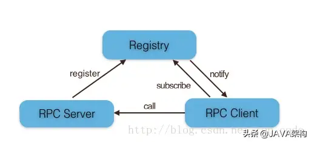

# RPC
RPC（Remote Procedure Call）中文名「远程过程调用」，又是一个很蹩脚的翻译。我们拆开理解下，「过程」也叫方法或函数，「远程」就是说方法不在当前进程里，而是在其他进程或机器上面，合起来 RPC 就是调用其他进程或机器上面的函数。
在没有网络的时代，程序都是单机版的，所有逻辑都必须在同一个进程里。进程之间就像高楼大厦里面陌生的邻居，大家无法共享，遇到同样的功能只能重复实现一次。显然进程的障碍是逆天的，不符合先进生产力的发展方向，这个时候「进程间通信」的需求出现了，大家要求进程之间能够相互交流，相互共享和调用。这样再写程序，就可以利用进程间通信机制来调用和共享已经存在的功能了。随着网络的出现，进程的隔阂进一步消除，不光同一栋楼里的邻居可以共享资源，其他小区、甚至其他城市的居民都可以通过互联网互相调用，这就是 RPC。概念很容易理解，但是远程和本地的实现原理有很大区别，架构设计者的职责就是设计一个机制让远程调用服务就像调本地服务一样简单，这就是 RPC 框架。## RPC实现原理

## 基本原理
RPC 首要解决的是通讯的问题，主流的 RPC 框架分为基于 HTTP 和基于 TCP 的两种。基于 HTTP 的 RPC 调用很简单，就和我们访问网页一样，只是它的返回结果更单一（JSON 或 XML）。它的优点在于实现简单，标准化和跨语言，比较适合对外提供 OpenAPI 的场景，而它的缺点是 HTTP 协议传输效率较低、短连接开销较大（HTTP 2.0 后有很大改进）。而基于 TCP 的 RPC 调用，由于 TCP 协议处于协议栈的下层，能够更加灵活地对协议字段进行定制，减少网络开销，提高性能，实现更大的吞吐量和并发数。但是需要更多地关注底层复杂的细节，跨语言和跨平台难度大，实现的代价更高，它比较适合内部系统之间追求极致性能的场景。


## RPC主要角色
* Provider 暴露服务的服务提供方
* Registry 服务注册与发现的注册中心
* RPC Client 调用远程服务的服务消费方


## RPC调用流程

```
1. 调用方（Client）通过本地的 RPC 代理（Proxy）调用相应的接口
2. 本地代理将 RPC 的服务名，方法名和参数等等信息转换成一个标准的 RPC Request 对象交给 RPC 框架
3. RPC 框架采用 RPC 协议（RPC Protocol）将 RPC Request 对象序列化成二进制形式，然后通过 TCP 通道传递给服务提供方 （Server）
4. 服务端（Server）收到二进制数据后，将它反序列化成 RPC Request 对象
5. 服务端（Server）根据 RPC Request 中的信息找到本地对应的方法，传入参数执行，得到结果，并将结果封装成 RPC Response 交给 RPC 框架
6. RPC 框架通过 RPC 协议（RPC Protocol）将 RPC Response 对象序列化成二进制形式，然后通过 TCP 通道传递给服务调用方（Client）
7. 调用方（Client）收到二进制数据后，将它反序列化成 RPC Response 对象，并且将结果通过本地代理（Proxy）返回给业务代码
```

## 服务注册&发现
服务提供者启动后主动向注册中心注册机器ip、port以及提供的服务列表；

服务消费者启动时向注册中心获取服务提供方地址列表，可实现软负载均衡和容错转移；

## 通讯层协议的设计
> 因为在 TCP 通道里传输的数据只能是二进制形式的，所以我们必须将数据结构或对象转换成二进制串传递给对方，这个过程就叫「序列化」。而相反，我们收到对方的二进制串后把它转换成数据结构或对象的过程叫「反序列化」。而序列化和反序列化的规则就叫「协议」。

RPC 的协议分成两大类:
* 通讯层协议
    > 通讯层协议一般是和业务无关的，它的职责是将业务数据打包后，安全、完整的传输给接受方，HSF、Dubbo、gRPC 这些都是属于通讯层协议
* 应用层协议
    > 而应用层协议是约定业务数据和二进制串的转换规则，常见的应用层协议有 Hessian，Protobuf,JSON
    
> 这两种协议的关注点是不太一样的，对于一个 RPC 框架来说，通讯层协议一旦确定就很少变化，这要求它具备足够好的通用性和扩展性；而应用层协议理论上可以由业务自由选择，它更多的是关注编码的效率和跨语言等特性。在我看来 RPC 框架的核心是通讯层协议的设计，换句话说你理解了通讯层协议各个字段的含义，基本上也理解了 RPC 原理。

### 实现 一个简单的通讯协议
> 通常它由一个 Header 和一个 Payload（类似于 HTTP 的 Body）组成，合起来叫一个包（Packet）。之所有要有包，是因为二进制只完成 Stream 的传输，并不知道一次数据请求和响应的起始和结束，我们需要预先定义好包结构才能做解析
协议设计就像把一个数据包按顺序切分成若干个单位长度的「小格子」，然后约定每个「小格子」里存储什么样的信息，一个「小格子」就是一个 Byte，它是协议设计的最小单位，1 Byte 是 8 Bit，可以描述 0 ~ 2^8 个字节数，具体使用多少个字节要看实际存储的信息
* header
    + type
        - 描述：确认数据包是请求数据包还是响应数据包
        - 用一个 Byte 来标记包的类型，比如：0 表示请求，1 表示响应
    + requestId/responseId
        - 描述： 将请求和它对应的响应关联起来，通常的做法是在请求前生成一个「唯一」的 ID，放到 Header 里传递给服务端，服务端在返回的响应头里也要包含同样的 ID
        - 这个 ID 我们选择用一个 Int32 类型（4 Bytes）自增的数字表示
    + bodyLength
        - 描述： 要能实现包的准确切割，我们需要明确包的长度，Header 长度通常是固定的，而 Payload 长度是变化的。确定包长度后，我们就可以切分出一个个独立的包
        -  Header 留 4 个 Bytes（Int32） 记录 Payload 部分的长度
    + codec: 标记应用层协议的类型
* Payload(body)
    - Payload 部分编码规则由应用层协决定，不同的场景采用的协议可能是不一样的，那么接收端如何知道用什么协议去解码 Payload 部分呢？所以，在 Header 里面还需要一个  Byte 标记应用层协议的类型，我们称之为 Codec
    
    ```
    0      1      2      3      4      5      6      7      8      9     10
    +------+------+------+------+------+------+------+------+------+------+
    | type |          requestId        | codec|         bodyLength        |
    +------+---------------------------+------+---------------------------+
    |                  ...          payload                               |
    |                                                     ...             |
    +---------------------------------------------------------------------+
    ```
* 更多字段
    > 这已经是可以工作的 RPC 通讯协议了，但随着 RPC 功能的增加我们可能需要记录更多的信息，比如：在请求头里存放超时的时长，告诉服务端如果响应时间超过某个值了就不用再返回了；在响应头里存放响应的状态是成功还是失败等等。另外，虽然通讯层协议很少会变化，但是考虑到后期的平滑升级、向下兼容等问题，一般第一个 Byte 我们都会记录协议的版本信息。
    + header
        - 请求超时时长
        - 响应状态
        - 协议版本    
        
* 蚂蚁Bolt协议
```
// 蚂蚁 Bolt 协议
// ---------------------
// Request Packet

0     1     2           4           6           8          10           12          14         16
+-----+-----+-----+-----+-----+-----+-----+-----+-----+-----+-----+-----+-----+-----+-----+-----+
|proto| type| cmdcode   |ver2 |   requestId           |codec|        timeout        |  classLen |
+-----------+-----------+-----------+-----------+-----------+-----------+-----------+-----------+
| headerLen |      contentLen       |                             ... ...                       |
+-----------+-----------+-----------+                                                           +
|               className + header  + content  bytes                                            |
+                                                                                               +
|                               ... ...                                                         |
+-----------------------------------------------------------------------------------------------+

// Response Packet

0     1     2     3     4           6           8          10           12          14         16
+-----+-----+-----+-----+-----+-----+-----+-----+-----+-----+-----+-----+-----+-----+-----+-----+
|proto| type| cmdcode   |ver2 |   requestId           |codec|respstatus |  classLen | headerLen |
+-----------+-----------+-----------+-----------+-----------+-----------+-----------+-----------+
|       contentLen      |                  ... ...                                              |
+-----------------------+                                                                       +
|                          header  + content  bytes                                             |
+                                                                                               +
|                               ... ...                                                         |
+-----------------------------------------------------------------------------------------------+
```
### Node.js 如何实现 RPC 通讯协议
> 其核心就是对 Buffer 的操作，详细的 API 可以参考[文档](../Buffer/readme.md)，我只选择一些有意思的点展开讲。
* 编码
```javascript
// 编码
const payload = {
  service: 'com.alipay.nodejs.HelloService:1.0',
  methodName: 'plus',
  args: [ 1, 2 ],
};
const body = new Buffer(JSON.stringify(payload));

const header = new Buffer(10);
header[0] = 0;
header.writeInt32BE(1000, 1);
header[5] = 1; // codec => 1 代表是 JSON 序列化
header.writeInt32BE(body.length, 6);

const packet = Buffer.concat([ header, body ], 10 + body.length);
```
* 解码
```javascript
// 解码
const type = buf[0]; // => 0 (request)
const requestId = buf.readInt32BE(1); // => 1000
const codec = buf[5];
const bodyLength = buf.readInt32BE(6);

const body = buf.slice(10, 10 + bodyLength);
const payload = JSON.parse(body);
```

* 避免 Buffer 碎片化
上面编码那段代码里，我为了序列化一个 RPC 请求创建了三个 Buffer 对象，一个 Header 一个 Body，最后把两部分拼接成一个完整的 Packet。从逻辑上讲这段代码很清晰，没毛病，但是 Buffer 的创建和拼接都是比较耗性能的，为了追求极致的性能，我们需要避免频繁的创建小 Buffer。优化的思路很简单，就是预先分配一块比较大的内存，再维护一个偏移量（offset）代表当前写入的位置，每次写入以后将写入的长度加到偏移量上，写完以后从开始位置到结束位置创建切片。
```javascript
const buf = Buffer.alloc(1024 * 1024); // 分配一块 1M 的内存
let offset = 0;

// 开始编码
offset = 0; // 重置偏移量
buf[0] = 0;
buf.writeInt32BE(1000, 1);
buf[5] = 1; // codec => 1 代表是 JSON 序列化
offset += 10;

const payload = {
  service: 'com.alipay.nodejs.HelloService:1.0',
  methodName: 'plus',
  args: [ 1, 2 ],
};
const bodyLength = buf.write(JSON.stringify(payload), offset);
buf.writeInt32BE(bodyLength, 6);
offset += bodyLength;
buf.slice(0, offset); // 返回
```

* 操作Buffer的一个库
Buffer 原生 API 比较底层，对于用户不够友好， 可以使用`byte` 模块
```javascript
const ByteBuffer = require('byte');
const bb = ByteBuffer.allocate(1024 * 1024);
bb.put(0);
bb.putInt(1000);
bb.put(1);
bb.skip(4);

const payload = {
  service: 'com.alipay.nodejs.HelloService:1.0',
  methodName: 'plus',
  args: [ 1, 2 ],
};
bb.putRawString(JSON.stringify(payload));
const bodyLength = bb.position() - 10;
bb.putInt(6, bodyLength);
bb.array(); // 返回
```

* Long 类型的处理
    >JavaScript 的基本类型里面表示数字的只有 Number，它能够表达的整数范围是 -(2^53 - 1) ~ (2^53 - 1)，而 Java 里面的 Long 类型的范围是  -(2^64 - 1) ~ (2^64 - 1)。那么在 RPC 调用中遇到 Long 类型我们该如何处理呢？
    ```javascript
    // 2^64-1 正确的值应该是 18446744073709551615，在 JS 引擎中运行得到的值却是 18446744073709552000
    Math.pow(2, 64) - 1 // 18446744073709552000
    ```
    > 首先我们得搞清楚 Long 类型是怎么存储的，一个 Long 数字占用 8 Bytes，我们可以把它拆分成两个 32 位整数（各占 4 Bytes）来表示，分别称之为「高位」和「低位」，低位存储的是长整形对 2^32 取模后的值，高位储存的是长整形整除 2^32 后的值，下面是几个 Long 类型整数用二进制的表示形式：

    ```javascript
    Long: 4294967296
    
    High: 1     Low: 0
    +-----------+-----------+
    |00 00 00 01|00 00 00 00|
    +-----------+-----------+
      
    Long: 1000
    
    High: 0     Low: 1000
    +-----------+-----------+
    |00 00 00 00|00 00 03 e8|
    +-----------+-----------+
      
    Long: 45565600000000
    
    High: 10609 Low: 291956736
    +-----------+-----------+
    |00 00 29 71|11 66 e8 00|
    +-----------+-----------+
    ```
    > 那么在 JS 里面如何表示一个 Long 类型？这里我们使用了社区的 Long 模块，它可以通过 Number 或者字符串获得一个长整形，并且支持各种运算操作
    ```javascript
    const Long = require('long');
    const buf = new Buffer([ 0x00, 0x00, 0x29, 0x71, 0x11, 0x66, 0xe8, 0x00 ]);
    let long = new Long(
      buf.readInt32BE(4),
      buf.readInt32BE(0)
    );
    long = long.add(1);
    long.toString(); // 45565600000001
    const longBuf = new Buffer(long.toBytes()); // <Buffer 00 00 29 71 11 66 e8 01>
    
    Long.fromString('18446744073709551615'); // Long { low: -1, high: -1, unsigned: false }
    ```
    
### 协议包的切分
> 由于网络数据并不是按照我们定义的协议包为单位传输的，有可能一次收到多个包，或者一个包分多次收到。那么收到数据后第一件事情应该是将它切分成一个一个完整的包

#### 基于 data 事件版本
* data 事件是一种被动消费的方式，就是说一旦有数据传输过来就会吐给监听函数，监听函数必须马上处理或者把数据缓存下来，不然数据就丢失了。下面是基于 data 事件来切分协议包的一段实现
    ```javascript
    const net = require('net');
    const socket = net.connect(12200, '127.0.0.1');
    const HEADER_LEN = 10; // 头部长度
    
    let buf;
    
    socket.on('data', data => {
      if (!buf) {
        buf = data;
      } else {
        buf = Buffer.concat([ buf, data ]);
      }
      
      while (buf.length > HEADER_LEN) {
        const packetLength = HEADER_LEN + buf.readInt32BE(6);
        if (buf.length > packetLength) {
          // 切分出完整的 packet
          const packet = buf.slice(0, packetLength));
          // 处理 packet 逻辑
          // ...
          
          buf = buf.slice(packetLength);
        } else {
          break;
        }
      }
    });
    ```
    - Cutter 模块简化上面代码
    ```javascript
    const Cutter = require('cutter');
    const net = require('net');
    const socket = net.connect(12200, '127.0.0.1');
    const HEADER_LEN = 10; // 头部长度
    
    const cutter = new Cutter(10, data => {
      return HEADER_LEN + data.readInt32BE(6);
    });
    cutter.on('packet', packet => {
      // packet 的处理逻辑
      // ...
    });
    socket.on('data', data => {
      cutter.handleData(data);
    });
    ```
    - 缺点：需要频繁的合并、切分 Buffer，因为数据什么时候来，来多少都是未知的
    
#### 基于 readable 事件
* socket 还有一种主动消费模式，就是基于 readable 事件的方式。和 data 事件不同，readable 事件不会直接返回数据给业务，它只会通知业务有新数据来了，业务可以根据需求调用 socket.read 去主动读取数据。read 方法接收一个可选参数 size，若当前收到字节数小于传入的 size，那 read 方法返回 null，如果不传 size 那就读取所有数据
    ```
    const net = require('net');
    const socket = net.connect(12200, '127.0.0.1');
    const HEADER_LEN = 10; // 头部长度
    let header;
    socket.on('readable', () => {
      if (!header) { 
        header = socket.read(HEADER_LEN);
      }
      if (!header) {
        return;
      }
      const bodyLength = header.readInt32BE(6);
      const body = socket.read(bodyLength);
      if (!body) {
        return;
      }
      const packet = Buffer.concat([ header, body ], HEADER_LEN + bodyLength);
      // packet 的处理逻辑
      // ...
    });
    ```
     - 缺点：主要问题是协议包的切分逻辑其实也是协议的一部分，它应该内聚在协议内部，而不应该分散在 socket 的事件监听函数里面。这样协议一旦协议变化了，我们只需要替换协议实现即可，而不需要修改 RPC 框架的其他部分
#### 基于流的版本
* net.Socket 是一个双工的流（duplex stream），那我们是不是可以基于流的风格来封装序列化和反序列化两个过程呢
* 期待的效果如下：
    ```
    const net = require('net');
    const socket = net.connect(12200, '127.0.0.1');
    const encoder = protocol.encode();
    const decoder = protocol.decode();
    
    encoder.pipe(socket).pipe(decoder);
    
    decoder.on('request', req => {});
    decoder.on('response', res => {});
    
    encoder.writeRequest({ ... });
    encoder.writeResponse({ ... });
    ```
* Encoder实现
    ```
    // encoder
    const ByteBuffer = require('byte');
    const Transform = require('stream').Transform;
    const bb = ByteBuffer.allocate(1024 * 1024);
    let id = 0;
    
    class ProtocolEncoder extends Transform {
      constructor(options) {
        super({ writableObjectMode: true });
      }
      
      writeRequest(req) {
        return this._doTransform('request', req);
      }
    
      writeResponse(res) {
        return this._doTransform('response', res);
      }
      
      _doTransform(packetType, data) {
        const packetId = id++;
        return new Promise(resolve => {
          this.once(`tranform_${packetType}_${packetId}`, resolve);
          this.write(Object.assign({
            packetId,
            packetType,
          }, data)),
        }).then(([ result ]) => {
          if (result.error) {
            throw result.error;
          }
          return result;
        });
      }
      
      _transform(packet, encoding, callback) {
        const { packetId, packetType, data } = packet;
        const result = {
          packetId,
          packetType,
          data: null,
          error: null,
        };
        try {
          bb.reset();
          bb.put(packetType === 'request' ? 0 : 1);
          bb.putInt(packetId);
          bb.put(1);
          bb.skip(4);
          bb.putRawString(JSON.stringify(data));
          const bodyLength = bb.position() - 10;
          bb.putInt(6, bodyLength);
          result.data = bb.array();
          callback(null, result.data);
        } catch (err) {
          result.error = err;
        }
        this.emit(`tranform_${packetType}_${packetId}`, result);
      }
    }
    ```
* Decoder实现
    ```
    // decoder
    const Writable = require('stream').Writable;
    const HEADER_LEN = 10;
    
    class ProtocolDecoder extends Writable {
      constructor(options) {
        super(options);
        this._buf = null;
        this._bufLength = 0;
      }
      
      _write(chunk, encoding, callback) {
        if (this._bufLength > 0) {
          const total = this._bufLength + chunk.length;
          this._buf = Buffer.concat([ this._buf, chunk ], total);
          this._bufLength = total;
        } else {
          this._buf = chunk;
          this._bufLength = chunk.length;
        }
        try {
          let unfinish = false;
          do {
            unfinish = this._decode();
          } while (unfinish);
          callback();
        } catch (err) {
          callback(err);
        }
      }
      
      _decode() {
        if (this._bufLength < HEADER_LEN) {
          return false;
        }
        const bodyLength = this._buf.readInt32BE(6);
        const packetLength = HEADER_LEN + bodyLength;
        if (this._bufLength < packetLength) {
          return false;
        }
        const packet = {
          packetId: this._buf.readInt32BE(1),
          packetType: this._buf[0] === 0 ? 'request' : 'response',
          codec: this._buf[5];
          data: JSON.parse(this._buf.toString('utf8', HEADER_LEN, packetLength)),
        };
        // 这里异步化是为了避免 listener 报错影响到 decoder
        process.nextTick(() => { this.emit(packet.packetType, packet); });
        const restLen = this._bufLength - packetLength;
        this._bufLength = restLen;
        if (restLen) {
          this._buf = this._buf.slice(packetLength);
          return true;
        }
        this._buf = null;
        return false;
      }
    }
    ```
> 需要特别注意的一点是：虽然我们用了「流」风格的 API，但是 RPC 协议的原理决定了它不可能是真正的流，因为编码的时候我们只能一次性将对象序列化为完整的二进制，解码时也需要拿到完整的包以后才能反序列化。强调这点的是因为，有的同学会用 RPC 接口去做上传下载这样的功能，这显示是不合适的，正确的做法应该是先将文件上传到 OSS，然后通过 RPC 接口返回 OSS 地址，客户端再从 OSS 去下载。

## 实现一个RPC额外需要考虑的一些点
* 服务的发布和寻址
* 负载均衡策略
* 分布式 Tracing
* 监控与 Metrics
* 高可用相关特性
    - 限流和熔断
    - 单机故障摘除
* 安全相关
    - 服务鉴权
    - 数据包校验

**本文摘录自[https://www.yuque.com/egg/nodejs/dklip5#dl4qug](https://www.yuque.com/egg/nodejs/dklip5#dl4qug)**
