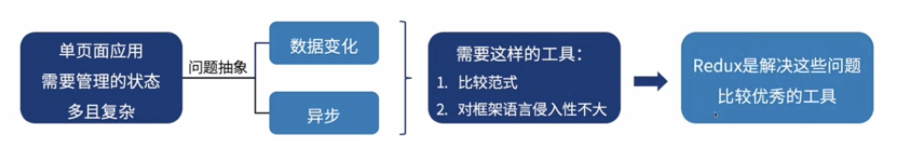
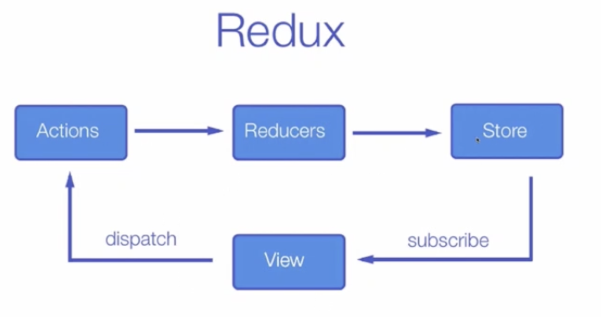
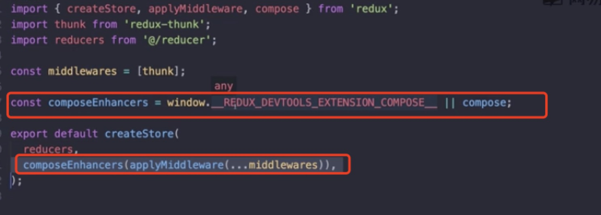
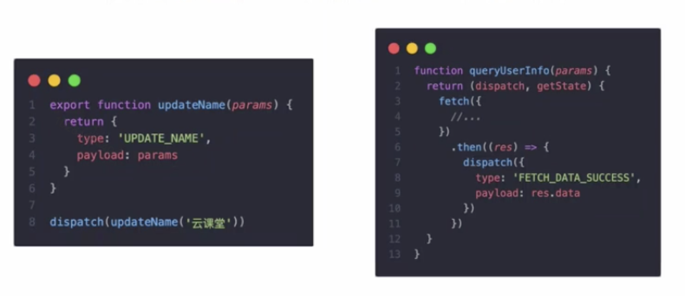
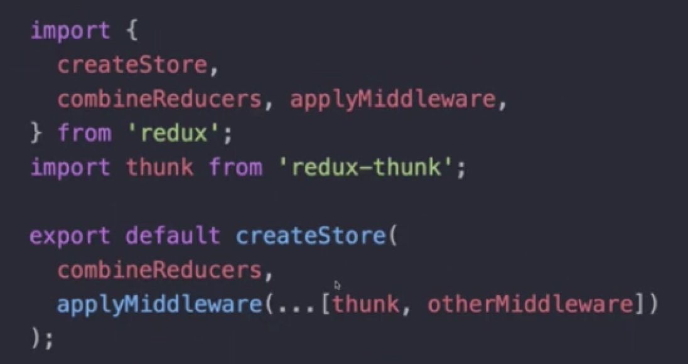
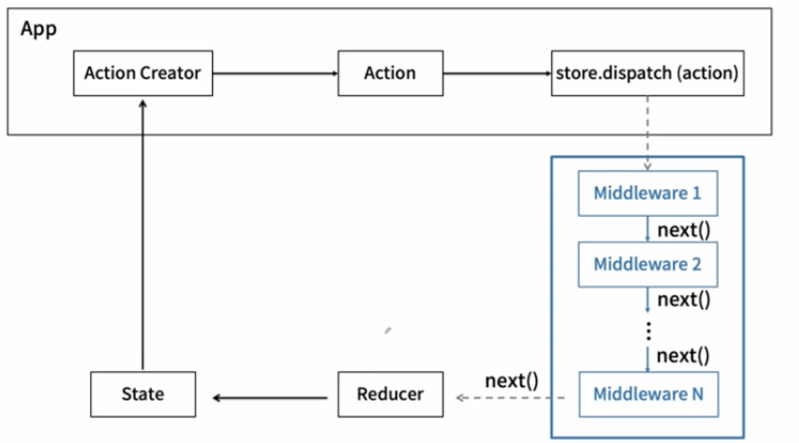

# Redux

## redux 动机
* redux适合于大型复杂的单页面应用 

## 核心概念
* state 应用全局数据的来源，数据驱动视图的核心
* action 数据发生改变动作的描述
* reducer 结合state和action，返回一个新的state

## redux的三个原则
* 单一数据源 整个应用的state被存储在一颗object tree中，并且这个object tree只存在于唯一一个store中
* State是只读的 为医改办state的方法就是触发action， action是一个用于描述已发生事件的普通对象
* 使用纯函数来执行修改State 可纯函数意味着同样的输入就会有同样的输出
## redux运转图

## redux API
* createStore 创建一个 Redux store来存放应用中所有state
* combineReducers 将多个不同的reducer函数作为value的object，合并成一个最终的reducer函数
* applyMiddleware 接受自定义功能的middleware来扩展redux
* compose 函数式编程中的方法，右到左来组合执行参数

## react-redux API
* connect 将react组件与redux链接起来
* Provider 提供被connect链接起来的组件能够访问到Store

## 调试redux

## Redux 异步
* redux Middleware redux的插件机制，是的redux默认的同步Action扩展支持异步action

    - applyMiddleware接收一系列插件。每个插件middleware都会以dispatch和getState作为参数，并返回一个函数。该函数会被传入下一个插件中，直到调用结束
    
    

## Reselect & Immutable Data
* Reselect
    - 针对 mapStateToProps中state在统一数据源中需要筛选的场景
    - mapStateToProps中的state如果带有筛选函数，会导致每次返回新对象
* Immutable Data
    - 避免副作用
    - 状态可追溯
    - React 中比较是 shallowCompare
