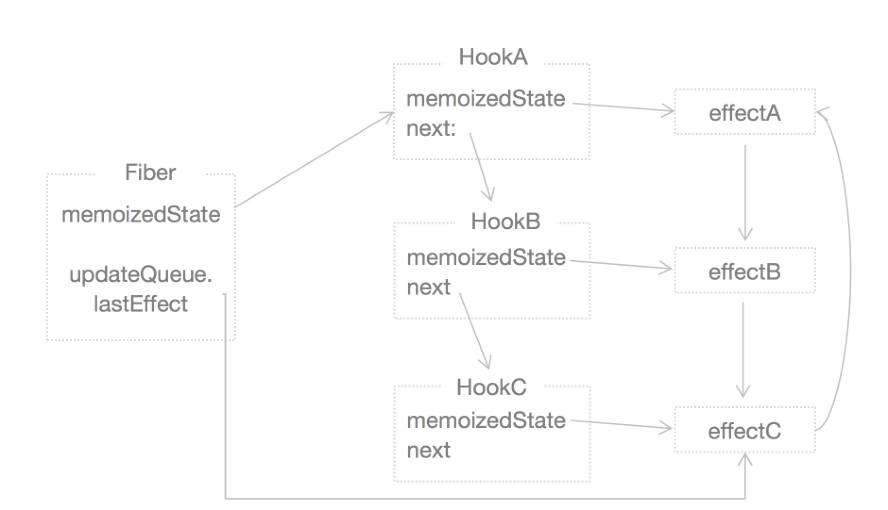

# ReactCurrentDispatcher详解
* 函数组件在实例化的时候可能会调用各种React`Hook`钩子（[参考文档](https://react.docschina.org/docs/hooks-intro.html)）
    - 除了函数组件执行的其他场景，`ReactCurrentDispatcher.current`都会设置成`ContextOnlyDispatcher`
    - 函数组件第一次实例化的时候`ReactCurrentDispatcher.current`都会设置成`HooksDispatcherOnMount`
    - 函数组件第一次以后其他实例化的时候`ReactCurrentDispatcher.current`都会设置成`HooksDispatcherOnUpdate`
    - 如果函数组件实例过程中存在调用`setState`类似的操作，`ReactCurrentDispatcher.current`都会设置成`HooksDispatcherOnRerender`

## ContextOnlyDispatcher
* 除了`readContext`，其他Hook在被调用的时候都会抛出错误
* ContextOnlyDispatcher 对象
```javascript
const ContextOnlyDispatcher: Dispatcher = {
  readContext,

  useCallback: throwInvalidHookError,
  useContext: throwInvalidHookError,
  useEffect: throwInvalidHookError,
  useImperativeHandle: throwInvalidHookError,
  useLayoutEffect: throwInvalidHookError,
  useMemo: throwInvalidHookError,
  useReducer: throwInvalidHookError,
  useRef: throwInvalidHookError,
  useState: throwInvalidHookError,
  useDebugValue: throwInvalidHookError,
  useResponder: throwInvalidHookError,
  useDeferredValue: throwInvalidHookError,
  useTransition: throwInvalidHookError,
  useMutableSource: throwInvalidHookError,
  useEvent: throwInvalidHookError,
};
```
### throwInvalidHookError
* 在被调用的时候会抛出： `hook` 只能在函数组件内被调用的错误信息
```javascript
function throwInvalidHookError() {
  invariant(
    false,
    'Invalid hook call. Hooks can only be called inside of the body of a function component. This could happen for' +
      ' one of the following reasons:\n' +
      '1. You might have mismatching versions of React and the renderer (such as React DOM)\n' +
      '2. You might be breaking the Rules of Hooks\n' +
      '3. You might have more than one copy of React in the same app\n' +
      'See https://fb.me/react-invalid-hook-call for tips about how to debug and fix this problem.',
  );
}
```

## HooksDispatcherOnMount
* HooksDispatcherOnMount 对象
```javascript
const HooksDispatcherOnMount: Dispatcher = {
  readContext,
  useCallback: mountCallback,
  useContext: readContext,
  useEffect: mountEffect, // useEffect和useState等的区别 useEffect将effect额外的添加到了fiber的UpdateQueue上 这么做的情况是希望effect会在组件更新的时候触发执行
  useImperativeHandle: mountImperativeHandle,
  useLayoutEffect: mountLayoutEffect,
  useMemo: mountMemo,
  useReducer: mountReducer,
  useRef: mountRef,
  useState: mountState,
  useDebugValue: mountDebugValue,
  useResponder: createDeprecatedResponderListener,
  useDeferredValue: mountDeferredValue,
  useTransition: mountTransition,
  useMutableSource: mountMutableSource,
  useEvent: mountEventListener,
};
```
### mountState

#### mountWorkInProgressHook
[参考文档](mountWorkInProgressHook解析.md)

#### basicStateReducer
```
// 基态Reducer
function basicStateReducer<S>(state: S, action: BasicStateAction<S>): S {
  //$FlowFixMe:流不喜欢混合类型
  // $FlowFixMe: Flow doesn't like mixed types
  return typeof action === 'function' ? action(state) : action;
}
```

#### dispatchAction
* [参考文档](dispatchAction解析.md)

### mountCallback
* [参考文档](useCallback解析.md)

### mountEffect
* `mountEffect`函数主要调用了`mountEffectImpl`函数，接下来主要看`mountEffectImpl`函数
* `mountEffectImpl`函数的形参：
    - fiberEffectTag：UpdateEffect | PassiveEffect = 0b0000000000100 | 0b0001000000000 = 0b0001000000100 = 516
    - hookEffectTag：HookPassive = 0b100 = 4
    - create: `useEffect`第一个参数，一个函数，代表被动效果执行函数
    - deps：`useEffect`第二个参数，一个数组，代表该被动效果的依赖列表，deps里的任何一个变量变化时都会触发`create`参数的执行
* 执行步骤：
    - 新建一个hook，且将hook绑定为函数组件Fiber的`memoizedState`和`workInProgressHook`或者`workInProgressHook.next`
    - 设置`workInProgress`的`effectTag`属性，供React DevTools使用
    - 给上面新建的`hook`的`memoizedState`属性赋值
    
* 执行完后 Fiber对象`workInProgress`和当前组件的hooks以及当前组件的effects的关系如下图：

* 源码如下：
```javascript
function mountEffectImpl(fiberEffectTag, hookEffectTag, create, deps): void {
  const hook = mountWorkInProgressHook();
  const nextDeps = deps === undefined ? null : deps;
  currentlyRenderingFiber.effectTag |= fiberEffectTag;
  hook.memoizedState = pushEffect(
    HookHasEffect | hookEffectTag,
    create,
    undefined,
    nextDeps,
  );
}
```

### mountLayoutEffect
[参考文档](useLayoutEffect解读.md)

### mountImperativeHandle
[参考文档](useImperativeHandle解析.md)


## HooksDispatcherOnUpdate
```javascript
const HooksDispatcherOnUpdate: Dispatcher = {
  readContext,

  useCallback: updateCallback,
  useContext: readContext,
  useEffect: updateEffect,
  useImperativeHandle: updateImperativeHandle,
  useLayoutEffect: updateLayoutEffect,
  useMemo: updateMemo,
  useReducer: updateReducer,
  useRef: updateRef,
  useState: updateState,
  useDebugValue: updateDebugValue,
  useResponder: createDeprecatedResponderListener,
  useDeferredValue: updateDeferredValue,
  useTransition: updateTransition,
  useMutableSource: updateMutableSource,
  useEvent: updateEventListener,
};
```

## HooksDispatcherOnRerender
```javascript
const HooksDispatcherOnRerender: Dispatcher = {
  readContext,

  useCallback: updateCallback,
  useContext: readContext,
  useEffect: updateEffect,
  useImperativeHandle: updateImperativeHandle,
  useLayoutEffect: updateLayoutEffect,
  useMemo: updateMemo,
  useReducer: rerenderReducer,
  useRef: updateRef,
  useState: rerenderState,
  useDebugValue: updateDebugValue,
  useResponder: createDeprecatedResponderListener,
  useDeferredValue: rerenderDeferredValue,
  useTransition: rerenderTransition,
  useMutableSource: updateMutableSource,
  useEvent: updateEventListener,
};
```
