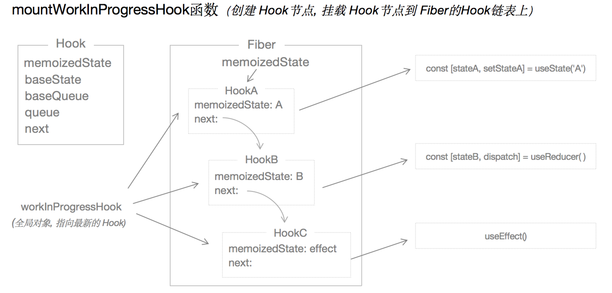

# mountWorkInProgressHook

* HooksDispatcherOnMount的每个`hook`钩子函数都会调用它来生成一个描述自己的`Hook`对象
* 1 初始化一个描述当前`hook`对象
* 将该对象绑定到当前组件对应的Fiber对象的 `memoizedState`属性上
* 2 将当前`hook`对象放置于整个Hooks链表的最后
    - 如果`workInProgressHook`为`null`，证明当前hook是`workInProgress`第一个`hook`对象，将 `workInProgress.memoizedState`和`workInProgressHook`都设置为第一步新创建的`hook`对象
    - 如果`workInProgressHook`不为`null`，将当前新建的`hook`绑定到`workInProgress`的`next`属性（一个函数组件的hooks是一个链条，挨着的两个hook之间用next作为连接）



## 源码
* `WorkInProgressHook`这个变量总是指向当前执行的`hook`钩子
```javascript
function mountWorkInProgressHook(): Hook {
  // 1 初始化一个描述当前`Hook`
  const hook: Hook = {
    memoizedState: null,

    baseState: null,
    baseQueue: null,
    queue: null, // 存放 useState和useReducer的相关属性，包含initialState
    next: null, // 通过next属性按照函数组件中的hook执行先后顺序进行连接
  };
  // 每个hook新创建的时候workInProgressHook都等于null
  if (workInProgressHook === null) {
    // currentlyRenderingFiber 会在 renderWithHooks的时候赋值为当时的workInProgress
    //这是列表中的第一个钩子
    // This is the first hook in the list
    currentlyRenderingFiber.memoizedState = workInProgressHook = hook;
  } else {
    //追加到列表末尾
    // Append to the end of the list
    workInProgressHook = workInProgressHook.next = hook;
  }
  return workInProgressHook;
}
```
