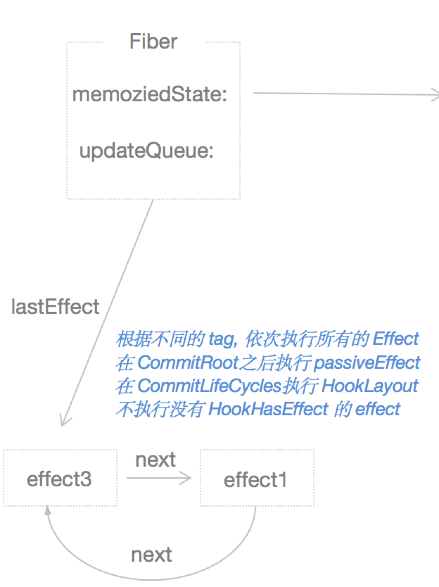

# pushEffect 解析
* `pushEffect`函数的目的就是创建一个被动效果的对象`effect`，然后将当前函数组件对应的`Fiber`对象的`UpdateQueue`的`lastEffect`属性指向该`effect`，然后将该`effect`的next属性指向`Fiber`对象的`UpdateQueue`的`lastEffect`之前原本的一系列`effect`链条，形成一个回环

## 源码
```javascript
function pushEffect(tag, create, destroy, deps) {
  const effect: Effect = {
    tag,
    create, // useEffect函数的第一个参数
    destroy, // useEffect第一个参数执行后返回的回调函数
    deps, // useEffect的第二个参数， 依赖项
    // Circular
    next: (null: any),
  };
  let componentUpdateQueue: null | FunctionComponentUpdateQueue = (currentlyRenderingFiber.updateQueue: any);
  // 为fiber.updateQueue增加effect
  if (componentUpdateQueue === null) {
    componentUpdateQueue = createFunctionComponentUpdateQueue();
    currentlyRenderingFiber.updateQueue = (componentUpdateQueue: any);
    componentUpdateQueue.lastEffect = effect.next = effect;
  } else {
    const lastEffect = componentUpdateQueue.lastEffect;
    if (lastEffect === null) {
      componentUpdateQueue.lastEffect = effect.next = effect;
    } else {
      const firstEffect = lastEffect.next;
      lastEffect.next = effect;
      effect.next = firstEffect;
      componentUpdateQueue.lastEffect = effect;
    }
  }
  return effect;
}
```
