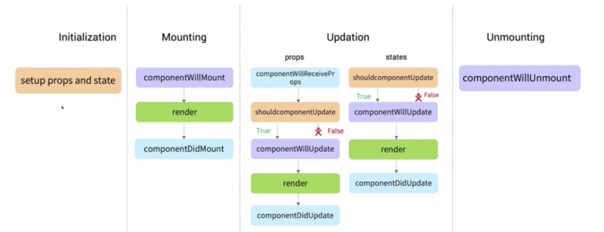
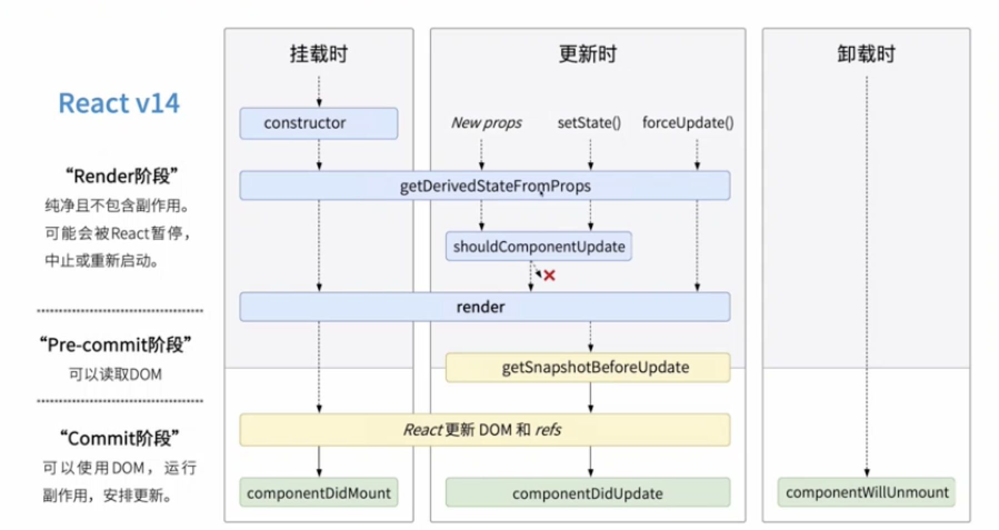

# React 组件 生命周期

## 老生命周期

## 新生命周期


### 挂载阶段的函数

* constructor 构造函数， 初始化state， 以及为事件处理函数绑定实例
* getDerivedStateFromProps
  这个生命周期函数是为了替代componentWillReceiveProps存在的，所以在你需要使用componentWillReceiveProps的时候，就可以考虑使用getDerivedStateFromProps来进行替代了。
  两者的参数是不相同的，而getDerivedStateFromProps是一个静态函数，也就是这个函数不能通过this访问到class的属性，也并不推荐直接访问属性。而是应该通过参数提供的nextProps以及prevState来进行判断，根据新传入的props来映射到state
  需要注意的是，如果props传入的内容不需要影响到你的state，那么就需要返回一个null，这个返回值是必须的，所以尽量将其写到函数的末尾。
  
  ```javascript
  static getDerivedStateFromProps(nextProps, prevState) {
      const {type} = nextProps;
      // 当传入的type发生变化的时候，更新state
      if (type !== prevState.type) {
          return {
              type,
          };
      }
      // 否则，对于state不进行任何操作
      return null;
  }
  ```

* render 渲染函数
* componentDidMount 挂载成功后立即调用的函数
### 更新阶段的函数
* getDerivedStateFromProps props变化或者state方法触发
* shouldComponentUpdate 判断是否进行更新
* render 渲染函数
* getSnapshotBeforeUpdate render方法后调用，返回一个dom更改之前的快照，将配合后续的componentDidUpdate方法使用
    >这个新更新代替componentWillUpdate。
     常见的 componentWillUpdate 的用例是在组件更新前，读取当前某个 DOM 元素的状态，并在 componentDidUpdate 中进行相应的处理。
     这两者的区别在于：
     在 React 开启异步渲染模式后，在 render 阶段读取到的 DOM 元素状态并不总是和 commit 阶段相同，这就导致在
     componentDidUpdate 中使用 componentWillUpdate 中读取到的 DOM 元素状态是不安全的，因为这时的值很有可能已经失效了。
     getSnapshotBeforeUpdate 会在最终的 render 之前被调用，也就是说在 getSnapshotBeforeUpdate 中读取到的 DOM 元素状态是可以保证与 componentDidUpdate 中一致的

* componentDidUpdate更新后会被立即调用

### 异常捕获的函数
> 原本处理异常捕获 我们一般是在关键代码用try catch代码
* `componentDidCatch` 生命周期方法在后代组件抛出错误后被调用，方法接收两个参数`(error, info)`,分别是错误信息和错误组件的栈信息。
    > 一般用来做错误日志的上传
* `getDerivedStateFromError` 在后代组件抛出错误后调用，接收一个参数`（error）`表示具体的错误信息
    > 兼容错误页面，让用户体验更好

## 升级组件版本
* componentWillUpdate
    - 在组建收到新的props或者state时，会在渲染之前调用
    - 方法内不能调用setState，触发循环，内存泄漏
* UNSAFE_componentWillUpdate
    - 应该在shouldComponentUpdate中判断是否更新
* componentWillReceiveProps
    - 接收父组件传递过来最新的props，转化为组件内的state
    - 判断是否进行更新或者执行异步请求数据
* UNSAFE_componentWillReceiveProps
    - 与渲染相关的props直接渲染，不需要处理为组件内的state
    - 异步数据请求在componentDidUpdate中处理
    - getDerivedStateFromProps方法替换，需要考虑生命周期的执行顺序

* 如果老工程代码很多，改动特别麻烦，需要回归的点非常多，怎么解决？
    ```javascript
    npx react-codemod rename-unsafe-lifecycles
    ```
