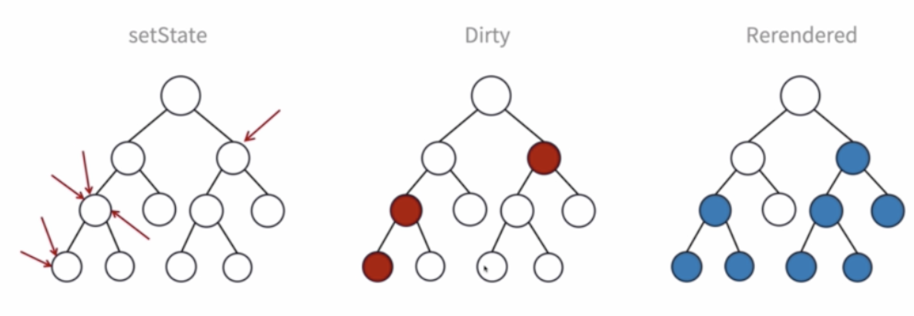
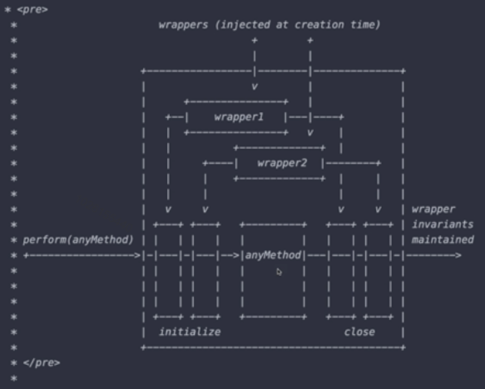
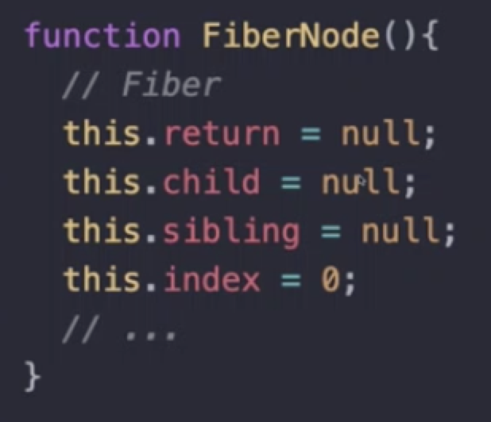
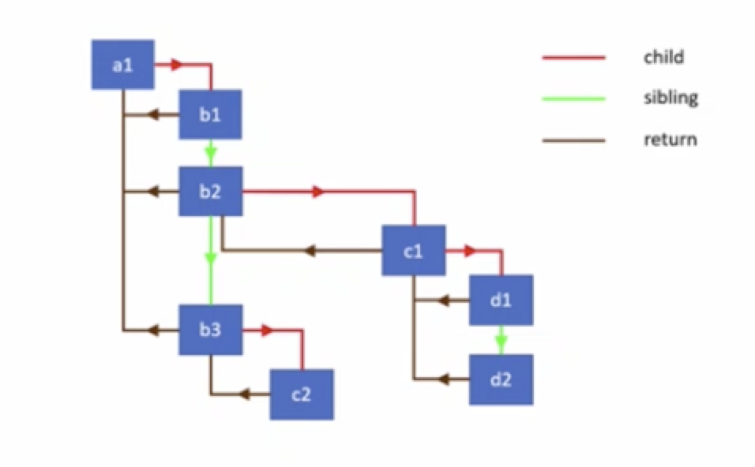
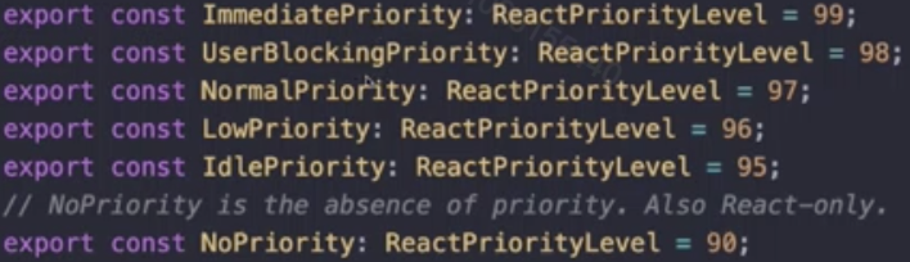

# React Reconciler 协调的过程
* stack Reconciler 栈协调
* Fiber Reconciler Fiber协调

## stack Reconciler 栈协调

* 事务性

> 事务性带来的弊端：过程无法中断。如果组件更新比较长，之间如果用户有进行交互这种优先级较高的任务的时候，会发生卡顿现象，如：输入框中输入字符串12345，输入1234的时候，数字看不见，输入5的时候，1234又突然出现的现象

## Fiber Reconciler
* 解决的问题：
    - 可阻断的渲染过程
    - 适时地重启渲染
    - 父子组件中来回切换布局更新
    - 更清晰的错误处理
    - ...
* Fiber的数据结构
Fiber描述Dom节点树用链表的结构来描述（React 15.x中VDom是用一个嵌套的js对象来表示的）

* render 阶段
执行组件的render方法（函数组件中是return），确定哪些需要更新。此过程可以被打断

* commit阶段
更新阶段，在确定更新内容后，提交更新并调用对应渲染模块（react-dom）进行渲染，为防止页面抖动，该过程是同步的且不能被打断的

### 时间分片
> React 在挂载或者更新过程中会做很多事情，比如调用组件的渲染函数，对比前后树的差异，而且commit阶段是同步的，所以在Stack Reconnciler中会有卡顿的问题, 所以应该对任务进行权重的划分

* requestAnimationFrame
在做动画时候经常用到，保障用户的体验，Priority（优先级）较高的任务用requestAnimationFrame执行
* requestIdleCallback
浏览器提供的闲时调用。将在浏览器的空闲时间段内调用的函数排队。这使开发者能够在主事件循环上执行后台和低优先级工作，且不会影响延迟关键事件，如动画和输入响应
