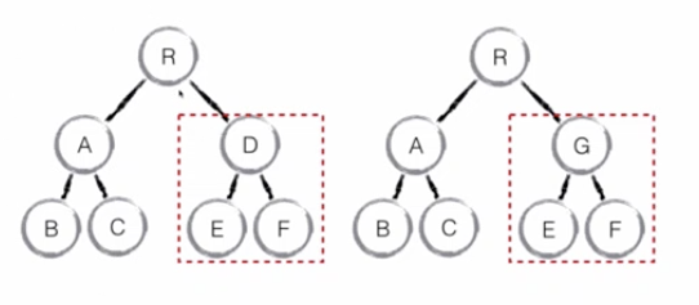
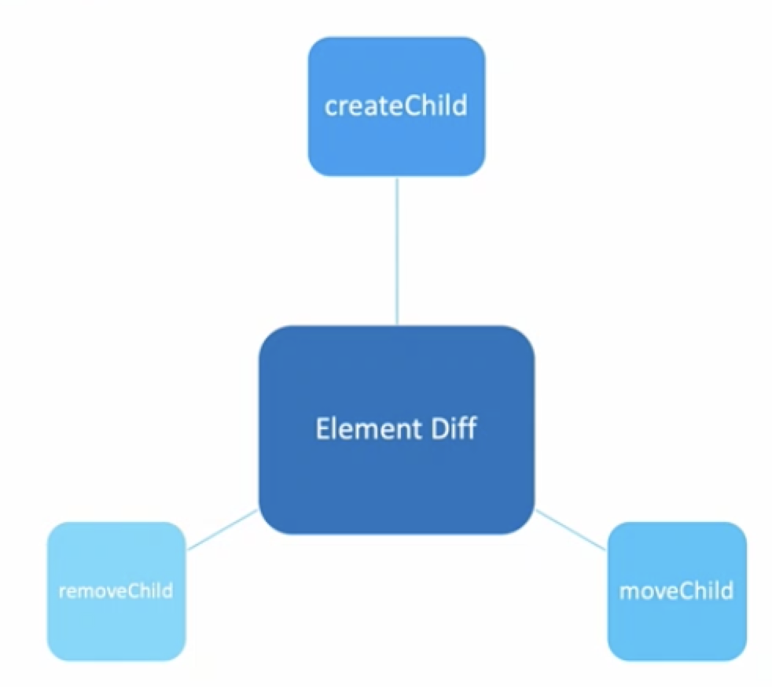

# Virtual DOM

## 是什么？
是一种编程理念，将UI节点虚拟的保存到内存中，通过某些库转换成真实的 DOM 。它是原生DOM的映射

* UI 节点的抽象
> 因为提供了对HTML DOM的抽象，所以在web开发中，通常不需要去调用DOM API，也是因为抽象，所以React也可以开发Native
*  通过Virtual DOM 渲染页面

## Virtual DOM 对比 原生DOM
Virtual Dom 渲染成HTML，在流程上会比原生DOM操作多几个步骤。

* 原生DOM更新：
    - DOM API 调用更新UI
* Virtual DOM更新
    - 每次render都会产生一份新的 'react DOM'
    -  Virtual DOM需要对新旧 react DOM进行比较，从而确定在旧DOM的基础上进行多少变更
    - 确定更新策略后调用DOM api更新UI

## Virtual Dom Diff
* VDom如何提高性能？
    - 我们将render产生的虚拟DOM称为 VDom
    - 通常调动setState方法触发VDom更新
    - 通过对比新旧VDom，确定最优实现新VDom所需要的操作
* Virtual DOM Diff 的层次
    - 组件级别的比较
    - 元素级别的比较
    
    只比同等级别的组件，避免深层次的递归（实际业务开发中大部分场景都是同等级别的元素进行改变）
    
    
