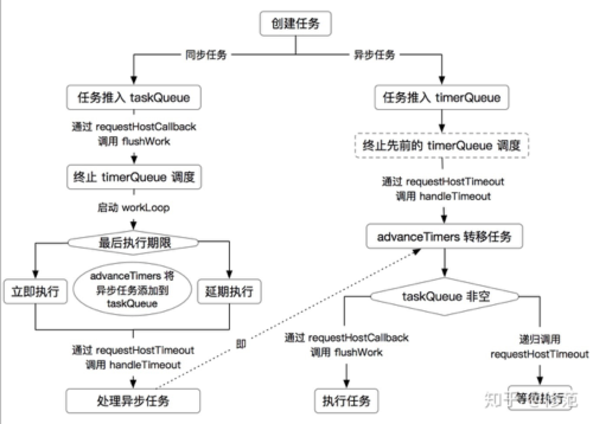

# React scheduler
scheduler 用于完成调度工作。可以将任务延迟执行（阻碍浏览器渲染的一些任务）

引用自[知乎](https://zhuanlan.zhihu.com/p/110161396)

scheduler 使用 Heap 堆存放任务队列。每个任务在进入 Heap 堆前，会根据 sortIndex、id 属性进行优先级排序。它首先比较 sortIndex 值，值越小，优先级越高；其次以相同的规则比较 id（即比较任务的创建顺序）。依循优先级的高低，scheduler 采用位运算取中位节点的方式交换任务在 Heap 堆中的位置。push 函数用于将任务添加到 Heap 堆的尾端，并重新按优先级调整 Heap 堆。peek、pop 用于取出 Heap 堆中的首个任务。其中，pop 会从 Heap 堆中移除首个任务，并重新按优先级调整 Heap 堆；peek 不会移除。在使用上，peek 主要拣选 Heap 堆中的首个任务；若任务已执行或已取消，则使用 pop 移除。

scheduler 使用 Heap 堆机制构造了两个队列：taskQueue、timerQueue。taskQueue 存放将被处理的任务；timerQueue 存放延期处理的任务。可以推想的处理流程是：首先使用 peek 函数取出 taskQueue 中的任务并执行，完成后使用 pop 函数移除；在执行期间，检查当前时间是否满足 timerQueue 中任务的延期标准，若满足，将该任务移入 taskQueue，并从 timerQueue 中移除。任务由 timerQueue 流向 taskQueue 的过程由 advanceTimers 函数 完成。

## React 将任务延后执行所依赖的一些技术
* [setTimeout](https://developer.mozilla.org/zh-CN/docs/Web/API/Window/setTimeout)
* [requestAnimationFrame](https://developer.mozilla.org/zh-CN/docs/Web/API/window/requestAnimationFrame)
* [MessageChannel](https://developer.mozilla.org/zh-CN/docs/Web/API/MessageChannel/MessageChannel)

## 调度函数入口`unstable_scheduleCallback`
```javascript
function unstable_scheduleCallback(priorityLevel, callback, options) {
  var currentTime = getCurrentTime();

  var startTime;
  var timeout;
  if (typeof options === 'object' && options !== null) {
    var delay = options.delay;
    if (typeof delay === 'number' && delay > 0) {
      startTime = currentTime + delay;
    } else {
      startTime = currentTime;
    }
    // 延期时间，有特意传就用options里面的timeout 没有就根据优先等级设置默认延期时间 reactDom调用render函数的时候 timeout接近 500ms
    timeout =
      typeof options.timeout === 'number'
        ? options.timeout
        : timeoutForPriorityLevel(priorityLevel);
  } else {
    timeout = timeoutForPriorityLevel(priorityLevel); // NORMAL_PRIORITY_TIMEOUT = 5000
    startTime = currentTime;
  }

  // 过期时间 = 开始执行时间 + 延期间隔
  var expirationTime = startTime + timeout;

  var newTask = {
    id: taskIdCounter++, // 自增的任务id
    callback, // 调度任务回调函数
    priorityLevel, // 优先等级
    startTime, // 开始时间
    expirationTime, // 过期时间
    sortIndex: -1, //排序索引
  };

  // 如果是开发环境， 设置newTask.isQueued 为false
  if (enableProfiling) {
    newTask.isQueued = false;
  }

  // 如果开始时间大于当前时间，证明当前任务是一个延期任务
  if (startTime > currentTime) {
    // This is a delayed task.
    newTask.sortIndex = startTime;
    // 把当前任务加到延期任务队列里面
    push(timerQueue, newTask);
    // 如果正在执行的任务队列是空的且延期任务队列里只有当前任务
    // peek（偷看，探出的意思）方法就是用来取数组的第一份数据
    if (peek(taskQueue) === null && newTask === peek(timerQueue)) {
      // All tasks are delayed, and this is the task with the earliest delay.
      // 初始化主延迟事件的执行状态
      if (isHostTimeoutScheduled) {
        // Cancel an existing timeout.
        cancelHostTimeout();
      } else {
        isHostTimeoutScheduled = true;
      }
      /**Schedule a timeout.
       * 调度一个timeout，将handleTimeout放在一个setTimeout中延迟执行 第一个时间间隔为最近的启动时间减去当前时间
       * handleTimeout函数将处理第一个到来的延迟时间点，并调用advanceTimers处理定时器队列
       * （1）跳过被取消的任务
       * （2）将到执行时间的任务放入任务队列(taskQueue)
       *（3） 执行任务：当任务队列不为空时，将会调用flushWork来执行任务，最终调用workLoop循环执行所有到时的任务。
       **/
      requestHostTimeout(handleTimeout, startTime - currentTime);
    }
  } else {
    newTask.sortIndex = expirationTime;
    // 将newTask按照从小到大的顺序放在taskQueue中
    push(taskQueue, newTask);
    // Schedule a host callback, if needed. If we're already performing work,
    // wait until the next time we yield.
    // 如果主回调调度执行状态是停滞状态，则开始调用requestHostCallback将flushWork通过setTimeout置于宏任务队列等待到点执行
    if (!isHostCallbackScheduled && !isPerformingWork) {
      isHostCallbackScheduled = true;
      requestHostCallback(flushWork);
    }
  }

  return newTask;
}
```

* `requestHostTimeout` 

通过`requestHostTimeout`调用`handleTimeout`，将`handleTimeout`放在`setTimeout`函数内延迟到下次宏任务执行，当传给setTimeout的时间到期后执行`handleTimeout`函数，
`handleTimeout`会首先调用`advanceTimers`看是否有到期需要执行的callback，有的话转移任务到taskQueue任务队列，然后通过查看taskQueue是否为空决定是调用`requestHostCallback`，还是继续调用`requestHostTimeout`等待下次事件循环的时候重新执行这次逻辑

```javascript
    requestHostTimeout = function(callback, ms) {
        taskTimeoutID = setTimeout(() => {
            callback(getCurrentTime());
        }, ms);
    };

    cancelHostTimeout = function() {
        clearTimeout(taskTimeoutID);
        taskTimeoutID = -1;
    };
```
* `requestHostCallback` 

`requestHostCallback` 通过浏览器兼容性来判断具体使用`setTimeout`还是`MessageChannel`处理任务
 
```javascript
const requestHostCallback = function(cb) {
    if (_callback !== null) {
      // Protect against re-entrancy.
      setTimeout(requestHostCallback, 0, cb);
    } else {
      _callback = cb;
      // 将
      setTimeout(_flushCallback, 0);
    }
  };
```
```javascript
const performWorkUntilDeadline = () => {
    if (scheduledHostCallback !== null) {
      const currentTime = getCurrentTime();
      // Yield after `yieldInterval` ms, regardless of where we are in the vsync
      // cycle. This means there's always time remaining at the beginning of
      // the message event.
      // 为了避免工作任务长期占用主线程，react 使用帧率计算任务的 yieldInterval 最大工作时长。
      // scheduler 允许使用 forceFrameRate 设置任务的最大工作时长。在任务执行开始时，
      // scheduler 会基于任务的开始工作时间加 yieldInterval 计算任务的 deadline 暂停时间，
      // 一旦 workLoop 执行到 deadline 时间后，scheduler 会让出主线程以执行其他任务。判断任务运行是否达到 deadline，基于 shouldYieldToHost 函数 实现。
      deadline = currentTime + yieldInterval;
      const hasTimeRemaining = true;
      try {
        const hasMoreWork = scheduledHostCallback(
          hasTimeRemaining,
          currentTime,
        );
        if (!hasMoreWork) {
          isMessageLoopRunning = false;
          scheduledHostCallback = null;
        } else {
          // If there's more work, schedule the next message event at the end
          // of the preceding one.
          port.postMessage(null);
        }
      } catch (error) {
        // If a scheduler task throws, exit the current browser task so the
        // error can be observed.
        port.postMessage(null);
        throw error;
      }
    } else {
      isMessageLoopRunning = false;
    }
    //向浏览器让步会给它一个画画的机会，所以我们可以重置此
    // Yielding to the browser will give it a chance to paint, so we can
    // reset this.
    needsPaint = false;
  };

  const channel = new MessageChannel();
  const port = channel.port2;
  channel.port1.onmessage = performWorkUntilDeadline;

const requestHostCallback = function(callback) {
    scheduledHostCallback = callback;
    if (!isMessageLoopRunning) {
      isMessageLoopRunning = true;
      port.postMessage(null);
    }
  };

  cancelHostCallback = function() {
    scheduledHostCallback = null;
  };
```

* `handleTimeout`
```javascript
function handleTimeout(currentTime) {
  isHostTimeoutScheduled = false;
  // 检查不再延迟的任务并将其添加到队列time中
  /**
   * 1 将timerQueue队列中已经被取消掉的任务消除
   * 2 当当前时间已经超过了timerQueue队列中的某一项任务规定开始时间，将该任务探出timerQueue队列,且将该任务的sortIndex设置为它的过期时间expirationTime，然后将其加入taskQueue队列
   * */
  advanceTimers(currentTime);

  if (!isHostCallbackScheduled) {
    if (peek(taskQueue) !== null) {
      isHostCallbackScheduled = true;
      //flushwork是schedule的一个刷新任务队列函数,就是通过循环，在给定的时间里去调用flushFirstCallback()，并且在最后去执行最紧急的callback
      // requestHostCallback会将回调函数进行保留为一个_callback的变量，如果_callback不为空 通过setTimeout(requestHostCallback, 0, cb);将此次执行放入下一个事件循环中的宏队列等待下次循环执行该任务，否则
      // 如果_callback为空则将flushWork方在setTimeout中等待下次时间循环时候执行flushWork
      requestHostCallback(flushWork);
    } else {
      // taskQueue任务队列为空的时候又重复之前步骤：取待执行timerQueue队列第一份任务，将其放在延迟事件setTimeout中，等待他到期后执行
      const firstTimer = peek(timerQueue);
      if (firstTimer !== null) {
        requestHostTimeout(handleTimeout, firstTimer.startTime - currentTime);
      }
    }
  }
}
```

### `flushWork`
* 第一次执行`flushWork`的时候参数`hasTimeRemaining`是`true`，`initialTime`是通过`unstable_now`函数获取到的一个程序运行开始至今的时间差值
```javascript
function flushWork(hasTimeRemaining, initialTime) {
  //下次安排工作时，我们需要一个主机回调。
  // We'll need a host callback the next time work is scheduled.
  isHostCallbackScheduled = false;
  // 暂时忽略
  if (isHostTimeoutScheduled) {
    //我们安排了一个暂停，但现在不需要了。取消它。
    // We scheduled a timeout but it's no longer needed. Cancel it.
    isHostTimeoutScheduled = false;
    cancelHostTimeout();
  }

  isPerformingWork = true;
  // 上一优先级
  const previousPriorityLevel = currentPriorityLevel;
  try {
    return workLoop(hasTimeRemaining, initialTime);
  } finally {
    currentTask = null;
    currentPriorityLevel = previousPriorityLevel;
    isPerformingWork = false;
  }
}
```
* workLoop
```javascript
function workLoop(hasTimeRemaining, initialTime) {
  let currentTime = initialTime;
  // 提前计时器
  advanceTimers(currentTime);
  // 选第一个task 选expiration最小的task
  currentTask = peek(taskQueue);
  // 如果当前任务队列第一个任务不为空且为暂停调度，则进行循环
  while (
    currentTask !== null &&
    !(enableSchedulerDebugging && isSchedulerPaused)
  ) {
    // 判断任务运行是否达到 deadline，基于 shouldYieldToHost 函数 实现。
    if (
      currentTask.expirationTime > currentTime &&
      (!hasTimeRemaining || shouldYieldToHost())
    ) {
      // 当前任务尚未过期，我们已达到截止日期 退出循环
      // This currentTask hasn't expired, and we've reached the deadline.
      break;
    }
    const callback = currentTask.callback;
    if (callback !== null) {
      currentTask.callback = null;// 去除callback后将当前任务callback置为null，方便下次清除此次执行过的任务
      currentPriorityLevel = currentTask.priorityLevel;
      // currentTask.expirationTime <= currentTime的时候证明callback可以执行啦
      const didUserCallbackTimeout = currentTask.expirationTime <= currentTime; // 用户回调是否还处于延迟状态
      // 忽略
      markTaskRun(currentTask, currentTime);
      // 回调函数执行，可能会返回一个回调函数，比如useEffect的callback里面return一个函数这种情况
      const continuationCallback = callback(didUserCallbackTimeout);
      currentTime = getCurrentTime();
      if (typeof continuationCallback === 'function') {
        //如果回调函数返回了回调函数 则继续执行返回的回调函数
        currentTask.callback = continuationCallback;
      } else {
        // 清除执行过的当前任务
        // 如果taskQueue只有一个task ，name就将执行过的task进行清除掉
        if (currentTask === peek(taskQueue)) {
          pop(taskQueue);
        }
      }
      // 继续检查不再延迟的任务并将其添加到队列taskQueue中
      advanceTimers(currentTime);
    } else {
      pop(taskQueue);
    }
    // 去除下一个任务继续执行
    currentTask = peek(taskQueue);
  }
  // Return whether there's additional work
  //返回是否有其他工作
  if (currentTask !== null) {
    return true;
  } else {
    // 如果taskQueue队列所有任务执行完了，则取延迟执行任务队列的第一个任务，调用requestHostTimeout等待其开始执行时间到后执行自己
    let firstTimer = peek(timerQueue);
    if (firstTimer !== null) {
      //requestHostTimeout 是将handleTimeout放在一个setTimeout中，setTimeout延迟事件是firstTimer.startTime - currentTime
      requestHostTimeout(handleTimeout, firstTimer.startTime - currentTime);
    }
    return false;
  }
}
```

* `advanceTimers` 检查延迟任务队列`timerQueue`，将超过执行时间`startTime`的所有任务从`timerQueue`中取出来，放进执行任务队列`taskQueue`
 > 执行任务队列`taskQueue`是按每一个`task`的`sortIndex`也就是`task.expirationTime`升序的方式从小到大排序的，每次都是取第一个执行，也就是取最早到期的任务执行
```javascript
// 检查不再延迟的任务并将其添加到队列taskQueue中
function advanceTimers(currentTime) {
  //检查不再延迟的任务并将其添加到队列中。
  // 第一次进入 timerQueue是空的
  // Check for tasks that are no longer delayed and add them to the queue.
  let timer = peek(timerQueue);
  while (timer !== null) {
    // 将timerQueue队列中已经被取消掉的任务消除
    if (timer.callback === null) {
      // Timer was cancelled.
      pop(timerQueue);
    } else if (timer.startTime <= currentTime) {
      // 当当前时间已经超过了timerQueue队列中的某一项任务规定开始时间，将该任务探出timerQueue队列,且将该任务的sortIndex设置为它的过期时间expirationTime，然后将其加入taskQueue队列
      // Timer fired. Transfer to the task queue.
      pop(timerQueue);
      timer.sortIndex = timer.expirationTime;
      push(taskQueue, timer);
    } else {
      // Remaining timers are pending.
      return;
    }
    timer = peek(timerQueue);
  }
}
```
* `peek` 查看队列的第一个任务
```javascript
export function peek(heap: Heap): Node | null {
  const first = heap[0];
  return first === undefined ? null : first;
}
```
* `push`函数 将一个任务`node`放入对应的任务队列`heap`(`timerQueue`和`taskQueue`中的一个)
```javascript
function push(heap: Heap, node: Node): void {
  const index = heap.length;
  heap.push(node);
  siftUp(heap, node, index);
}
```
* `siftUp`和`siftDown`函数 对任务队列进行排序（升序)
```javascript
// 将node按升序放在heap中
function siftUp(heap, node, i) {
  let index = i;
  while (true) {
    const parentIndex = (index - 1) >>> 1; // index -1 是node在heap中的下标，index -1 >>> 1就是node在heap中preNode的下标
    const parent = heap[parentIndex];
    // 对比node在和它前一个node的大小，如果前一个node的expirationTime更大或者id更大，就互换两个node  将大的放在后面小的放前面
    if (parent !== undefined && compare(parent, node) > 0) {
      //父母是更大的。互换头寸。
      // The parent is larger. Swap positions.
      heap[parentIndex] = node;
      heap[index] = parent;
      index = parentIndex;
    } else {
      //父母比我小。Exit。
      // The parent is smaller. Exit.
      return;
    }
  }
}
```

* `compare`是对比两个任务的优先级 a.sortIndex越小，任务优先级越高
```javascript
function compare(a, b) {
  //首先比较排序索引，然后比较任务id。
  // Compare sort index first, then task id.
  // 对比两个task的expirationTime
  const diff = a.sortIndex - b.sortIndex;
  return diff !== 0 ? diff : a.id - b.id;
}
```
