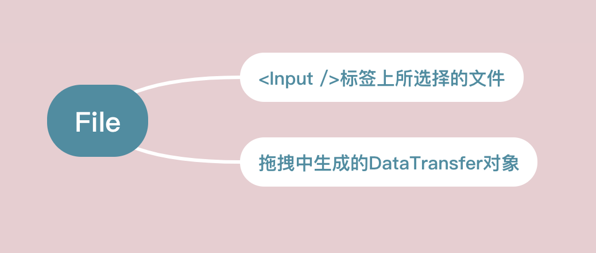
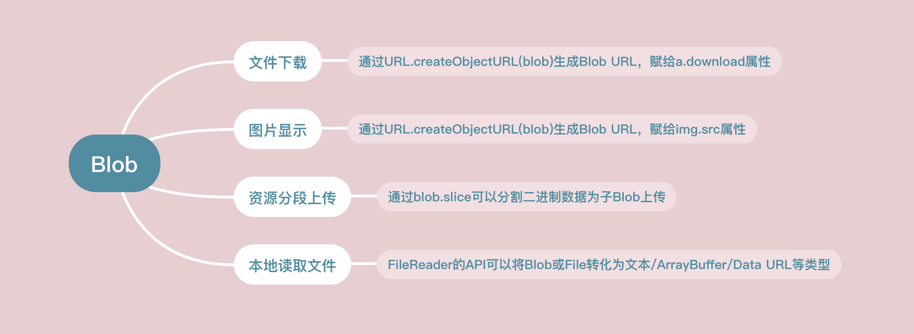
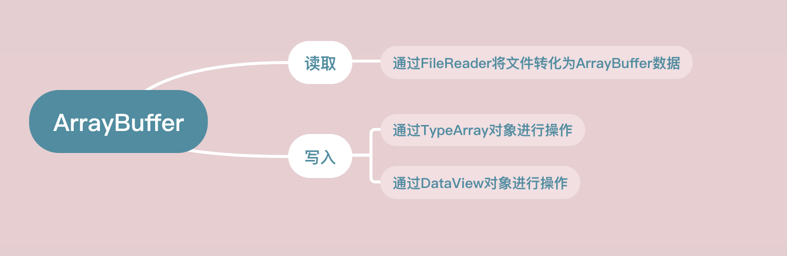
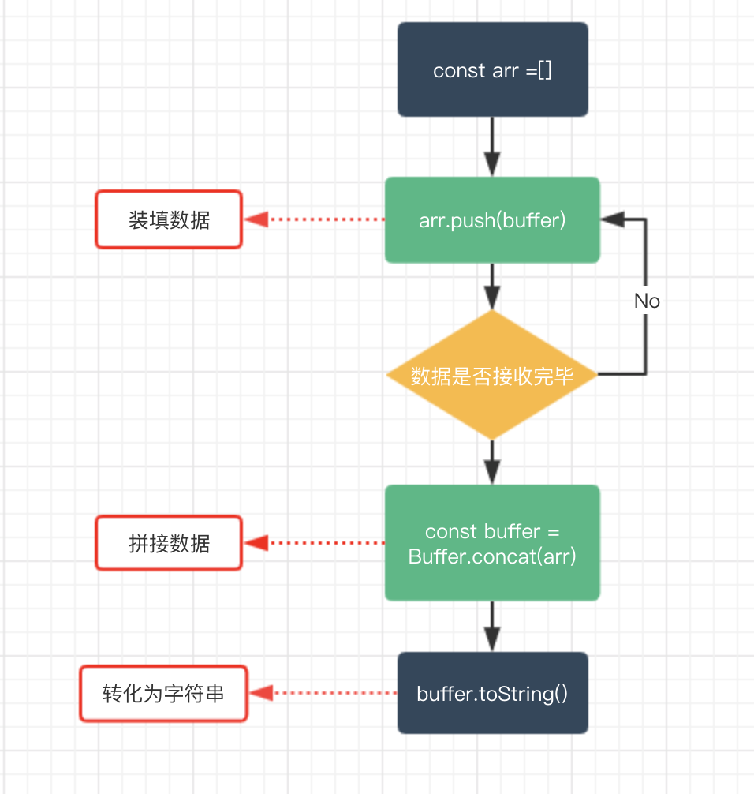

# Blob、ArrayBuffer、Buffer

* Blob: 前端的一个专门用于支持文件操作的二进制对象

* ArrayBuffer：前端的一个通用的二进制缓冲区，类似数组，但在API和特性上却有诸多不同

* Buffer：Node.js提供的一个二进制缓冲区，常用来处理I/O操作 

## Blob
Blob是用来支持文件操作的。简单的说：在JS中，有两个构造函数 File 和 Blob, 而File继承了所有Blob的属性。所以在我们看来，File对象可以看作一种特殊的Blob对象。
                                                                
* 前端工程如何获得File对象

* Blob对象的方法


### Blob实战
* 下载文件
> 我们可以通过window.URL.createObjectURL，接收一个Blob（File）对象，将其转化为Blob URL,然后赋给 a.download属性，然后在页面上点击这个链接就可以实现下载了
  
```
<!-- html部分 -->
<a id="h">点此进行下载</a>
<!-- js部分 -->
<script>
  var blob = new Blob(["Hello World"]);
  var url = window.URL.createObjectURL(blob);
  var a = document.getElementById("h");
  a.download = "helloworld.txt";
  a.href = url;
</script>
```
_备注：download属性不兼容IE, 对IE可通过window.navigator.msSaveBlob方法或其他进行优化(IE10/11)_
  
* Blob图片本地显示
> window.URL.createObjectURL生成的Blob URL还可以赋给img.src，从而实现图片的显示
```
<!-- html部分 -->
<input type="file" id='f' />

<!-- js部分 -->
<script>
  document.getElementById('f').addEventListener('change', function (e) {
    var file = this.files[0];
    const img = document.getElementById('img');
    const url = window.URL.createObjectURL(file);
    img.src = url;
    img.onload = function () {
        // 释放一个之前通过调用 URL.createObjectURL创建的 URL 对象
        window.URL.revokeObjectURL(url);
    }
  }, false);
</script>
```

* Blob文件分片上传
    - 通过Blob.slice(start,end)可以分割大Blob为多个小Blob

    - xhr.send是可以直接发送Blob对象的
    ```
    <!-- html部分 -->
    <input type="file" id='f' />
    <!-- js部分 -->
    <script>
      function upload(blob) {
        var xhr = new XMLHttpRequest();
        xhr.open('POST', '/ajax', true);
        xhr.setRequestHeader('Content-Type', 'text/plain')
        xhr.send(blob);
      }
      document.getElementById('f').addEventListener('change', function (e) {
        var blob = this.files[0];
        const CHUNK_SIZE = 20; .
        const SIZE = blob.size;
        var start = 0;
        var end = CHUNK_SIZE;
        while (start < SIZE) {
            upload(blob.slice(start, end));
            start = end;
            end = start + CHUNK_SIZE;
        }
      }, false);
    </script>
    ```
* 本地读取文件内容
如果想要读取Blob或者文件对象并转化为其他格式的数据，可以借助FileReader对象的API进行操作
    - FileReader.readAsText(Blob)：将Blob转化为文本字符串

    - FileReader.readAsArrayBuffer(Blob)： 将Blob转为ArrayBuffer格式数据

    - FileReader.readAsDataURL(): 将Blob转化为Base64格式的Data URL

```
<input type="file" id='f' />


document.getElementById('f').addEventListener('change', function (e) {
    var file = this.files[0];
    const reader = new FileReader();
    reader.onload = function () {
        const content = reader.result;
        console.log(content);
    }
    reader.readAsText(file);
}, false); 
```
> 上面介绍了Blob的用法，我们不难发现，Blob是针对文件的，或者可以说它就是一个文件对象，同时呢我们发现Blob欠缺对二进制数据的细节操作能力，比如如果如果要具体修改某一部分的二进制数据，Blob显然就不够用了，而这种细粒度的功能则可以由下面介绍的ArrayBuffer来完成。

## ArrayBuffer
* 功能

* 与Array的不同


### ArrayBuffer使用
* 通过ArrayBuffer的格式读取本地数据
```javascript
document.getElementById('f').addEventListener('change', function (e) {
  const file = this.files[0];
  const fileReader = new FileReader();
  fileReader.onload = function () {
    const result = fileReader.result;
    console.log(result)
  }
  fileReader.readAsArrayBuffer(file);
}, false);
```
* 通过ArrayBuffer格式读取Ajax请求数据
```javascript
const xhr = new XMLHttpRequest();
xhr.open("GET", "ajax", true);
xhr.responseType = "arraybuffer";
xhr.onload = function () {
    console.log(xhr.response)
}
xhr.send();
```
* 通过TypeArray对ArrayBuffer进行写操作
```javascript
const typedArray1 = new Int8Array(8);
typedArray1[0] = 32;

const typedArray2 = new Int8Array(typedArray1);
typedArray2[1] = 42;
 
console.log(typedArray1);
//  output: Int8Array [32, 0, 0, 0, 0, 0, 0, 0]
 
console.log(typedArray2);
//  output: Int8Array [32, 42, 0, 0, 0, 0, 0, 0]
```

* 通过DataView对ArrayBuffer进行写操作
```javascript
const buffer = new ArrayBuffer(16);
const view = new DataView(buffer);
view.setInt8(2, 42);
console.log(view.getInt8(2));
// 输出: 42
```
## Buffer
Buffer是Node.js提供的对象，前端没有。 它一般应用于IO操作，例如接收前端请求数据时候，可以通过以下的Buffer的API对接收到的前端数据进行整合
参考[文档](buffer.md)


