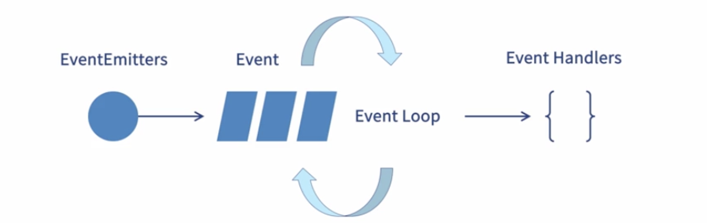
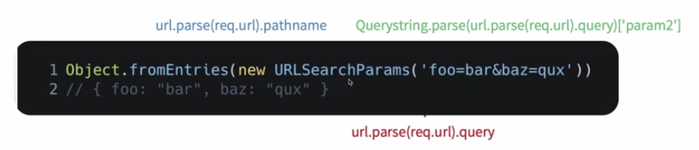
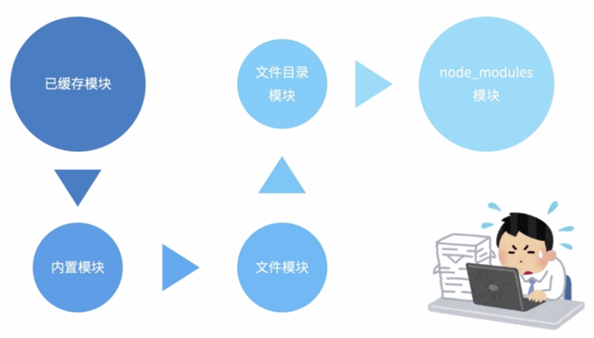
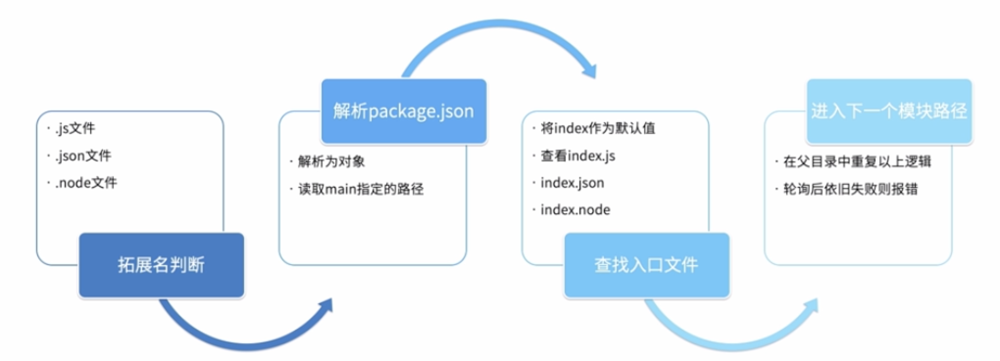
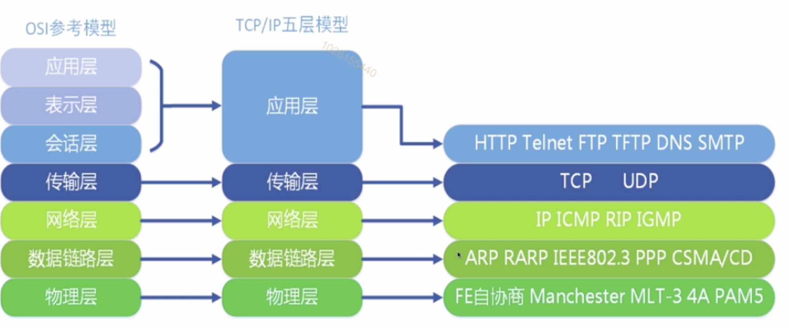
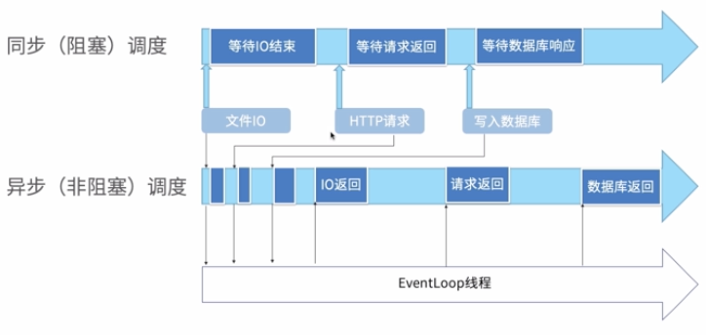

# Node.js提供的原生API
## Node.js提供的数据类型
### Buffer
* buffer一些定义
    - 流式数据（非一次加载完成的数据）由于产生和使用不一定同速，所以需要缓存区
    - 存储需要临时占用大量内存的数据，内存中开辟的一片区域，用于存放二进制数据
    - 流的生产者和消费者之间的速度通常是不一致的，因此需要buffer来暂存一些数据
    - buffer 大小通过 `highWaterMark` 参数指定，默认是 **16kb**


* 创建buffer
流式数据会自动创建Buffer，手动创建Buffer需要谨慎
    - Buffer.from(buffer|array|string) 使用堆外内存新增Buffer
    - Buffer.from(ArrayBuffer) 浅拷贝arrayBuffer，共享内存
    - Buffer.alloc(size) 分配一个指定大小的Buffer，默认填0 使用UTF-8编码
    - Buffer.allocUnsafe(size) 分配一个未初始化的Buffer（速度很快，但存在安全风险）
    
* 创建Buffer-坑
    - 预分配一个内部的大小为Buffer.poolSize(8K)的buffer实例，作为快速分配的内存池
    - 如果allocUnsafe/from(array)的size小于4k，则从预分配的池子中分配
    
    - 绕开V8回收机制，使用专用回收机制，提高性能和内存使用效率
        > 由于 Buffer 需要处理的是大量的二进制数据，假如用一点就向系统去申请，则会造成频繁的向系统申请内存调用，所以 Buffer 所占用的内存不再由 V8 分配，而是在 Node.js 的 C++ 层面完成申请，在 JavaScript 中进行内存分配。因此，这部分内存我们称之为堆外内存。
Buffer类的一个特点是数据占用的内存不是分配在JavaScript VM / V8内存堆中，即这些对象不会被垃圾回收；相反，它会占用一个不会被修改的永久的内存地址(Node的C++层面实现内存的申请)，这避免了因缓冲区内容的内存复制所造成的CPU浪费。Node在内存中使用上应用的是C++层面申请内存、在JavaScript中分配的策略。Node采用了Slab分配机制，Slab是一种动态内存管理机制。
切分缓冲区：var temp = b.slice(1,3);需要注意的是切分缓冲区并没有重新分配内存。所以要小心原始数据对切分后数据的影响，还有就是内存泄露，如果父缓冲区操作结束后会因为子缓冲区而被保留。为了避免这种问题，一般使用copy代替slice：buf.copy(targetBuffer, targetStart(默认为0), sourceStart(默认为0), sourceEnd(默认为buffer.length))
* 使用buffer
    - 转换格式
        + 字符串： 编码Buffer.from(string),解码buf.toString()
        + JSON: buf.toJSON()
    - 剪裁和拼接：
        + 剪裁： Buffer.slice()表现与Array.slice()不同，返回Buffer与原Buf共享内存
        + 拼接： Buf.copy/buf.concat 返回新的Buffer
    - 比较和遍历索引
        + 判断相等： buf1.equals(buf2)比较的是二进制的值
        + 索引buf[index]形式进行索引，for...of/indexOf/includes等Array方法也可以使用


### Stream
* Stream模块提供的是抽象接口，有很多模块实现了这个接口。
* Stream 就是解决生产者和消费者问题的一种方式， 解决异步IO问题
* Stream模块对于流的使用者而言无需关系 readableSrc.pipe(writableDest)
### event/EventEmitter

### Error
* 错误的种类：
    - 标准Javascript错误，如：SyntaxError、ReferenceError等
    - 底层操作触发的系统错误： 比如： 文件的读写
    - 用户自定义错误
    - 异常逻辑触发的AssertionError，通常来自assert模块
* 错误冒泡和捕获
    - 所有通过Node.js或Javascript运行时抛出的错误都是Error实例
    - 大多数异步方法都接收一个callback函数，第一个参数为一个Error对象
    
### URL
* 弃用urlObjects，改用WHATWG URL
* 使用URLSearchParams操作参数


### Node.js全局变量-global
* 看上去像是全局变量的存在，实际上仅存在于模块的作用域中
    > 常见的全局变量有： __dirname, __filename, exports, module, require()
* 从JavaScript继承而来的全局变量
    > console, timer全家桶，global（容器）
* Node.js特有的全局变量
    > Buffer, process, URL, WebAssembly

## Node.js提供的几个工具库
### util 
* 风格转换
    - promisify <==> callbackify、TextEncoder<==>TextDecoder
* 调试工具
    - debuglog、inspect、format、getSystemErrorName
* 类型判断
    - types.isDate(value)
### 断言库
内置断言库，需要配合测试框架使用，主动抛出AssertionError错误
* 断言真假
    - assert(value, msg), match(string, reg)
* 断言等价
    - strictEqual、deepStrictEqual以及相反的操作
* 断言成功失败
    - fail、throws、doesNotThrow、ifError、rejects
    
    
### querystring
官方提供的解析和格式化URL查询字符串的实用工具
* 查询字符串转键值对 
```javascript
querystring.parse(str[, sep[, eq[, options]]])
```
* 键值对转查询字符串 
```javascript
querystring.stringify(obj)
```

### os
os模块提供了与操作系统相关的使用方法和属性（用来进行接口上报监控日志等）
* 通过兼容的方式调用不同平台的底层命令，形成系统快照
    - cpus 、 platform、type、uptime、userInfo
* 定义系统级别的美剧常量
    - 信号常量SIG*、错误常量E*、Window特有WSA*、优先级PRIORITY_*

## Node.js的文件系统能能力
### fs
fs模块模拟Linux环境，提供了用于与文件系统进行交互的API
> 所有文件系统都有同步异步的形式
URI作为特殊的文件也能被fs模块使用
* 操作文件夹
    - mkdir、rmdir
* 操作文件
    - chmod、open、read、write

## Node.js的模块机制-CommonJS

* 模块的引用 通过require(module)来引入module
* 模块定义 通过挂载在module.exports对象上实现定义
* 模块标识 通过路径标识引入的是哪个模块


### 路径分析
* 内置模块
    - 在node进程开始的时候就预加载了
    - 加载的是二进制文件，无需定位和编译
* 文件模块
    - 通过NPM安装的第三方模块
    - 本地模块
* 模块内容
    - 函数、对象或者属性，如函数、数组升值任意类型的js对象
### 模块加载的优先级


### 文件模块定位

### 模块编译执行
* .js文件 通过fs模块同步读取后编译执行，未识别类型也会当做js处理
    - 注入全局变量
        + 以参数的形式，注入module/exports/require方法
        + 同时注入路径解析时候得到的__filename/__dirname
    - 构造上下文执行环境
        + 闭包产生作用域，通过runInThisContext()执行
        - 将function对象挂载到exports对象上，并导出
* .json文件 通过fs模块同步读取后，用JSON.parse()解析并返回结果
* .node文件 这是C/C++写的扩展文件，通过process.dlopen()方法加载最后编译生成
### 加入缓存以及清除缓存
* 核心模块
    - 等级在NativeModule._cache上
* 文件模块 封装后以字符串的形式存储，等待调用
* 清除缓存 通过delete require.cache[require.resolve(module)]
## require vs import
* import
    - ES6的规范
    - 静态加载模块（编译时加载）
    - 编译的时候执行代码
    - 缓存执行结果
    - 按需引入，节省内存
* require
    - commonJs规范
    - 动态加载模块（运行时加载）
    - 调用的时候加载源码
    - 加载全部代码
## Nodejs的网络编程能力

> 在osi模型中没有socket
### Socket
* 实现底层通信，几乎所有的应用层都是通过socket进行通信
    > socket可以看做是数据结构，是网络中节点进行相互通信的门户，网络编程可以看做是socket编程。socket主要用来描述IP地址和端口，可以用来实现不同虚拟机和不同计算机之间的通信
    举例：internet上的一台主机，运行着多个服务软件，每种服务都打开一个socket，并绑定一个端口上，不同端口对应不同服务，socket就像插座，主机就想布满插座的房间，每个插座都对应不同的服务，有的电视节目，有的电影，
    客户端将插头插到不同的插座就能获取到不同的服务
* 对TCP/IP协议进行封装，向应用层协议暴露接口调用
* Http协议通过socket传输协议
* TCP/IP协议族中，传输层存在两种通用的协议：TCP、UDP，这两种协议的不同，是因为不同参数的socket实现过程也不一样
### Node网络基础模块-net/dgram

* net模块是TCP/IP的Node的实现，提供了一些用于底层的网络通信的小工具
* http.Server继承自net.Server
* http客户端和http服务端的通信均依赖于socket(net.Socket)
    - net.Server：TCP server，内部通过socket实现与客户端的通信
    - net.Socket: 本地socket的node版实现，它实现了全双工的stream接口
### net.Socket
* net.Socket是TCP或UNIX Socket的抽象
* net.Socket实例实现了一个双工流接口
* API：
    - 连接相关 connect
    - 数据读写 write
    - 数据属性bufferSize
    - 地址相关 address
    
### http/https/http2
http模块是Node的门脸，是变成Web Server最常见的模块
Server部分继承自net.Server,并对请求和响应数据进行了封装
也提供了request/get的能力，允许想其他服务端发起http请求
Node封装了HTTPS/HTTP2的实现，能轻松创建类Http服务

## node.js的进程管理
> Node.js是一个单线程的程序吗？node.js做耗时计算的时候如何避免阻塞呢？node.js如何实现多进程的开启和关闭呢？node.js可以创建线程吗？怎么做进程守护的呢？
### 操作系统的进程和线程
* 运行任务的程序叫"进程"，一个进程只能执行一个任务
    - 进程是 拥有独立功能的程序在一个程序集上的动态执行的过程，是操作系统进行资源分配和调度的独立单位，是应用程序运行的载体，cpu一个核只能运行一个进程
    - 每个进程都有独立分配内存，相互隔离
* 进程并发： 以多进程的形式，允许多个任务同时允许
* 线程并发： 以多线程形式，允许单个任务分成不同部分进行运行
    - 线程是程序执行中单一程序控制流程，是程序执行流的最小单位
* 操作系统提供协调机制，防止冲突，共享资源
* JavaScript是单线程语言，所以多个任务只能排队进行

## Event Loop

* JavaScript通过EventLoop的形式解决单线程任务调度问题
* EventLoop是一个程序结构，用于等待和发送消息和事件
* 浏览器的Event loop和Node的Event loop是两个概念
## 浏览器的Event loop


## Nodejs的Event loop
[参考文档](事件循环.md)

##Nodejs进程-process
* Process是一个全局对象，无需require直接使用，提供进程描述
* Process对象是EventEmitter的实例，暴露了进程事件的钩子
    - exit 监听进程的退出
    - uncaugthException监听进程的异常
* 提供标准流的输出，对应的是进程的I/O操作
    - node版本的console底层是由stdio实现的
    - 数据流与其他双工数据流不同，同步写会阻塞进程导致性能开销（生产环境打日志会造成性能开销）
### Nodejs进程的创建-child_process/cluster
* child_process 是Nodejs的内置模块
    - spawn 使用返回大连数据，例如图像处理，二进制数据处理
    - exec 使用销量数据，maxBuffer默认值是200* 1024 超出崩溃
    - fork 衍生新的进程，进程间相互独立
* cluster 是nodejs的内置模块
    - Worker对象包含了关于工作进程的所有公共的信息和方法
    - fork：衍生新的进程，进程间相互独立
    - 使用主从模型轮询处理服务的负载任务，通过IPC通信
## 进程守护
* 最佳实践是：该挂就挂，挂了怎么自动启动
* 使用工具实现进程守护 pm2 forever
