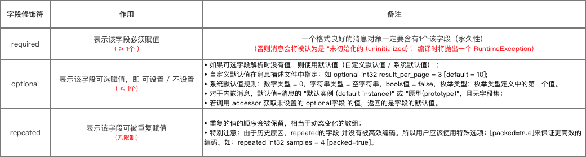
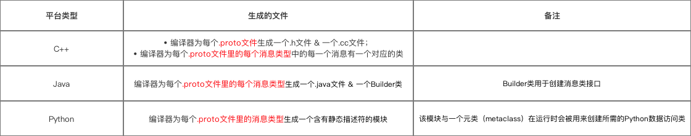

# .proto文件语法详解

```
package protocobuff_Demo;
// 关注1：包名

option java_package = "com.carson.proto";
option java_outer_classname = "Demo";
// 关注2：option选项

// 关注3：消息模型
// 下面详细说明
// 生成 Person 消息对象（包含多个字段，下面详细说明）
message Person {
  required string name = 1;
  required int32 id = 2;
  optional string email = 3;

  enum PhoneType {
    MOBILE = 0;
    HOME = 1;
    WORK = 2;
  }

  message PhoneNumber {
    required string number = 1;
    optional PhoneType type = 2 [default = HOME];
  }

  repeated PhoneNumber phone = 4;
}

message AddressBook {
  repeated Person person = 1;
}
```
## 包名
```package protocobuff_Demo;``` 
* 作用：防止不同 .proto 项目间命名 发生冲突

## Option选项
```
option java_package = "com.carson.proto";
option java_outer_classname = "Demo";
```
作用：影响 特定环境下 的处理方式
```
option java_package = "com.carson.proto";
// 定义：Java包名
// 作用：指定生成的类应该放在什么Java包名下
// 注：如不显式指定，默认包名为：按照应用名称倒序方式进行排序

option java_outer_classname = "Demo";
// 定义：类名
// 作用：生成对应.java 文件的类名（不能跟下面message的类名相同）
// 注：如不显式指定，则默认为把.proto文件名转换为首字母大写来生成
// 如.proto文件名="my_proto.proto"，默认情况下，将使用 "MyProto" 做为类名

option optimize_for = ***;
// 作用：影响 C++  & java 代码的生成
// ***参数如下：
// 1. SPEED (默认):：protocol buffer编译器将通过在消息类型上执行序列化、语法分析及其他通用的操作。（最优方式）
// 2. CODE_SIZE:：编译器将会产生最少量的类，通过共享或基于反射的代码来实现序列化、语法分析及各种其它操作。
  // 特点：采用该方式产生的代码将比SPEED要少很多， 但是效率较低；
  // 使用场景：常用在 包含大量.proto文件 但 不追求效率 的应用中。
//3.  LITE_RUNTIME:：编译器依赖于运行时 核心类库 来生成代码（即采用libprotobuf-lite 替代libprotobuf）。
  // 特点：这种核心类库要比全类库小得多（忽略了 一些描述符及反射 ）；编译器采用该模式产生的方法实现与SPEED模式不相上下，产生的类通过实现 MessageLite接口，但它仅仅是Messager接口的一个子集。
  // 应用场景：移动手机平台应用

option cc_generic_services = false;
option java_generic_services = false;
option py_generic_services = false;
// 作用：定义在C++、java、python中，protocol buffer编译器是否应该 基于服务定义 产生 抽象服务代码（2.3.0版本前该值默认 = true）
// 自2.3.0版本以来，官方认为通过提供 代码生成器插件 来对 RPC实现 更可取，而不是依赖于“抽象”服务

optional repeated int32 samples = 4 [packed=true];
// 如果该选项在一个整型基本类型上被设置为真，则采用更紧凑的编码方式（不会对数值造成损失）
// 在2.3.0版本前，解析器将会忽略 非期望的包装值。因此，它不可能在 不破坏现有框架的兼容性上 而 改变压缩格式。
// 在2.3.0之后，这种改变将是安全的，解析器能够接受上述两种格式。

optional int32 old_field = 6 [deprecated=true];
// 作用：判断该字段是否已经被弃用
// 作用同 在java中的注解@Deprecated
```

## 消息模型
```
// 消息对象用message修饰
message Person {

  required string name = 1;
  required int32 id = 2;
  optional string email = 3;

  enum PhoneType {
    MOBILE = 0;
    HOME = 1;
    WORK = 2;
  }

  message PhoneNumber {
    optional PhoneType type = 2 [default = HOME];
  }

  repeated PhoneNumber phone = 4;
}

message AddressBook {
  repeated Person person = 1;
}
```
* 一个 .proto 消息模型 = 一个 .proto文件 = 消息对象 + 字段
* 一个消息对象（Message） = 一个 结构化数据
* 消息对象（Message）里的 字段 = 结构化数据 里的成员变量


### 消息对象
* 消息对象用 修饰符 `message` 修饰
* 一个`.proto`文件里可以有多个消息对象
    - 应用场景：尽可能将与 某一消息类型 对应的响应消息格式 定义到相同的 .proto文件 中
    - 实例：
        ```
        message SearchRequest {
        
          required string query = 1;
          optional int32 page_number = 2;
          optional int32 result_per_page = 3;
        
        }
        
        // 与SearchRequest消息类型 对应的 响应消息类型SearchResponse
        message SearchResponse {
         …
        }
        ```
* 一个消息对象里可以定义另外一个消息对象（嵌套）
    - 实例
        ```
        message Person {
          required string name = 1;
          required int32 id = 2;
          optional string email = 3;
        
        // 该消息类型 定义在 Person消息类型的内部
        // 即Person消息类型 是 PhoneNumber消息类型的父消息类型
          message PhoneNumber {
            required string number = 1;
          }
        }
        
        <-- 多重嵌套 -->
        message Outer {   // Level 0
          message MiddleAA {  // Level 1
            message Inner {   // Level 2
              required int64 ival = 1;
              optional bool  booly = 2;
            }
          }
        }
        ```

### 字段
消息对象的字段 组成主要是：字段 = 字段修饰符 + 字段类型 +字段名 +标识号

```
message Person {

  // 基本数据类型 字段
  required string name = 1;
  required int32 id = 2;
  optional string email = 3;

  enum PhoneType {
    MOBILE = 0;
    HOME = 1;
    WORK = 2;
  }

  message PhoneNumber {
    optional PhoneType type = 2 [default = HOME];
    // 枚举类型 字段
  }

  repeated PhoneNumber phone = 4;
  // 消息类型 字段
}
```
* 字段修饰符

* 字段类型
    - 基本数据 类型 .proto基本数据类型 对应于 各平台的基本数据类型如下：
    
    - 枚举 类型
        + 作用：为字段指定一个 可能取值的字段集合 该字段只能从 该指定的字段集合里 取值
        ```
        // 枚举类型需要先定义才能进行使用
        
        // 枚举类型 定义
         enum PhoneType {
            MOBILE = 0;
            HOME = 1;
            WORK = 2;
        // 电话类型字段 只能从 这个集合里 取值
          }
        
        // 特别注意：
        // 1. 枚举类型的定义可在一个消息对象的内部或外部
        // 2. 都可以在 同一.proto文件 中的任何消息对象里使用
        // 3. 当枚举类型是在一消息内部定义，希望在 另一个消息中 使用时，需要采用MessageType.EnumType的语法格式
        
          message PhoneNumber {
            required string number = 1;
            optional PhoneType type = 2 [default = HOME];
            // 使用枚举类型的字段（设置了默认值）
          }
        
        // 特别注意：
        // 1.  枚举常量必须在32位整型值的范围内
        // 2. 不推荐在enum中使用负数：因为enum值是使用可变编码方式的，对负数不够高
        ```
    - 消息对象 类型
    
        + 使用 内部消息类型: 先在 消息类型 中定义 其他消息类型 ，然后再使用,即嵌套，需要 用作字段类型的 消息类型 定义在 该消息类型里
        ```
        message Person {
          required string name = 1;
          required int32 id = 2;
          optional string email = 3;
        
        // 该消息类型 定义在 Person消息类型的内部
        // 即Person消息类型 是 PhoneNumber消息类型的父消息类型
          message PhoneNumber {
            required string number = 1;
          }
        
          repeated PhoneNumber phone = 4;
          // 直接使用内部消息类型
        }
        ```
        + 使用 外部消息类型:即外部重用，需要 用作字段类型的消息类型 定义在 该消息类型外部
        ```
        message Person {
          required string name = 1;
          required int32 id = 2;
          optional string email = 3;
        }
        
        message AddressBook {
          repeated Person person = 1;
          // 直接使用了 Person消息类型作为消息字段
        }
        ```
        + 使用 外部消息的内部消息类型
        ```
        message Person {
          required string name = 1;
          required int32 id = 2;
          optional string email = 3;
        
        // PhoneNumber消息类型 是 Person消息类型的内部消息类型
          message PhoneNumber {
            required string number = 1;
            optional PhoneType type = 2 [default = HOME];
          }
        }
        
        // 若父消息类型外部的消息类型需要重用该内部消息类型
        // 需要以 Parent.Type 的形式去使用
        // Parent = 需要使用消息类型的父消息类型，Type = 需要使用的消息类型
        
        // PhoneNumber父消息类型Person 的外部 OtherMessage消息类型 需要使用 PhoneNumber消息类型
        message OtherMessage {
          optional Person.PhoneNumber phonenumber = 1;
        // 以 Parent.Type = Person.PhoneNumber  的形式去使用
        
        }
        ```
        + 使用不同 .proto 文件里的消息类型: 目的：需要在 A.proto文件 使用 B.proto文件里的消息类型
        ```
        import "myproject/other_protos.proto"
        // 在A.proto 文件中添加 B.proto文件路径的导入声明
        // ProtocolBuffer编译器 会在 该目录中 查找需要被导入的 .proto文件
        // 如果不提供参数，编译器就在 其调用的目录下 查找
        ```
        
### 字段名
该字段的名称
### 标识号
作用：通过二进制格式唯一标识每个字段
* 一旦开始使用就不能够再改变
* 标识号使用范围：[1,2的29次方 - 1]
* 不可使用 [19000－19999] 标识号， 因为 Protobuf 协议实现中对这些标识号进行了预留。假若使用，则会报错

* 编码占有内存规则：
    - 范围 [1,15] 标识号的字段 在编码时占用1个字节；
        + 为将来有可能添加的、频繁出现的 消息字段预留 [1,15] 标识号
        + 为频繁出现的 消息字段 保留 [1,15] 的标识号
    - 范围 [16,2047] 标识号的字段 在编码时占用2个字节

## 通过 Protocol Buffer 编译器 编译 .proto 文件
* 作用：将 .proto 文件 转换成 对应平台的代码文件
* Protoco Buffer提供 C++、Java、Python 三种开发语言的 API


### 编译指令说明
```
// 在 终端 输入下列命令进行编译
protoc -I=$SRC_DIR --xxx_out=$DST_DIR   $SRC_DIR/addressbook.proto

// 参数说明
// 1. $SRC_DIR：指定需要编译的.proto文件目录 (如没有提供则使用当前目录)
// 2. --xxx_out：xxx根据需要生成代码的类型进行设置
// 对于 Java ，xxx =  java ，即 -- java_out
// 对于 C++ ，xxx =  cpp ，即 --cpp_out
// 对于 Python，xxx =  python，即 --python_out

// 3. $DST_DIR ：编译后代码生成的目录 (通常设置与$SRC_DIR相同)
// 4. 最后的路径参数：需要编译的.proto 文件的具体路径

// 编译通过后，Protoco Buffer会根据不同平台生成对应的代码文件
```

```
// 编译说明
// 1. 生成Java代码
// 2. 需要编译的.proto文件在桌面，希望编译后生成的代码也放在桌面
protoc -I=/Users/Carson_Ho/Desktop --java_out=/Users/Carson_Ho/Desktop /Users/Carson_Ho/Desktop/Demo.proto

// 编译通过后，Protoco Buffer会按照标准Java风格，生成Java类及目录结构
```
### 编写新的 .proto 编译器
* 需求场景： Protocol Buffer 仅支持 C++、java 和 Python 三种开发语言，一旦超出该三种开发语言，Protocol Buffer将无法使用
* 解决方案：使用 Protocol Buffer 的 Compiler 包 开发出支持其他语言的新的.proto编译器

本文只是作为自我记忆的笔录，摘录自[链接](https://www.jianshu.com/p/e06ba6249edc),读者推荐看原文章
