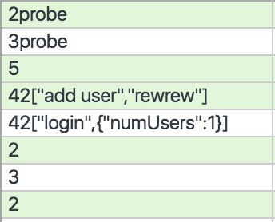
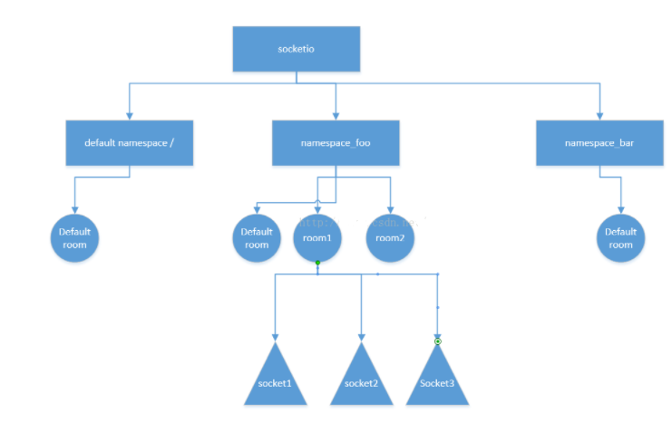

# socket.io
http://socket.io 是基于 WebSocket 的 C-S 实时通信库，我假设题目问的是 http://socket.io 而非 WebSocket 协议的实现。http://socket.io 底层是 http://engine.io，这个库实现了跨平台的双向通信。http://engine.io 使用了 WebSocket 和 XMLHttprequest（或JSONP） 封装了一套自己的 Socket 协议（暂时叫 EIO Socket），在低版本浏览器里面使用长轮询替代 WebSocket。一个完整的 EIO Socket 包括多个 XHR 和 WebSocket 连接.

## 客户端
* 获取sid    
    -sid 是本次 EIO Socket 的会话 ID，因为一次 EIO Socket 包含了多个请求，而后端又会同时连接多个 EIO Socket，sid 的作用就相当于 SESSION ID。
    - 另一个字段 upgrades，正常情况下是 ['websocket']，表示可以把连接方式从长轮询升级到 WebSocket.
    - 前端在发送第一个 XHR 的时候就开始了 XHR 长轮询，这个时候如果有收发数据的需求，是通过长轮询实现的。
        > 所谓长轮询，是指前端发送一个 request，服务端会等到有数据需要返回时再 response. 前端收到 response 后马上发送下一次 request。这样就可以实现双向通信。    
    ```
    http get
    
    request:http://localhost:3007/socket.io/?transport=polling&b64=1&sid
    
    
    response:
    97:0{"sid":"wEnc-Ds06m0oZ1z_AAAM","upgrades":["websocket"],"pingInterval":25000,"pingTimeout":60000}
    
    解析上述信息可以得出sid
    解析的流程是
    1.读出第一个:的位置 前面的字符串转成int值 就是从:开始后数据结尾的长度
    2.得到json格式的数据体
    3.获取相关值 sid   upgrades  pingInterval pingTimeout
    ```


* 创建ws连接
    - 前端收到握手的 upgrades 后，EIO 会检测浏览器是否支持 WebSocket，如果支持，就会启动一个 WebSocket 连接，然后通过这个 WebSocket 往服务器发一条内容为 probe, 类型为 ping 的数据。如果这时服务器返回了内容为 probe, 类型为 pong 的数据，前端就会把前面建立的 HTTP 长轮询停掉，后面只使用 WebSocket 通道进行收发数据。EIO Socket 生命周期内，会间隔一段时间 ping - pong 一次，用来测试网络是否正常

    ```
    连接格式:ws://localhost:3007/socket.io/?transport=websocket&sid={sid}
    sid的值就是之前获取的sid
    ```
* 发送http的Ping 直到ws连接成功
    > EIO Socket 通过一个 XHR (XMLHttprequest) 握手。前端发送一个 XHR，告诉服务端我要开始 XHR 长轮询了。后端返回的数据里面包括一个 open 标志(数字 0 表示), 以及一个 sid 和 upgrades 字段。
```
http get
  request:http://localhost:3007/socket.io/?transport=polling&b64=1&sid={sid}

  response:
  返回些数据
```
* ws连接成功后
    - 首先发送2probe的textframe过去 服务端应答一个3probe的textframe 这样与socketio服务端的连接就算完成建立了
    - 这是 WebSocket 帧的结构，绿色是发送，白色是接收。前面的数字是数据包类型，2 是 ping, 3 是 pong, 4 是 message.


### 前端简单实例代码
```javascript
import io from 'socket.io-client'
// 指定连接服务器的地址
io('http://localhost:3333')
io.on('connection', socket => {
      // socket.io-client连接成功

      socket.on('data', data => {
        // 接收服务端回传的消息
      })
      socket.emit('data', () => {
        // 发送消息到服务端
      })
      socket.on('disconnect', () => {
        // socket连接失败
      })
    })
```

## 服务端
http://socket.io 服务启动时，会先启动一个 ws 服务。http://socket.io 会监听 HTTP 服务器的 upgrade 和 request 事件。
当 upgrade 事件触发时，说明可能是 WebSocket 握手，先简单校验下，然后把请求交给 ws 服务进行处理，拿到 WebSocket 对象。
当 request 事件触发时，根据 url 路径判断是不是 http://socket.io 的 XHR 请求，拿到 res 和 res 对象。这样就可以正确接收和返回客户端数据了，具体处理过程和前端部分是对应的

### Node 简单实例代码
```javascript
const Koa = require('koa')
const app = new Koa()
const server = require('http')(app.callback())
const io = require('socket.io')(server)
io.on('connection', socket => {
  // sock.io连接成功
  
    // socket:单线连接
  socket.emit('data', () => {
    // 单线发送消息
  })
  socket.on('data', data => {
    // 接收消息
  })
  socket.on('disconnect', () => {
    // socket连接失败
  })
  io.emit('broadcast', () => {
    // 全部进行广播，发送消息
  })
})
server.listen(3333, () => {
    console.log('sever is running %d', 3333)
})
```

### room和namespace

* 使用场景
    - 服务端发送的消息有分类，不同的客户端需要接收的分类不同
    - 服务端并不需要对所有的客户端都发送消息，只需要针对某个特定群体发送消息

#### namespace
* 服务端
```
    io.of("/post").on("connection", function(socket) {
        socket.emit("new message", { mess: `这是post的命名空间` });
    });

    io.of("/get").on("connection", function(socket) {
        socket.emit("new message", { mess: `这是get的命名空间` });
    });
```
* 客户端
  
```
    // index.js
    const socket = io("ws://0.0.0.0:****/post");
    socket.on("new message", function(data) {
        console.log('index',data);
    }

    //message.js
    const socket = io("ws://0.0.0.0:****/get");
    socket.on("new message", function(data) {
        console.log('message',data);
    }
```

#### room
* 服务端
```
    io.sockets.on('connection',function(socket){
        //提交者会被排除在外（即不会收到消息）
        socket.broadcast.to('room one').emit('new messages', data);
        // 向所有用户发送消息
        io.sockets.to(data).emit("recive message", "hello,房间中的用户");     
    }
```
* 客户端
```
    //可用于客户端进入房间;
    socket.join('room one');
    //用于离开房间;
    socket.leave('room one');
```


**参考文档1[大专栏](https://www.dazhuanlan.com/2020/02/03/5e379573d17f3/)**
**参考文档2[知乎](https://www.zhihu.com/question/31965911)**
**参考文档2[简书](https://www.jianshu.com/p/f62cd8b72ab2)**
