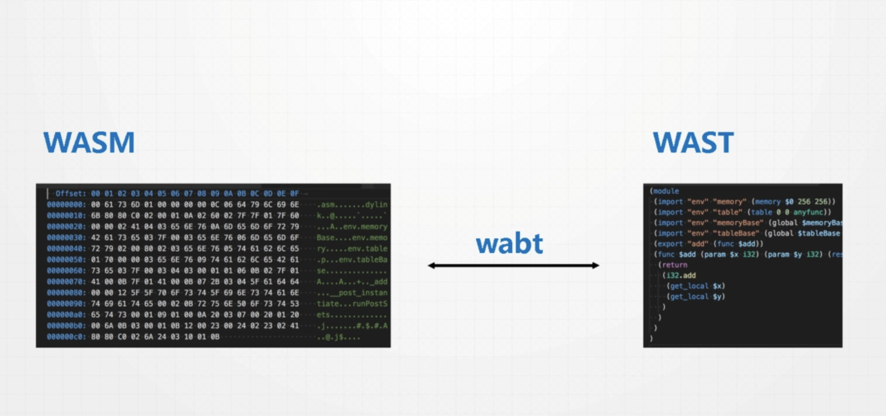

# webAssembly
## webAssembly 概念
WebAssembly 是一种可以使用非 JavaScript 编程语言编写代码并且能在浏览器上运行的技术方案。
WebAssembly 是由主流浏览器厂商组成的 W3C 社区团体 制定的一个新的规范。

## webAssembly的特点
* 高效
    > WebAssembly 有一套完整的语义，实际上 wasm 是体积小且加载快的二进制格式， 其目标就是充分发挥硬件能力以达到原生执行效率
* 安全
    > WebAssembly 运行在一个沙箱化的执行环境中，甚至可以在现有的 JavaScript 虚拟机中实现。在web环境中，WebAssembly将会严格遵守同源策略以及浏览器安全策略。
* 开放
    > WebAssembly 设计了一个非常规整的文本格式用来、调试、测试、实验、优化、学习、教学或者编写程序。可以以这种文本格式在web页面上查看wasm模块的源码。
* 标准
    > WebAssembly 在 web 中被设计成无版本、特性可测试、向后兼容的。WebAssembly 可以被 JavaScript 调用，进入 JavaScript 上下文，也可以像 Web API 一样调用浏览器的功能。当然，WebAssembly 不仅可以运行在浏览器上，也可以运行在非web环境下。

## webAssembly发展的前因后果
[点击了解详细内容](https://www.zhihu.com/question/31415286)

[点击了解JavaScript编译过程及webAssembly的编译过程](https://www.jianshu.com/p/bff8aa23fe4d)

总结：
* 第一阶段：javaScript产生之初是一门解释型语言-----慢
* 第二阶段：Google在2009年在v8引入JIT技术（即时编译）（[JIT的理解参考](https://blog.csdn.net/sunboylife/article/details/88564369)）
    > JIT 遇到的问题是类型不确定问题和有一些语言功能，比如异常，for in 
* 第三阶段：为解决上面的问题，有了以下两个解决方案：
    - Typescript, Dart, JSX --- 强类型语言，编译成Javascript继续运行（让JIT (即时编译) 快一点）
    - 火狐的 Asm.js  javascript 子集， 同时试图利用标注的方法，加上变量类型（直接编译）
* 第四阶段：更为激进的Web Assembly ----- 允许任何语言编译到它制定的AST tree

## webAssembly的应用场景
> 定义一个可移植，体积紧凑，加载迅速的二进制格式为编译目标，而此二进制格式文件将可以在各种平台（包括移动设备和物联网设备）上被编译，然后发挥通用的硬件性能以原生应用的速度运行。
* 前端应用
* node.js （[参考](https://ppt.baomitu.com/d/ff574384#/11)）
    - 并行编程
    - 前后端共享wasm
    - AssemblyScript
* 网页游戏
* 线上工具 如web版本的Photoshop

## webAssembly 在js代码的运行
> WebAssembly是在Web上运行代码的新途径。使用它，你可以使用C/C++编写一些模块，并在浏览器上运行
目前，模块不能自动运行。随着ES模块的发展，浏览器逐步开始支持ES模块。WebAssembly 模块将会像加载 ES 模块一样被加载。比如：`<script type="module">`。
不过现在，你需要使用 JavaScript 来加载运行 WebAssembly 模块。首先创建一个 WebAssembly 模块的实例。然后，JavaScript 可以调用 WebAssembly 实例上的方法。

* 加载js文件，执行js文件的时候由js的语句异步加载.wasm文件（webAssembly）
    > 如果想在您的页面里上添加 WebAssembly，您需要将您的代码编译成 .wasm 文件。
    

* WebAssembly 的迅速转换成目标机器的汇编代码。


## 编译代码成WebAssembly文件
当前对 WebAssembly 支持最多的编译器工具链称是 LLVM。有许多不同的“前端”和“后端”可以插入到 [LLVM](https://www.jianshu.com/p/1367dad95445) 中。
不管你使用的什么工具链，最终的结果都应该是以 `.wasm`结尾的文件
* [emscripten](https://www.jianshu.com/p/d6b268634e46)
    ```
    C/C++   ->  LLVM        -> asm.js
            ->  binaryen    -> .wasm
    ```
    
    [参考](https://ppt.baomitu.com/d/ff574384#/6)
    - [LLVM](https://www.jianshu.com/p/1367dad95445)
        ```
        source code -> IR -> target code
        ```
    - binaryen
        ```
        LLVM ast /asm.js -> wasm
        ```
    - wabt
        ```
        wast <-> wasm
        ```
        

## WebAssembly的一些概念

### WebAssembly与JavaScript的交互流程
[查看此博客了解详细](https://www.zcfy.cc/article/creating-a-webassembly-module-instance-with-javascript-x2605-mozilla-hacks-8211-the-web-developer-blog)

### 我们主要用的几个方法

* WebAssembly.compile()
    > WebAssembly.compile() 方法编译WebAssembly二进制代码到一个WebAssembly.Module 对象。如果在实例化之前有必要去编译一个模块，那么这个方法是有用的（否则，将会使用WebAssembly.instantiate() 方法）
    - 参数
        + bufferSource 一个包含你想编译的wasm模块二进制代码的 typed array(类型数组) or ArrayBuffer(数组缓冲区)
    - 返回值
        + 一个解析为 WebAssembly.Module 的Promise 对象。
    - 异常
        + 如果 bufferSource 不是一个 typed array, 将抛出一个 TypeError
        + 如果编译失败 promise 将会 reject 一个 WebAssembly.CompileError
    ```
    // index.js
    var worker = new Worker("wasm_worker.js");
    
    fetch('simple.wasm').then(response =>
      response.arrayBuffer()
    ).then(bytes =>
      WebAssembly.compile(bytes)
    ).then(mod =>
      worker.postMessage(mod)
    );
    ```

* WebAssembly.compileStreaming()

    > WebAssembly.compileStreaming() 方法用来从一个流式源中直接编译一个 WebAssembly.Module。当模块需要在被实例化前被编译时，这个方法会很有用。如果要从流式源实例化一个模块应采用 WebAssembly.instantiateStreaming() 方法。
    
     - 参数
            + source 一个 Response 对象或一个会履行（fulfill）它的 promise，用来表示你想编译的 .wasm 模块的流式源。
        - 返回值
            + 一个会被解决（resolve）为编译后的 WebAssembly.Module 对象的 Promise。
        - 异常
            + 如果 bufferSource 不是一个 typed array, 将抛出一个 TypeError
            + 如果编译失败 promise 将会 reject 一个 WebAssembly.CompileError
    
    ```javascript
    var importObject = { imports: { imported_func: arg => console.log(arg) } };
    
    WebAssembly.compileStreaming(fetch('simple.wasm'))
    .then(module => WebAssembly.instantiate(module, importObject))
    .then(instance => instance.exports.exported_func());
    ```

* WebAssembly.instantiate()
WebAssembly.instantiate() 允许你编译和实例化 WebAssembly 代码. 这个方法有两个重载方式:
    - 第一种主要重载方式使用WebAssembly二进制代码的 typed array 或ArrayBuffer形，一并进行编译和实例化。返回的 Promise 会携带已编译的 WebAssembly.Module 和它的第一个实例化对象 WebAssembly.Instance.
    ```
    var importObject = {
      imports: {
        imported_func: function(arg) {
          console.log(arg);
        }
      },
      env: {
        abort: () => {},
      },
    };
    
    /* 2019-08-03：importObject必须存在env对象以及env对象的abort方法 */
    
    fetch('simple.wasm').then(response =>
      response.arrayBuffer()
    ).then(bytes =>
      WebAssembly.instantiate(bytes, importObject)
    ).then(result =>
      result.instance.exports
    );
    ```
    - 第二种重载使用已编译的 WebAssembly.Module , 返回的 Promise 携带一个 Module的实例化对象 Instance. 如果这个 Module 已经被编译了或者是从缓存中获取的( retrieved from cache), 那么这种重载方式是非常有用的.

    ```javascript
    // wasm_worker.js
    var importObject = {
      imports: {
        imported_func: function(arg) {
          console.log(arg);
        }
      }
    };
    
    onmessage = function(e) {
      console.log('module received from main thread');
      var mod = e.data;
    
      WebAssembly.instantiate(mod, importObject).then(function(instance) {
        instance.exports.exported_func();
      });
    
      var exports = WebAssembly.Module.exports(mod);
      console.log(exports[0]);
    };
    ```
    > 重要: 此方法不是获取(fetch)和实例化wasm模块的最具效率方法。 如果可能的话，您应该改用较新的WebAssembly.instantiateStreaming()方法，该方法直接从原始字节码中直接获取，编译和实例化模块，因此不需要转换为ArrayBuffer。

* WebAssembly.instantiateStreaming()
WebAssembly.instantiateStreaming() 方法直接从流式底层源编译和实例化WebAssembly模块。这是加载wasm代码一种非常有效的优化方式。
    - 参数
        + soure 一个Response对象 或 一个可以履行（fulfill）一个（Response）的 Promise，表示你想要传输、编译和实例化的 .wasm 模块基础源。
        + importObject 包含一些想要导入到新创建Instance中值的对象，例如方法 或  WebAssembly.Memory 对象。每个已编译模块的声明导入必须有一个匹配属性，否则抛出 WebAssembly.LinkError 异常。
    - 返回值
        + 一个 Promise ，通过resolve返回一个包含两个属性的 ResultObject ：
            - module: WebAssembly.Module 对象表示编译完成的WebAssembly模块. 这个Module能够再次被实例化 或 通过postMessage()共享。
            -  instance: WebAssembly.Instance 对象包含WebAssembly所有公开方法 Exported WebAssembly functions.

    ```javascript
    var importObject = { imports: { imported_func: arg => console.log(arg) } };
    
    WebAssembly.instantiateStreaming(fetch('simple.wasm'), importObject)
    .then(obj => obj.instance.exports.exported_func());
    ```
* WebAssembly.validate()
WebAssembly.validate() 方法用于验证包含 WebAssembly 二进制码的一个 typed array 是否合法，返回 true 如果这些字节能构成一个合法的 wasm 模块，否则返回 false。

    ```javascript
    fetch('simple.wasm').then(response =>
      response.arrayBuffer()
    ).then(function(bytes) {
      var valid = WebAssembly.validate(bytes);
      console.log("The given bytes are "
        + (valid ? "" : "not ") + "a valid wasm module");
    });
    ```

### Module
对象包含已经由浏览器编译的无状态 WebAssembly 代码，可以高效地与 Workers 共享、缓存在 IndexedDB 中，和多次实例化。
> <font color=red>重要提示：由于大型模块的编译可能很消耗资源，开发人员只有在绝对需要同步编译时，才使用 `Module()` 构造函数；其他情况下，应该使用异步 WebAssembly.compile() 方法。</font>
* WebAssembly.Module

```javascript
/**
* 示例一个Modal对象
* @param bufferSource 一个 类型化数组 或 `ArrayBuffer`，包含要编译的 .wasm 模块的二进制代码
* @return myModule 一个解析为WebAssembly.Module的**Promise** 对象
* @error 1. 如果 `bufferSource` 不是一个 `typed array`, 将抛出一个 `TypeError` \n 2. 如果编译失败 promise 将会 reject 一个 `WebAssembly.CompileError`
* */
var module = new WebAssembly.Module(bufferSource);

/**
* Module构造函数的方法属性customSections
* 给定 Module 对象和字符串，通过该字符串，返回 Module 对象中所有自定义部分的内容的副本
* @param module Module实例对象
* @param sectionName 给module绑定的名称
* */
WebAssembly.Module.customSections(module, 'sectionName');

/**
* Module构造函数的方法属性exports和imports
* 返回一个数组，其中包含给定Module的所有声明的导出的描述。
* @param module Module实例对象
* @return {Array}
* */
var custSec = WebAssembly.Module.exports(module);
var custSec = WebAssembly.Module.imports(module); // 似乎该方法会废除
```
````
// imports 完整示例
fetch('simple.wasm').then(response =>
  response.arrayBuffer()
).then(bytes =>
  WebAssembly.compile(bytes)
).then(function(mod) {
  var imports = WebAssembly.Module.imports(mod);
  console.log(imports[0]);
});
````

### WebAssembly.Instance

* WebAssembly.Instance() 构造函数以同步方式实例化一个WebAssembly.Module 对象. 然而, 通常获取实例的方法是通过异步函数WebAssembly.instantiate()

```javascript
/**
* 
* @param module 一个Module实例对象
* @param importObject 一个Module实例对象 一个包含值的对象,导入到新创建的 实例, 比如函数或 WebAssembly.Memory 对象
*                     如果importObject参数不是undefined的并且Type（importObject）不是Object，则抛出TypeError。如果module.imports列表不为空，并且Type（importObject）不是Object，则引发TypeError。
* @return myModule 一个解析为WebAssembly.Instance**Promise** 对象
* @error 1. 如果 `bufferSource` 不是一个 `typed array`, 将抛出一个 `TypeError` \n 2. 如果编译失败 promise 将会 reject 一个 `WebAssembly.CompileError`
* */
var myInstance = new WebAssembly.Instance(module, importObject);

```
### WebAssembly.Global
WebAssembly.Global 对象表示一个全局变量实例, 可以被JavaScript 和importable/exportable 访问 ,跨越一个或多个WebAssembly.Module 实例. 他允许被多个modules动态连接.
* 参数 
    - descriptor {value, mutable}
        + value: A USVString 表示全局变量的数据类型. 可以是i32, i64, f32, 或 f64.
        + mutable: 布尔值决定是否可以修改. 默认是 false.
    ```javascript
    const output = document.getElementById('output');
    
    function assertEq(msg, got, expected) {
        output.innerHTML += `Testing ${msg}: `;
        if (got !== expected)
            output.innerHTML += `FAIL!<br>Got: ${got}<br>Expected: ${expected}<br>`;
        else
            output.innerHTML += `SUCCESS! Got: ${got}<br>`;
    }
    
    assertEq("WebAssembly.Global exists", typeof WebAssembly.Global, "function");
    
    const global = new WebAssembly.Global({value:'i32', mutable:true}, 0);
    
    WebAssembly.instantiateStreaming(fetch('global.wasm'), { js: { global } })
    .then(({instance}) => {
        assertEq("getting initial value from wasm", instance.exports.getGlobal(), 0);
        global.value = 42;
        assertEq("getting JS-updated value from wasm", instance.exports.getGlobal(), 42);
        instance.exports.incGlobal();
        assertEq("getting wasm-updated value from JS", global.value, 43);
    });
    ```

### WebAssembly.Memory
WebAssembly.Memory() 构造函数创建一个新的 Memory 对象。该对象的 buffer 属性是一个可调整大小的 ArrayBuffer ，其内存储的是 WebAssembly 实例 所访问内存的原始字节码。
从 JavaScript 或 WebAssembly 中所创建的内存，可以由 JavaScript 或 WebAssembly 来访问及更改。

[推荐这篇博客对Memory的具体解释，非常形象](https://www.zcfy.cc/article/memory-in-webassembly-and-why-it-s-safer-than-you-think-x2605-mozilla-hacks-8211-the-web-developer-blog)

### WebAssembly.Ajax
WebAssembly.Ajax() 构造函数根据给定的大小和元素类型创建一个Table对象。 
这是一个包装了WebAssemble Ajax 的Javascript包装对象，具有类数组结构，存储了多个函数引用。在Javascript或者WebAssemble中创建Table 对象可以同时被Javascript或WebAssemble 访问和更改。
[推荐这篇博客对Table的具体解释，非常形象](https://www.zcfy.cc/article/webassembly-table-imports-what-are-they-x2605-mozilla-hacks-8211-the-web-developer-blog)
