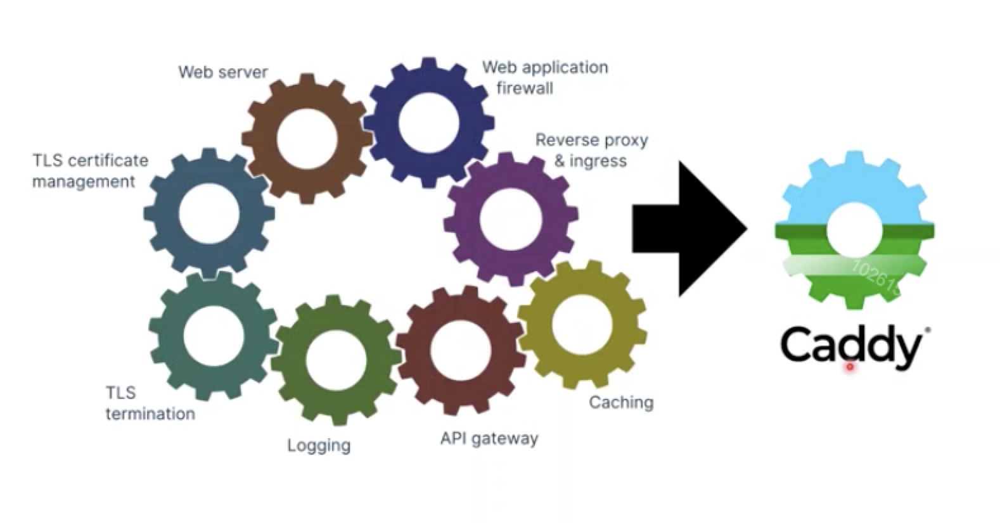
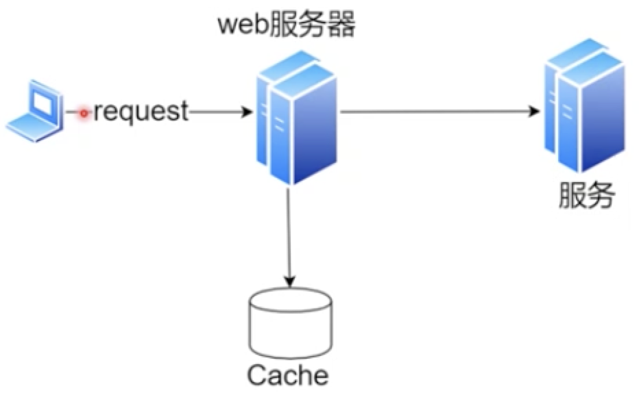

# web服务器与caddy

## web服务器

web服务器需要哪些能力？以caddy为例：

* web server
用户发送请求，server返回网页 最核心的基础能力

* 代理（proxy）

    + 正向代理
        > 走的是http服务
         正向代理，当客户端无法访问外部资源的时候（由于诸如墙这样的原因），可以通过一个正向代理去间接地访问，所以客户端需要配置代理服务器的ip。
        正向代理是一个位于客户端和原始服务器(origin server)之间的服务器，为了从原始服务器取得内容，客户端向代理发送一个请求并指定目标(原始服务器)，然后代理向原始服务器转交请求并将获得的内容返回给客户端。客户端必须要进行一些特别的设置才能使用正向代理
    
    + 反向代理
        > 不一定是http服务，web服务器可以看做一个负载均衡服务器或者中间的服务器，客户端请求发到代理服务器，代理服务器再请求真正有服务的服务器，真正的服务返回数据给代理服务器，代理服务器再返回数据给客户端
        反向代理，客户端是无感知代理的存在，以代理服务器来接受internet上的连接请求，然后将请求转发给内部网络上的服务器，并将从服务器上得到的结果返回给internet上请求连接的客户端。
        - 保证内网的安全，公网作为访问地址，web服务器谁内网    
        - 负载均衡
* 缓存（cache）

web服务器尽可能让客户端的请求直接返回回去，通常体现在一些不常变化的接口或者数据

如果请求量很大，数据变化非常小，name缓存通常使用本机内存。内存不是最快的，cpu缓存更快，[CPUL1/L2/L3](https://baijiahao.baidu.com/s?id=1598811284058671259&wfr=spider&for=pc)之间的速度也有区别。如果能合理利用CPU缓存则能处理大的并发量，如果合理利用内存，则可以处理不小的并发量

还有一种情况，缓存也是存在服务器上，web服务器从缓存服务器上获取到数据后返回给客户端，这个速率不能低于web服务器固态硬盘SSD的获取速度，如果低于则没必要做这种缓存

> 缓存 有数据不一致的问题。并且如果缓存不一致的时候谁来更新缓存这些都需要合理设置

* 日志（logging）
所有请求都走web服务器，所以web服务器是获取日志最合适的节点，如果不在web服务器获取日志，而是在各种终端服务器获取日志的话需要存在各自的服务上，那么日志的收集，分析等

    + access_log: 用户访问产生的日志（访问时间、访问网址、ua、ip等等）
    + error_log： 错误日志
    
访问日志和错误日志都可以做报警。比如访问日志突然上升，产生一个大的波动，那么可能就是后面的服务挂了，用户在刷新页面等
