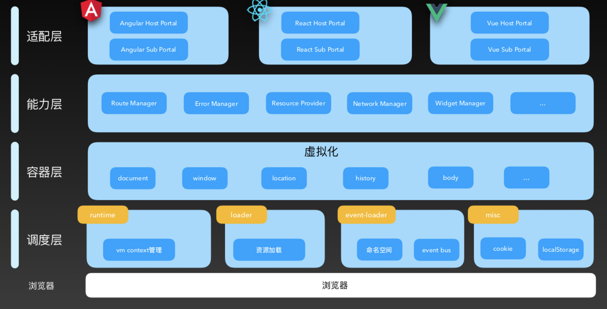
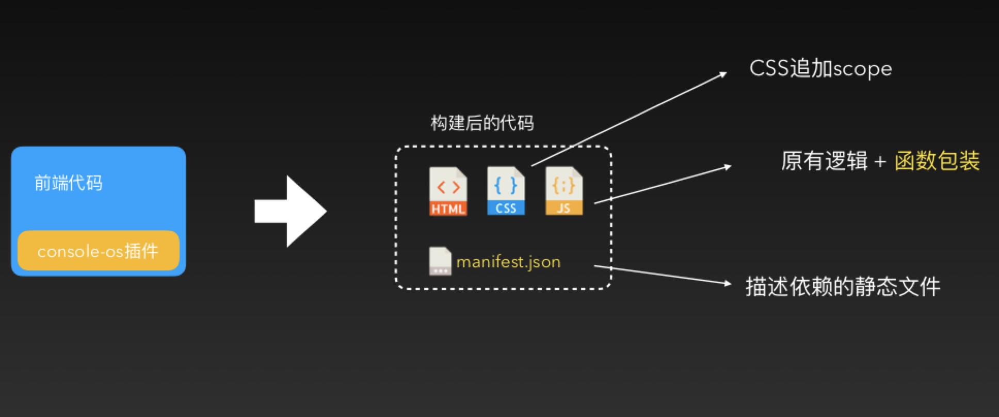
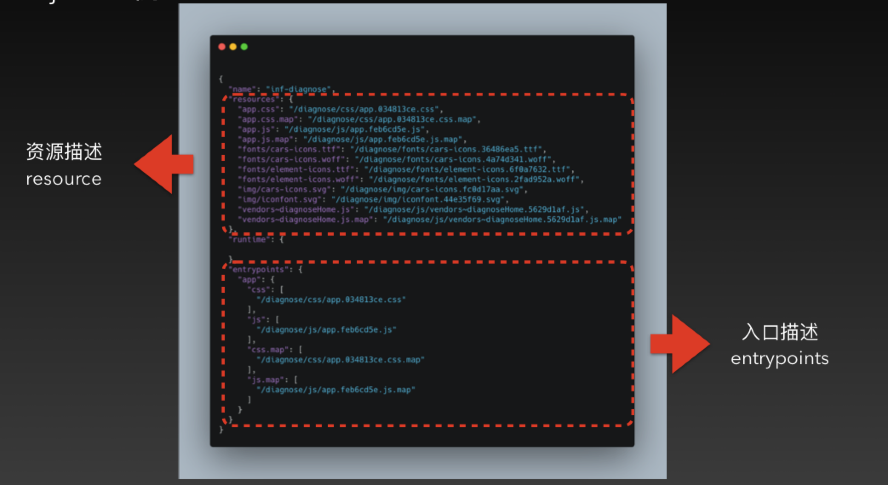
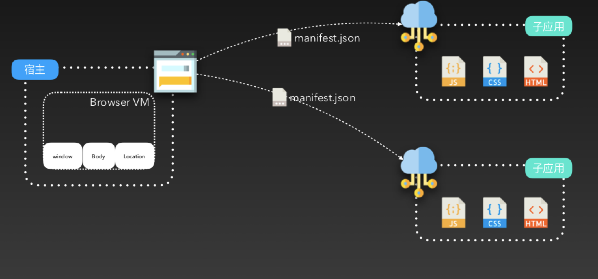
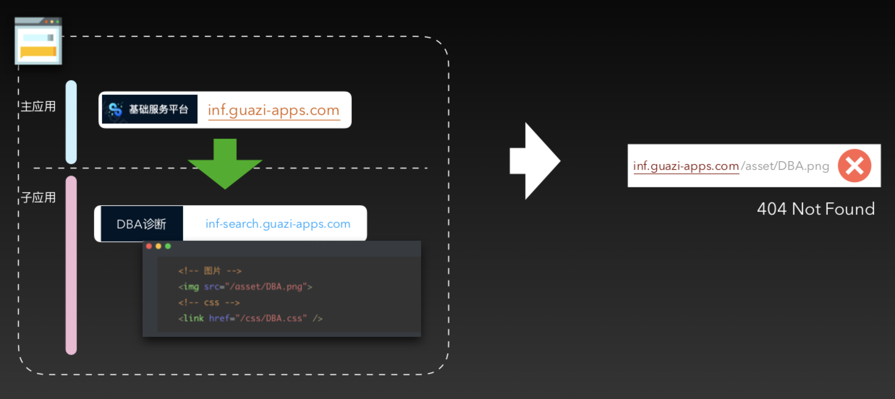
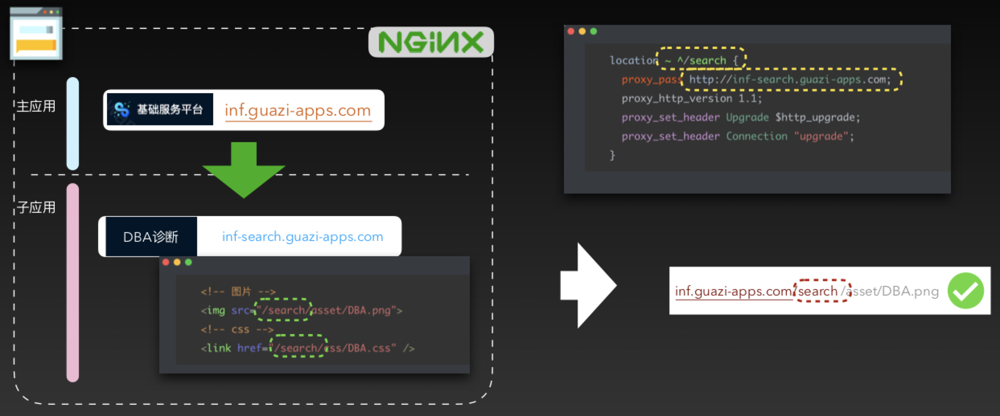

# 微前端

## 概念
微前端是一种类似于微服务的架构，它将微服务的理念应用于浏览器端，即将单页面前端应用由单一的单体应用转变为多个小型前端应用聚合为一的应用。各个前端应用还可以独立开发、独立部署。同时，它们也可以在共享组件的同时进行并行开发——这些组件可以通过 NPM 或者 Git Tag、Git Submodule 来管理。

## 为什么需要微前端

* 空间分离带来的协作问题(巨石应用)
    - 工程越来越大，打包越来越慢
    - 团队人员多，产品功能复杂，代码冲突频繁、影响面大
    - 内心想做 SaaS 产品，但客户总是要做定制化
        > SaaS是Software-as-a-Service（软件即服务）的简称，随着互联网技术的发展和应用软件的成熟， 在21世纪开始兴起的一种完全创新的软件应用模式。它与“on-demand software”，the application service provider(ASP，应用服务提供商)，hosted software(托管软件)所具有相似的含义。它是一种通过Internet提供软件的模式，厂商将应用软件统一部署在自己的服务器上，客户可以根据自己实际需求，通过互联网向厂商定购所需的应用软件服务，按定购的服务多少和时间长短向厂商支付费用，并通过互联网获得厂商提供的服务。用户不用再购买软件，而改用向提供商租用基于Web的软件，来管理企业经营活动，且无需对软件进行维护，服务提供商会全权管理和维护软件，软件厂商在向客户提供互联网应用的同时，也提供软件的离线操作和本地数据存储，让用户随时随地都可以使用其定购的软件和服务。对于许多小型企业来说，SaaS是采用先进技术的最好途径，它消除了企业购买、构建和维护基础设施和应用程序的需要。
* 时间延续带来的升级维护
    > 几乎是所有年龄超过 3 年的 web 应用都会存在的问题
    
## 微前端核心价值（阿里大牛提出来的，个人觉得得看微前端实现的前提是什么，如果是重构整体架构的话）
> [参考](https://zhuanlan.zhihu.com/p/95085796)
* 技术栈无关
    > 应用之间不应该有任何直接或间接的技术栈、依赖、以及实现上的耦合。比如我们不能要求子应用、主应用必须使用某一版本的技术栈实现。
    
    > 正确的微前端方案的目标应该是：方案上跟使用 iframe 做微前端一样简单，同时又解决了 iframe 带来的各种体验上的问题。
    
    > 理想状态下，以此为目标的微前端应用，是自动具备流通能力的，且这个流通能力不会因为主应用的实现升级而丧失（也就是说在 19 年能接入主应用的微前端应用，到了 2025 年也应该能正常接入正常运行，并同样保有在不同主应用间流通的能力）。           
* 优势
    - 独立版本控制和独立部署
    - 大型单页应用的无限扩展
    - 不限技术栈
    - 业务场景的任意拼接
    - 多团队的协作
* 劣势
    - 体验有折损（异步加载子应用）
    - 维护成本高
    - 技术复杂度高（主应用）
    - 开发体验不够友好（父子应用联调）
    - 粒度不宜太小
## 微前端实现方案
[引用](https://tech.meituan.com/2020/02/27/meituan-waimai-micro-frontends-practice.html)
*****
[参考](https://baijiahao.baidu.com/s?id=1638313846156942854&wfr=spider&for=pc)
*****
* NPM式：子工程以NPM包的形式发布源码；打包构建发布还是由基座工程管理，打包时集成。
* iframe式：子工程可以使用不同技术栈；子工程之间完全独立，无任何依赖；基座工程和子工程需要建立通信机制；无单页应用体验；路由地址管理困难。
* 通用中心路由基座式：子工程可以使用不同技术栈；子工程之间完全独立，无任何依赖；统一由基座工程进行管理，按照DOM节点的注册、挂载、卸载来完成。
* 特定中心路由基座式：子业务线之间使用相同技术栈；基座工程和子工程可以单独开发单独部署；子工程有能力复用基座工程的公共基建。

|方案|技术栈是否统一|单独打包|单独部署|打包部署速度|单页应用体验|子工程切换速度|工程间通信难度|现有工程侵入性|学习成本|示例|
| ------ | --- |-------- | ------| --------- | -------- | ---------- | ---------- | ---------- | ----- | --- |
| NPM式 | Y（不强制）| N|N|慢|Y|快|正常|高|高| |
| iframe式 | Y（不强制）| Y|Y|正常|N|慢|高|高|低| |
| 通用中心路由基座式 | Y（不强制）| Y|Y|慢|Y|快|高|高|高| |
| 特定中心路由基座式 | Y（强制）| Y|Y|快|Y|快|正常|低|低|[美团实现具体方案](https://tech.meituan.com/2020/02/27/meituan-waimai-micro-frontends-practice.html) |

## 另外的一些方案
* 应用组件化。借助于 Web Components 技术，来构建跨框架的前端应用。[文档](https://developer.mozilla.org/en-US/docs/Web/Web_Components)
    > Web Components 是一套不同的技术，允许您创建可重用的定制元素（它们的功能封装在您的代码之外）并且在您的 Web 应用中使用它们。   
    
        - Custom elements，允许开发者创建自定义的元素，诸如 <today-news></today-news>。
        - Shadow DOM，即影子 DOM，通常是将 Shadow DOM 附加到主文档 DOM 中，并可以控制其关联的功能。而这个 Shadow DOM 则是不能直接用其它主文档 DOM 来控制的。
        - HTML templates，即 <template> 和 <slot> 元素，用于编写不在页面中显示的标记模板。
        - HTML Imports，用于引入自定义组件。
    > 缺点：浏览器兼容性不好
## iframe、中心路由基座式

|  | iframe | 中心路由基座式 |
| --- | --- | --- | 
| 体验 | Url不同步，导致访问路径的缺失 | 父子应用有同步URL机制 |
| 性能问题 | 慢，主应用Load事件触发滞后 | 异步加载应用会耗时、但是有优化空间 |
| 样式隔离 | 完全隔离， DOM结构无法共享 | 隔离，可共享DOM |
| JS隔离 | 完全隔离， 上下文不能共享 | 隔离， 可共享 | 

## 微前端需要考虑的功能点
* 基座模式 通过一个主应用，来管理其它应用。设计难度小，方便实践，但是通用度低。
    - 子系统应用注册
    - 路由
    - 全局数据管理中心
* 自组织模式 应用之间是平等的，不存在相互管理的模式。设计难度大，不方便实施，但是通用度高。


## 微前端在基础平台的探索
* 基础平台的痛点：
    - 存量平台多 功能分散
    - 产品形态问题：例子：用户想看一个数据分析表，要找人在权限应用开权限，再在另外的应用查询和验证，最后到另外的报表查询和制作，呈现给用户的工具是独立的多个工具，使用繁琐
    - 技术问题
        + 技术选型发散、维护成本高
        + 对接团队多 版本控制难以把握
* 基础平台的最终形态：
    - 用户角度：
        + 化整为零，功能集中、平台化
    - 开发者角度
        + 化整为零 分制管理、独立部署

## 微前端框架对比

|  | qiankun | Console-OS(Alfa) |
| --- | --- | --- | 
| 背景 | umi开发、star 7.5k+| aliyun cloud开发、star 300+ |
| 子应用 | export 生命周期 | 利用portal来替换原有的instance |
| 主应用 | 维护成本高 | 维护成本高 |
| 文档 | 文档较少 | 文档少、可以直接联系做着 | 
| 应用场景 | 飞猪 | 阿里云 | 

## 微前端的原理
* ConsoleOS架构

### 前端沙盒
* JS隔离
    - context虚拟化： 借鉴了iframe => new iFrame()
    - scope 隔离： 借鉴了NodeJS => 函数包装
    ```javascript
    // 打包代码
    __CONSOLE_OS_GLOBAL_HOOK__(id, function(require, module, exports, {
          window, location, body, history, cookie
    }) {
        // 打包代码
    })
    
    // 加载代码
    function __CONSOLE_OS_GLOBAL_HOOK__(id, entry) {
          entry(require, module, exports, { window, location, body, history, cookie })
    }
    ```
* 样式隔离
    - 子应用DOM外追加Wrapper容器
    - css使用postcss追加scope
    ```
    // 宿主 host app
    .confirm-btn {
        color: #000;
    }
    // 微应用 sub app
    inf-sub .confirm-btn {
        color: #fff;
    }
    // 宿主中生成的节点
    <inf-sub>
        <!-- 子应用的节点 -->
    </inf-sub>
    ```

* 子应用的构建过程


    - manifest.json示例：
    

* 资源加载
    - 宿主通过 manifest.json 获取子应用的资源信息
    - 加载子应用按照模块来加载


## 产品规划
* 固定的页面框架
* 子应用间可以任意跳转
* 子应用样式尽量统一
* 页面布局统一
* 组件统一

## 资源的调度


