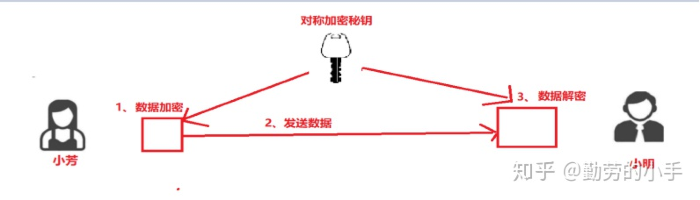
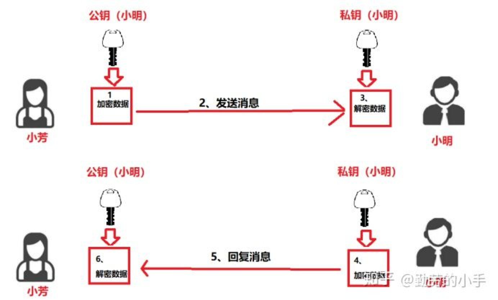
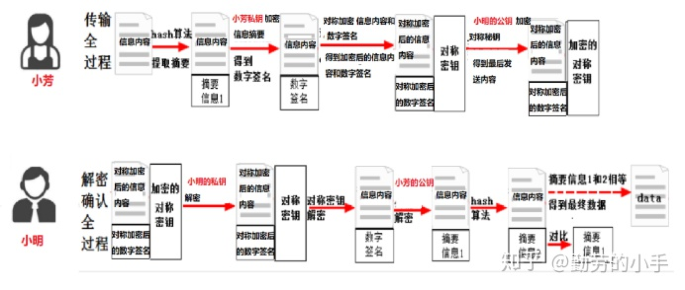
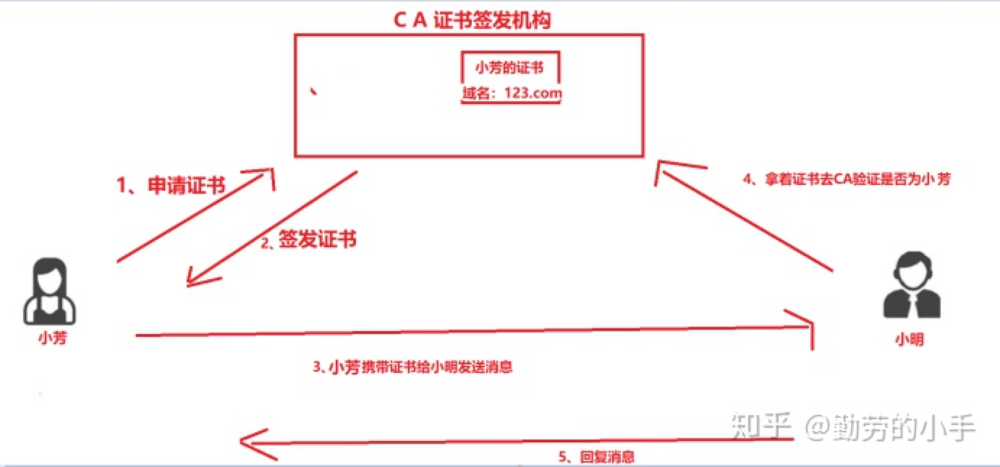
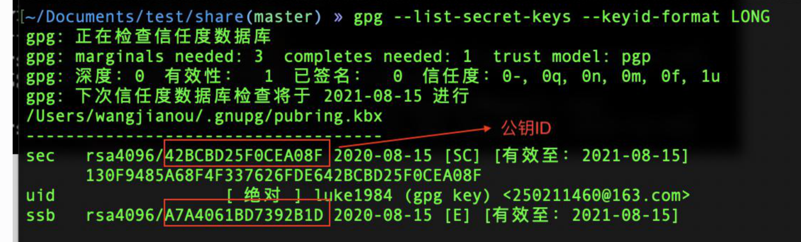

# 加密
信息加密主要是为了保证信息在传输的过程中被第三方窃取从而引起的安全问题,信息不经过加密

## 信息
* 保密性
* 不可篡改性
* 不可抵赖性

## 加密分类
* 可逆加密
    可逆加密是指经过加密过后的信息可以通过对应的密钥反向解析还原信息内容，常见的就是我们上面所说的对称加密和非对称加密。
    常见的对称加密算法：AES、DES、3DES、Blowfish、IDEA、RC4、RC5、RC6
    常见的非对称加密算法：RSA、DSA（数字签名用）、ECC（移动设备用）、Diffie-Hellman、El Gamal
* 不可逆加密
    和可逆加密相反，不可逆加密是指经过加密过后的信息是无法反向解析还原信息内容。
    比如我们为了保证用户资料的安全，存在数据库的用户密码一般是用不可逆的加密算法进行加密，这样就算系统管理员得到了用户加密过后的密码，也无法通过解密还原用户的真实密码。
    常见的不可逆加密算法: MD5、SHA、HMAC

# 数字签名和数字证书

## 对称加密
对称密钥很容易理解， 如同 小芳 用一把钥匙将 文件上锁，而 小明 使用 相同的钥匙就可以将文 件解锁，即加密使用的 密钥与解密使用的密钥 是相同的。

* 算法
    - DES
    - 3DES
    - AES
    -...
* 特点：
    - 加密速度快，使用简单，因为加密解密只需要同一把钥匙就行了；
    - 对称加密的破解难度是随着钥匙的大小增加而增加的，钥匙越大就越难破解，但是钥匙越大相应的据解密的时间也会越长
* 问题：
    - 双方都必须事先约定好加密规则
    - 密钥的数目难于管理。因为对于每一个合作者都需要使用不同的密钥，很难适应开放互联网中的大量的合作者交流
    - 无法适用于陌生的网络的环境，双方都必须是可信任的才可进行，而在互联网通信过程中我们通信的双方都是互不相识的，如果双方要约定加密规则，那么势必也要通过网络发送加密秘钥，因为网络环境本身就会存在被窃取的可能，我们发送密钥的请求本身又是不安全的
## 非对称加密
1976年，美国斯坦福大学的研究生Diffie和教授Hellman发表了一个基于非对称秘钥加密的想法，这个想法开创了密码学的变革。他们的想法非常简单：
将秘钥分为 **公钥（publicKey）**、**私钥（privateKey）**。公钥加密的内容可以使用私钥解开，私钥加密的内容用公钥可以解开，但单独知道私钥和公钥却没办法推出另外一种秘钥

1977年 三位数学家Rivest、Shamir和Adleman设计了一种算法，可以实现非对称加密。这种算法用他们三个人的名字命名，叫做 **RSA算法**。 从那时直到现在，RSA算法一直是最广的非对称加密算法
这种算法非常可靠，秘钥越长，他就越难破解。根据已经披露的文献，目前被破解的最长RSA秘钥是768.因此可以认为1024位RSA秘钥基本安全，2048位秘钥及其安全
* 特点
    - 比对称加密安全：加密和解密是不同的钥匙，非对称加密的私钥是由自己保管不会外泄的，除了自己没有任何人知道私钥，而对称加密只有一把密钥并且通信双方都要知道密钥，一旦密钥知道的人越多那么安全的风险就越大
    - 更方便可扩展：公钥可以公布在网络中，任何人都可以拿着公钥和你进行通信，而对称加密密钥是不可能公布在网络中的，只能通过私下约定密钥规则
   

* 问题：
    - 由于非对称加密算法的复杂度更高，因此非对称加密的速度远没有对称加密算法快，升值可能要慢上1000倍

## 信息摘要、数字签名、验签
> 上面的对称加密和非对称加密已经解决了信息传输中的安全问题了，经过加密的数据黑客截取了也无法解密。但是还有一个问题，虽然黑客无法解密通信的内容，但是黑客可以篡改数据双方的通信数据，那么这种情况下我们如何识别数据经过网络传输之后是否被别人篡改过呢，这种情况下就需要用到数字签名了来验证数据是否为对方发出

### 信息摘要
> 一般来说，我们将消息的摘要也称为信息的指纹。如同指纹含义，相同的信息一定会得相同的指纹，而仅通过指纹又无法还原出原始信息。
* 所谓信息摘要，其实就是某种HASH算法。将信息明文转化为固定长度的字符，它具有如下特点
    - 无论输入的信息有多长，计算出来的消息摘要的长度总是固定的
    - 用相同的摘要算法对相同的消息两次摘要，其结果必然相同
    - 一般来说，只要输入的消息不同，对其进行摘要以后产生的消息几乎也不可能相同
    - 消息摘要函数是单向函数，及只要进行正向的信息摘要，而无法从摘要中恢复任何消息
    - 好的摘要算法，没人能从中找到碰撞，虽然碰撞是肯定存在的：即对于给定的一个摘要，不可能找到一条消息使其摘要正好是给定的，或者说无法找到两条消息使他们的摘要相同
* 目前主要的摘要算法有 MD5 、 SHA1 、 SHA2，信息摘要算法一般都是不可逆算法

### 数字签名
数字签名，就是对原始文件的指纹进行私钥加密，这样可以保证文件的特征（摘要值）一定经过了私钥的加密。同时由于信息摘要的长度普遍不长（MD5为128位，SHA1主要为256位），也并没有带来太大的开销

#### 数字签名的流程

* 小芳给小明发送信息需要做4件事：
   - 小芳发送信息前首先把需要发送的数据用哈希函数计算出一个哈希值出来得到一个信息摘要（不懂技术的人可以把这个哈希值类比成发送内容里面所有字的笔画的总和，只要内容改变那么这个值就会跟着变)，当然这个计算哈希值的过程是不可逆的，无法通过哈希值推导出信息的内容。
   - 小芳用自己的私钥对信息摘要进行加密得到一个数字签名（因为私钥加密的数据只有公钥才能解密，如果小明用小芳的公钥能解密到正确的数据，那证明此信息必定是由小芳发出）。
   - 小芳然后用“对称秘钥”对加密信息内容和数字签名进行对称加密。
   - 最后小芳用小明的公钥对“对称秘钥”进行非对称加密，然后把用加密过后的“对称加密秘钥”，和用对称加密秘钥加密过后的信息内容、数字签名一起发给了小明。
*当小明接收到小芳的信息后，小明需要做4件事
    - 当小明收到了小芳的信息后，首先用自己的私钥解密得到对称加密的秘钥。
    - 然后用对称加密秘钥解密得到 信息信息内容和数字签名。
    - 然后用小芳的公钥解密数字签名得到信息摘要。
    - 最后把信息内容进行哈希得到哈希值与解密过后得到的信息摘要进行比对，如果相同则信息没有被篡改过。
## 数字证书
数字签名解决了信息可能会被篡改的问题，但是还有另外一个问题就是小明如何确定当前给我发信息的人就是小芳呢？黑客也可以伪装成小芳的身份然把小芳的公钥替换成自己的公钥，这样小明无法分辨出来的。
这样就衍生了一个身份认证的问题，显然这个身份证明不能由当事人自己发出来，只能由一个大家都信任的公开机构（certificate authority，简称CA）来发行证书，大家先要到CA去申请一个数字证书（证书信息包括发布机构，所属人，公钥，过期时间等信息）；

* PKCS10数据包：
    - 算法名称
    - 主题（唯一标识符DN-distinguished name）
    - 有效期

* PKCS10数据包可以被冒充，比如被第三方获取到公钥后，然后用第三方的私钥加密，最终让用户用第三方的公钥解密  这样就变成了第三方处理后的数据包
> 为了解决PKCS10数据包可被冒充的问题，就需要一个权威的第三方机构，对P10结构的数据进行认证，如同在PKCS10文件上改一个权威机构的章，防止仿造。这样的的权威机构，我们称  **CA(Certificate Authority)数字证书认证中心**
* CA(Certificate Authority)数字证书认证中心：
    - GlobalSign
    - Comodo（科摩多）
    - Symantec（赛门铁克）
    - GeoTrust
### 最终的通信流程变成下面情况
* 小芳首先去CA申请一个数字证书；

* 小芳把信息加密后+加上签名和数字证书发送给小明；

* 小明收到小芳信息后，拿着小芳传过来的数字证书到CA去验证；

* 如果查询到对应数字证书信息里的所属人的确为小芳，那么身份真实可以进行通讯；

* 然后小明根据数字证书信息生成一个专属于小芳和小明加密方式（这里为对称加密），两个人通过此加密方式进行通讯；

## 数字签名的应用

### github
* https
    - 可以随意克隆github上的项目，而不管是谁
    - 首次需要输入用户密码，然后缓存以后就不用再次输入
    - 查看缓存策略：git help -a | grep credential
    - 缓存策略三种： credential.helper=osxkeychain/cache/store
* ssh key
    - 必须是你要克隆的项目所拥有者或者管理员
    - 不需要输入用户名密码
    - 设置账号邮箱： git config --global user.name 'xxx'/user.email 'xxx@xxx.com'
    - 生成秘钥：ssh-keygen -t rsa -C 'xxx@xxx.com'
    - cd ~/.ssh: id_rsa(私钥)、id_rsa.pub(公钥)，公钥内容拷贝到github里新建的SSH KEY中
    - 测试 ssh -T git@github.com
* gpg key
    - GNU Privacy Guard(简称 GnuPG 或者 GPG)也是一种加密软件，他是PGP加密软件的开源替代程序，它是一个混合加密软件程序，可以使用多种非专利的算法
    - github支持commit使用GPG加密，从而保证提交的commit在传输中没有被篡改
    - 安装gpg：brew install gpg
    - 生成秘钥：gpg --full-generate-key
    - 列出已经创建好的秘钥： gpg --list-secret-keys --keyid-format LONG,  sec是公钥
    - 查看公钥： gpg --armor --export [公钥id]
    - 将功耗内容添加到github设置----SSH and GPG keys里新建的GPG key中
    - 将公钥ID添加到git设置中： git config --global user.signingkey [公钥ID]
    - 让当前git项目启用签名认证：git config commit.gpgsign true
    - 让所有项目都启用签名验证： git config --global commit.gpgsign true
    - 这样一来 在使用git commit 命令提交的时候，就会用gpg来签名提交
    - 也可以在提交的时候使用git commit -S 参数来显示启用验证

### https 
https是一个对称加密和非对称加密共同应用的协议

本文参考文档[知乎](https://zhuanlan.zhihu.com/p/50046393)
