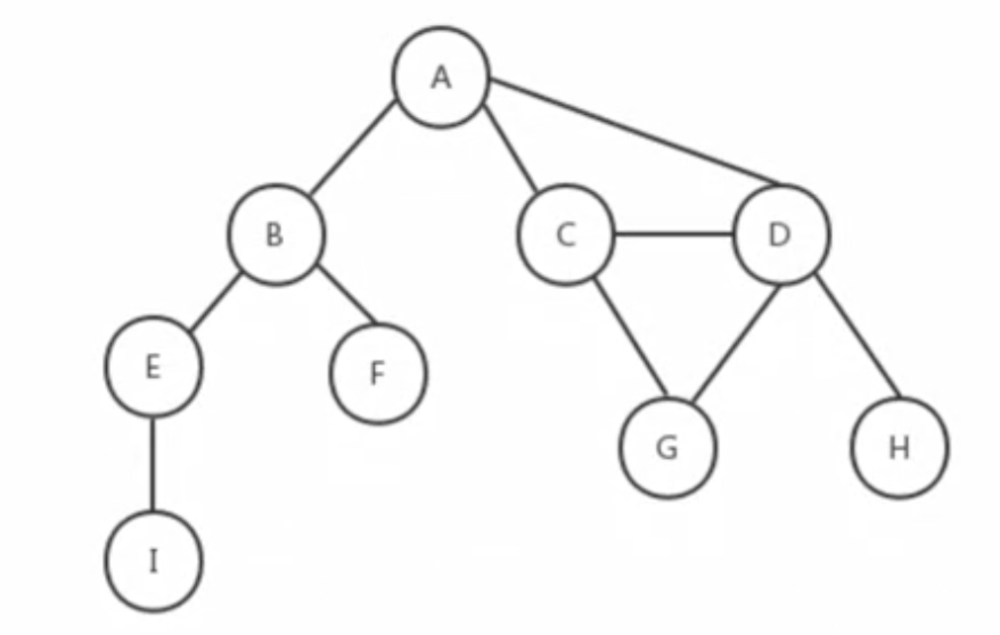
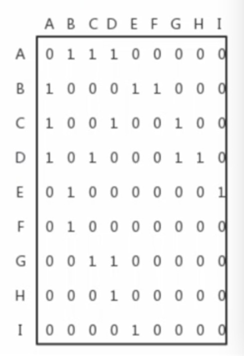
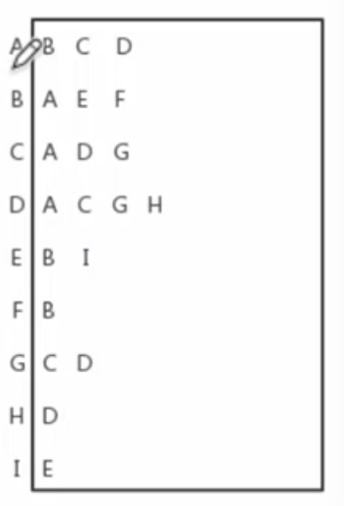
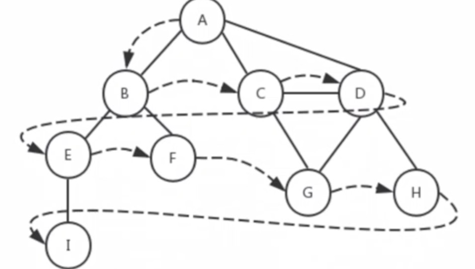
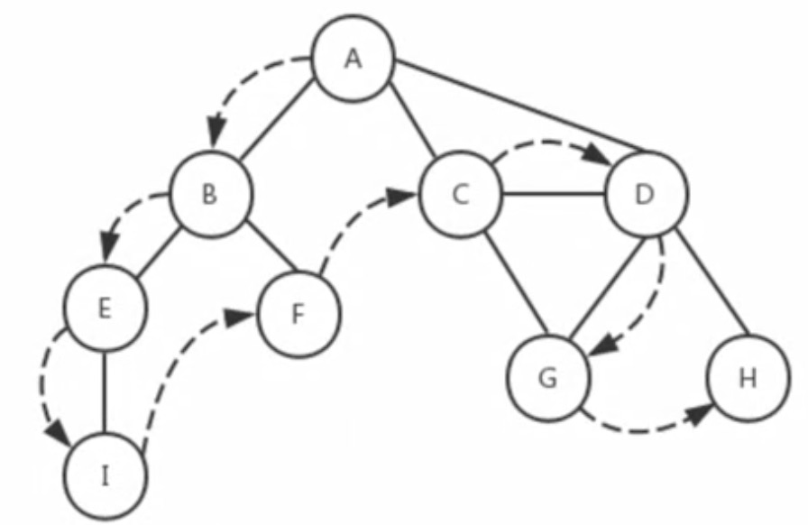

# 图及图的应用
图是一种网络结构的抽象模型，他是一种由边连接的定点组成

## 图-邻接矩阵表示法

## 图-邻接表表示法

## 遍历方法
### 广度优先
* 从指定的第一个定点开始遍历图，先访问这个顶点所有相邻点，然后在访问这些相邻点，以此类推

### 深度优先
* 从图的第一个顶点开始，沿着这个顶点的一条路径递归查找到最后一个顶点，然后返回探查路径上的其他路径，知道所有路径全被访问到

