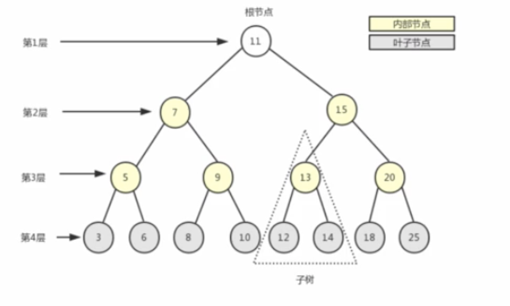
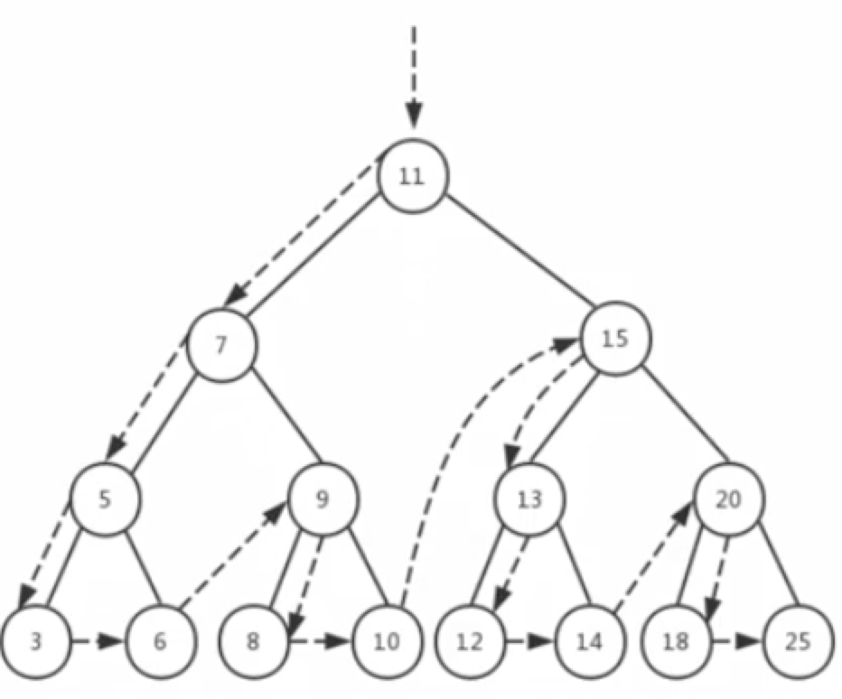
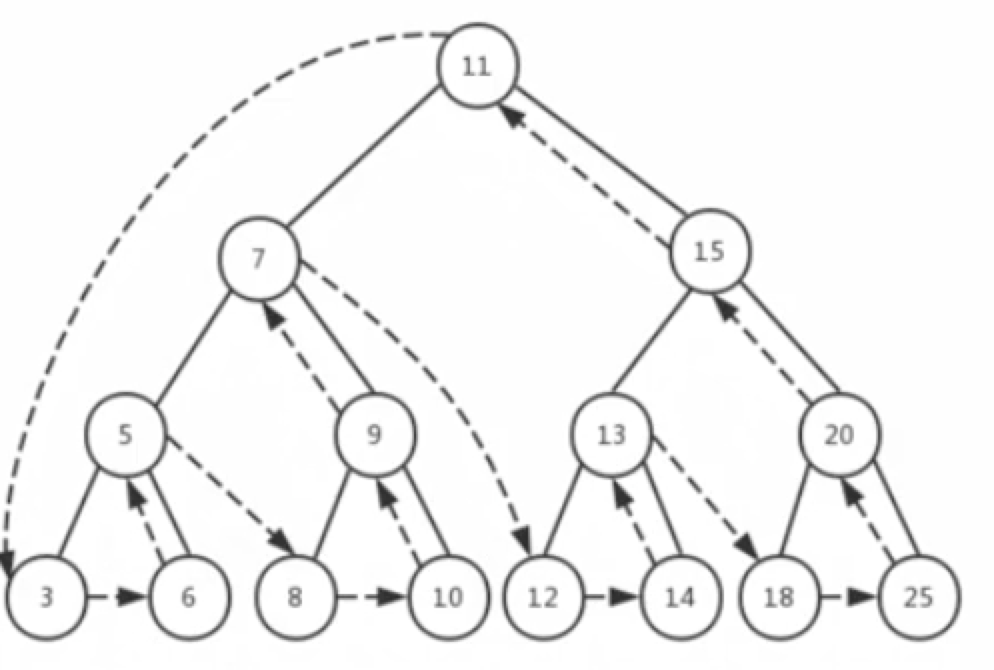
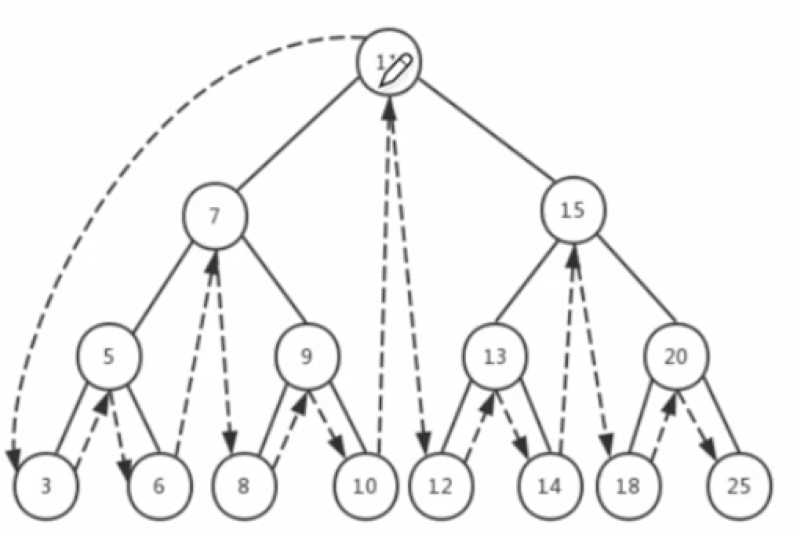

# 树及树的应用

树被用来描述为一种分层数据抽象模型，常用来描述数据间的层级关系和组织结构



## JavaScript中树的表示方法-类表示方法
```javascript
class Node{
    constructor(n, child = null) {
        this.n = n
        this.child = child
    }
}

const tree = new Node(11, [
    new Node(5, [
        new Node(6, [new Node(3), new Node(4)]),
        new Node(7, [new Node(9), new Node(12)]),
    ]),
    new Node(22, [
        new Node(16, [new Node(31), new Node(14)]),
        new Node(17, [new Node(91), new Node(121)]),
    ]),
])
```


## 遍历方法

### 前序遍历（先序遍历）
* 查找当前节点，如果当前节点有子节点，则依次查找子节点，从前往后依次遍历



```javascript
function traverse_f(tree) {
    console.log(tree.n)
    if(Array.isArray(tree.child)) {
        tree.child.for(child => {
            traverse_f(child)
        })
    }
}
```
### 后序遍历


* 先从根节点开始查找，直到找到叶子节点，然后遍历叶子节点的兄弟节点，兄弟节点遍历完后回书找到叶子节点的父节点，对父节点进行操作后再遍历 父节点的兄弟节点的子节点，父节点的兄弟节点的子节点遍历完后回溯找到兄弟节点，以此类推，先遍历所有子节点，对子节点执行操作，再遍历父节点，最后找到根节点，执行根节点的操作

```javascript
function traverse_b(tree) {
    if(Array.isArray(tree.child)) {
        tree.child.for(child => {
            traverse_b(child)
        })
    }
    console.log(tree.n)
}
```

### 中序遍历


* 先找到孩子节点，对第一个或前几个孩子节点执行操作，然后返回并执行父节点，再继续遍历其他子节点，如此循环

```javascript
function traverse_m(tree) {
    if(Array.isArray(tree.child)) {
        let isPrintFather = false
        // 定义当第几个child的时候打印父节点的对比参数
        const m = 1
        tree.child.for((child, index) => {
            if(index === m) {
                // 打印父节点参数
                console.log(tree.n)
                isPrintFather = true
            }
            traverse_m(child)
        }) 
        if (!isPrintFather) {
             console.log(tree.n)
        }
    } else {
        // 叶子节点答应叶子节点信息
       console.log(tree.n)
    }
}
```
