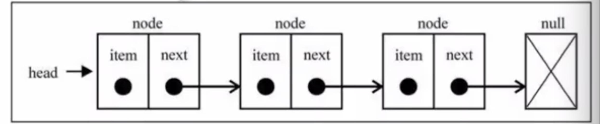

#链表及其应用

链表存储有序的元素集合，但不同于数组，链表中的元素在内存中 并不是连续放置的。每个元素由一个存储本身的节点和一个指向下一个元素的指针组成。想要访问链表中间的一个元素，需要从起点开始迭代链表直到找到需要的元素



## 链表的应用
* 两数相加
    > 给出两个非空的链表用来表示两个非负的整数。其中，它们各自的位置是按 逆序 的方式进行存储的，并且它们的每一个节点只能存储一位 数字。如果我们将两个数相加，则会返回一个新的链表来表示它们的和
* 实例：
    - 输入：(2 -> 4 -> 3) + (5 -> 6 -> 4)
    - 输出：7 -> 0 -> 8
    - 原因：342 + 465 = 807

```javascript
class ListNode {
    constructor(val, next = null) {
        this.val = val
        this.next = next
    }
}

// k 是进位
// 假设位数相同
function addTwoNumbers(num1, num2, k = 0) {
    const total = num1.val + num2.val + k
    // 取余数
    const value = total % 10
    if(num1.next === null) {
        return new ListNode(value)
    }
    return new ListNode(value, addTwoNumbers(num1.next, num2.next, Math.floor(total / 10)))
}
let num1 = new ListNode(2, new ListNode(4, new ListNode(3)))
let num2 = new ListNode(5, new ListNode(6, new ListNode(4)))
let result = addTwoNumbers(num1, num2)
```
