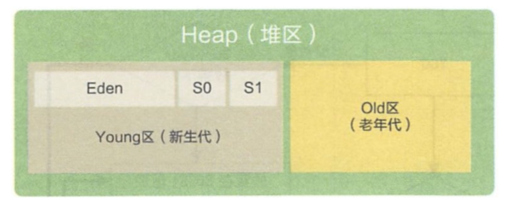
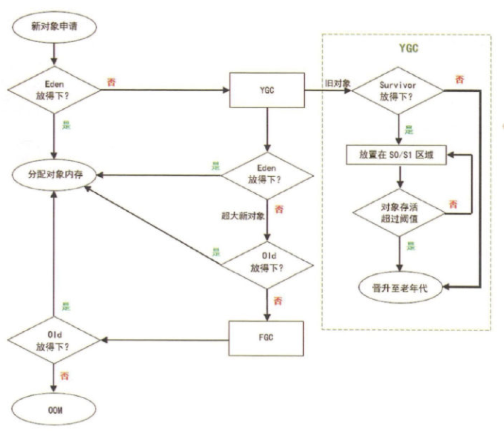
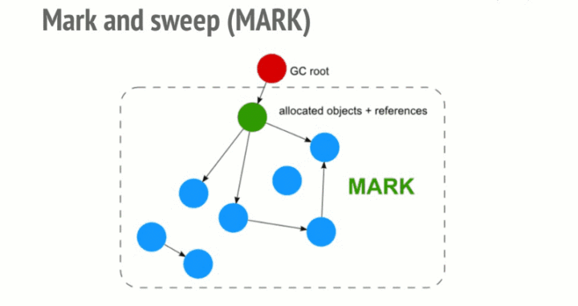

# GC
什么是 Minor GC/Major GC？


对于经典的 JVM heap 布局，有两个区域比较清晰，首先是 `Young` 区,一般会来存放年轻的对象或者刚被创建没多久的对象。其次是 `Old` 区，也就是老年代，一般会来存放比较长寿的对象，或者从 `young` 区晋升的对象。

对于 `young` 区 我们又有三个区域，一个是 `Eden` 区，还有两个大小相等的 `Survivor`(幸存) 区。

新生的对象会在 `Eden` 区创建。

## Minor GC
此时如果新生的对象无法在 Eden 区创建（Eden 区无法容纳) 就会触发一次Young GC 此时会将 S0 区与Eden 区的对象一起进行可达性分析，找出活跃的对象，将它复制到 S1 区并且将S0区域和 Eden 区的对象给清空，这样那些不可达的对象进行清除，并且将S0 区 和 S1区交换。

但是这里会产生一个问题，Q:为啥会有两个 Survivor 区？

A: 因为假设设想一下只有一个 Survibor 区 那么就无法实现对于 S0 区的垃圾收集，以及分代年龄的提升。

## Major GC
发生在老年代的GC ，基本上发生了一次Major GC 就会发生一次 Minor GC。并且Major GC 的速度往往会比 Minor GC 慢 10 倍。

## 什么时候发生Major GC
既然我们已经知道了 Minor GC 是在 Eden 区快满的情况下才会触发

Q:那么 Major GC 呢?

A:

对于一个大对象，我们会首先在Eden 尝试创建，如果创建不了，就会触发Minor GC
随后继续尝试在Eden区存放，发现仍然放不下
尝试直接进入老年代，老年代也放不下
触发 Major GC 清理老年代的空间
放的下 成功
放不下 OOM


## 避免频繁的Full GC

* 避免定义过大的对象(数组)
* 避免将过大对象定义为静态变量

## JS内存及GC

### 内存生命周期
不管什么程序语言，内存生命周期基本是一致的：

1. 分配你所需要的内存

2. 使用分配到的内存（读, 写）

3. 不需要时将其释放/归还

在 C语言中, 有专门的内存管理接口, 像 malloc() 和 free() . 而在 JS 中, 没有专门的内存管理接口, 所有的内存管理都是"自动"的. JS 在创建变量时, 自动分配内存, 并在不使用的时候, 自动释放. 这种"自动"的内存回收, 造成了很多 JS 开发并不关心内存回收, 实际上, 这是错误的.


### JS 中的内存回收

#### 引用
垃圾回收算法主要依赖于引用的概念. 在内存管理的环境中, 一个对象如果有访问另一个对象的权限（隐式或者显式）, 叫做一个对象引用另一个对象. 例如: 一个Javascript对象具有对它原型的引用（隐式引用）和对它属性的引用（显式引用）.

#### 引用计数垃圾收集
这是最简单的垃圾收集算法.此算法把“对象是否不再需要”简化定义为“对象有没有其他对象引用到它”. 如果没有引用指向该对象, 对象将被垃圾回收机制回收.
```javascript
let arr = [1, 2, 3, 4];
arr = null; // [1,2,3,4]这时没有被引用, 会被自动回收
```
####  限制: 循环引用
在下面的例子中, 两个对象对象被创建并互相引用, 就造成了循环引用. 它们被调用之后不会离开函数作用域, 所以它们已经没有用了, 可以被回收了. 然而, 引用计数算法考虑到它们互相都有至少一次引用, 所以它们不会被回收.
```javascript
function f() {
  var o1 = {};
  var o2 = {};
  o1.p = o2; // o1 引用 o2
  o2.p = o1; // o2 引用 o1. 这里会形成一个循环引用
}
f();
```
* 实际例子：
```javascript
var div;
window.onload = function(){
  div = document.getElementById("myDivElement");
  div.circularReference = div;
  div.lotsOfData = new Array(10000).join("*");
};
```
在上面的例子里, myDivElement 这个 DOM 元素里的 circularReference 属性引用了 myDivElement, 造成了循环引用. IE 6, 7 使用引用计数方式对 DOM 对象进行垃圾回收. 该方式常常造成对象被循环引用时内存发生泄漏. 现代浏览器通过使用标记-清除内存回收算法, 来解决这一问题.

#### 标记-清除算法
这个算法把"对象是否不再需要"简化定义为"对象是否可以获得".

这个算法假定设置一个叫做根 root 的对象（在Javascript里，根是全局对象）. 定期的, 垃圾回收器将从根开始, 找所有从根开始引用的对象, 然后找这些对象引用的对象, 从根开始,垃圾回收器将找到所有可以获得的对象和所有不能获得的对象.

从2012年起, 所有现代浏览器都使用了标记-清除内存回收算法. 所有对JavaScript垃圾回收算法的改进都是基于标记-清除算法的改进.


#### 自动 GC 的问题

尽管自动 GC 很方便, 但是我们不知道GC 什么时候会进行. 这意味着如果我们在使用过程中使用了大量的内存, 而 GC 没有运行的情况下, 或者 GC 无法回收这些内存的情况下, 程序就有可能假死, 这个就需要我们在程序中手动做一些操作来触发内存回收.

### 内存泄露
本质上讲, 内存泄露就是不再被需要的内存, 由于某种原因, 无法被释放.

### 常见的内存泄露案例
* 全局变量
```javascript
function foo(arg) {
    bar = "some text";
}
//在 JS 中处理未被声明的变量, 上述范例中的 bar 时, 会把 bar , 定义到全局对象中, 在浏览器中就是 window 上. 在页面中的全局变量, 只有当页面被关闭后才会被销毁. 所以这种写法就会造成内存泄露, 当然在这个例子中泄露的只是一个简单的字符串, 但是在实际的代码中, 往往情况会更加糟糕.

function foo() {
    this.var1 = "potential accidental global";
}
// Foo 被调用时, this 指向全局变量(window)
foo();
```
* 未销毁的定时器和回调函数
    > 在很多库中, 如果使用了观察着模式, 都会提供回调方法, 来调用一些回调函数. 要记得回收这些回调函数. 
* 闭包
在 JS 开发中, 我们会经常用到闭包, 一个内部函数, 有权访问包含其的外部函数中的变量. 下面这种情况下, 闭包也会造成内存泄露.

```javascript
var theThing = null;
var replaceThing = function () {
  var originalThing = theThing;
  var unused = function () {
    if (originalThing) // 对于 'originalThing'的引用
      console.log("hi");
  };
  theThing = {
    longStr: new Array(1000000).join('*'),
    someMethod: function () {
      console.log("message");
    }
  };
};
setInterval(replaceThing, 1000);
// 这段代码, 每次调用 replaceThing 时, theThing 获得了包含一个巨大的数组和一个对于新闭包 someMethod 的对象. 同时 unused 是一个引用了 originalThing 的闭包.

// 这个范例的关键在于, 闭包之间是共享作用域的, 尽管 unused 可能一直没有被调用, 但是someMethod 可能会被调用, 就会导致内存无法对其进行回收. 当这段代码被反复执行时, 内存会持续增长.
```
*  DOM 引用
很多时候, 我们对 Dom 的操作, 会把 Dom 的引用保存在一个数组或者 Map 中.
```javascript
var elements = {
    image: document.getElementById('image')
};
function doStuff() {
    elements.image.src = 'http://example.com/image_name.png';
}
function removeImage() {
    document.body.removeChild(document.getElementById('image'));
    // 这个时候我们对于 #image 仍然有一个引用, Image 元素, 仍然无法被内存回收. 
}
// 上述案例中, 即使我们对于 image 元素进行了移除, 但是仍然有对 image 元素的引用, 依然无法对齐进行内存回收.

// 另外需要注意的一个点是, 对于一个 Dom 树的叶子节点的引用. 举个例子: 如果我们引用了一个表格中的 td 元素, 一旦在 Dom 中删除了整个表格, 我们直观的觉得内存回收应该回收除了被引用的 td 外的其他元素. 但是事实上, 这个 td 元素是整个表格的一个子元素, 并保留对于其父元素的引用. 这就会导致对于整个表格, 都无法进行内存回收. 所以我们要小心处理对于 Dom 元素的引用
```

* 精读
ES6中引入 WeakSet 和 WeakMap 两个新的概念, 来解决引用造成的内存回收问题. WeakSet 和 WeakMap 对于值的引用可以忽略不计, 他们对于值的引用是弱引用,内存回收机制, 不会考虑这种引用. 当其他引用被消除后, 引用就会从内存中被释放.

JS 这类高级语言，隐藏了内存管理功能。但无论开发人员是否注意，内存管理都在那，所有编程语言最终要与操作系统打交道，在内存大小固定的硬件上工作。不幸的是，即使不考虑垃圾回收对性能的影响，2017 年最新的垃圾回收算法，也无法智能回收所有极端的情况。

唯有程序员自己才知道何时进行垃圾回收，而 JS 由于没有暴露显示内存管理接口，导致触发垃圾回收的代码看起来像“垃圾”，或者优化垃圾回收的代码段看起来不优雅、甚至不可读。

所以在 JS 这类高级语言中，有必要掌握基础内存分配原理，在对内存敏感的场景，比如 nodejs 代码做严格检查与优化。谨慎使用 dom 操作、主动删除没有业务意义的变量、避免提前优化、过度优化，在保证代码可读性的前提下，利用性能监控工具，通过调用栈定位问题代码。


> 引用 [https://zhuanlan.zhihu.com/p/134546736](https://zhuanlan.zhihu.com/p/134546736)
> 引用 [https://zhuanlan.zhihu.com/p/30552148](https://zhuanlan.zhihu.com/p/30552148)
