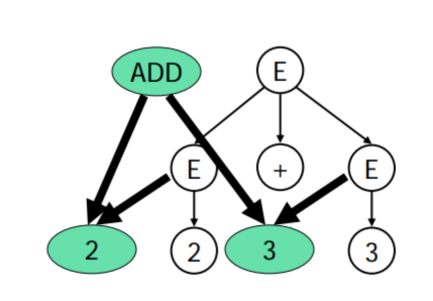

# 抽象语法树
> 源代码 ----语法分析器-----> 抽象语法树（起一个承前启后的作用，供语义分析器分析类型，定义等等）
## 分析树
> 由规则产生的一个详细推导过程


分析树编码了句子的推导过程，但是包含很多不必要的信息（需要浪费很多额外的内存占用空间）。对于表达式而言，编译只需要知道运算符和运算数。优先级、结合性等已经在语法分析部分处理掉了。对于语句、函数等语言其他构造而言也一样
例如，编译器不关心赋值符号是=还是:=或其它

### 上面分析树对应的语法树
 

### 具体语法和抽象语法
* **具体语法**是语法分析器使用的语法

```
E  -> E + T
    | T
T  -> T * F
    | F
F   -> n
    | (E)
```

* **抽象语法**是用来表达语法结构的内部表示
```
E   -> n
    | E + E
    | E * E
```

> 现代编译器一般都采用抽象语法作为前端(词法语法分析）和后端（代码生成）的接口

### 抽象语法树数据结构
在编译器中，为了定义抽象语法树，需要使用**实现语言**来定义一组数据结构(和实现语言密切相关)。早期的编译器有的不采用抽象语法树数据结构，直接在语法制导翻译中生成代码，但现代的编译器一般采用抽象语法树作为语法分析
器的输出（更好的系统的支持，简化编译器的设计 ）

### 抽象语法树的定义（C语言版）
```
E    -> n
    | E + E
    | E * E
```

```
enum kind {E_INT, E_ADD, E_TIMES};
struct Exp {
    enum kind kind;
};
struct Exp_Int{
    enum kind kind;
    int n;
};
struct Exp_Add{
    enum kind kind;
    struct Exp *left;
    struct Exp *right;
};
struct Exp_Times{
    enum kind kind;
    struct Exp *left;
    struct Exp *right;
};

struct Exp_Int *Exp_Int_new (int n)
{
    struct Exp_Int *p = malloc (sizeof(*p));
    p->kind = E_INT;
    p->n = n;
    return p;
}
struct Exp_Add *Exp_Add_new(struct Exp *left, struct Exp *right)
{
    struct Exp_Add *p = malloc (sizeof(*p));
    p->kind = E_ADD;
    p->left = left;
     p->right = right;
    return p;
}

```

```
/* 用数据结构来编码程序“2+3*4” */
e1 = Exp_Int_new (2);
e2 = Exp_Int_new (3);
e3 = Exp_Int_new (4);
e4 = Exp_Times_new (e2, e3);
e5 = Exp_Add_new (e1, e4);
```

## 抽象语法树的自动生成

### LR分析中生成抽象语法树
* 在语法动作中，加入生成语法树的代码片段，片段一般是语法树的“构造函数”，在产生式归约的时候，会自底向上构造整棵树（从叶子到根）
    - 语法动作加入生成语法树的代码片段
        ```
        E    -> E + E   {$$ = Exp_Add_new ($1, $3);}
             | E * E    {$$ = Exp_Times_new ($1, $3);}
             | n        {$$ = Exp_Int_new ($1);}
        ```
    - 归约
        ```
                    2 + 3 + 4
        2           ⊙ + 3 + 4
        E           ⊙ + 3 + 4
        E +         ⊙ 3 + 4
        E + 3       ⊙ + 4
        E + E       ⊙ + 4
        E           ⊙ + 4
        E +         ⊙ 4
        E + 4       ⊙
        E + E       ⊙
        ```
    
    
* 抽象语法树是编译器前端和后端的接口
> 程序一旦被转换成抽象语法树，则源代码即被丢弃后续的阶段只处理抽象语法树，所以抽象语法树必须编码足够多的源代码信息，例如，它必须编码每个语法结构在源代码中的位置（文件、行号、列号等），这样，后续的检查阶段才能精确的报错，或者获取程序的执行刨面
```
// 位置信息示例
………………………………
………………
…… 2+3+4+5+6+7 ……
……

struct position_t{
    char *file;
    int line;
    int column;
};
struct Exp_Add{
    enum kind kind;
    Exp *left;
    Exp *right;
    struct position_t from;
    struct position_t to;
};
```
