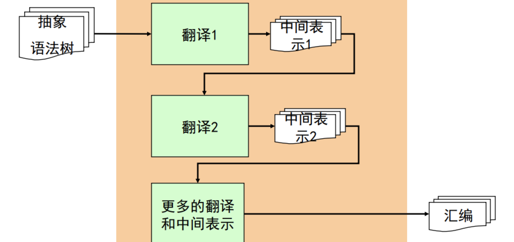
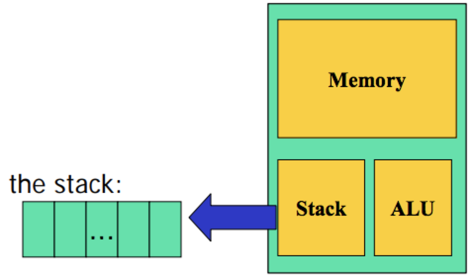
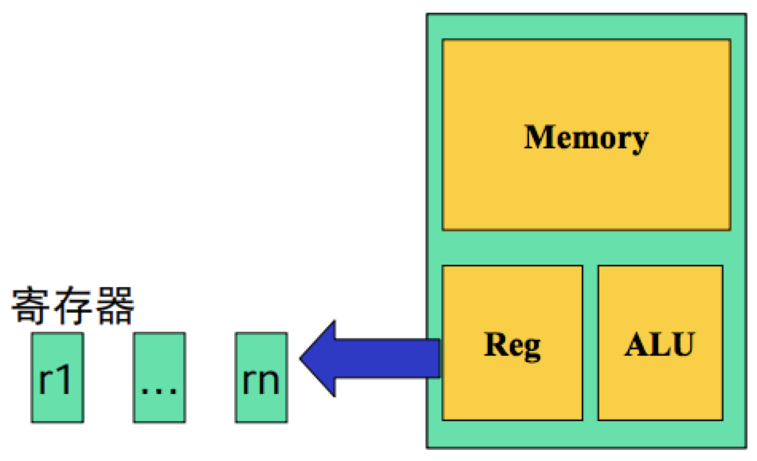

# 代码生成

## 代码生成的任务
* 负责把源程序翻译成**目标机器**上的代码
    > 目标机器：可以是真实的物理机器，也可以是虚拟机
* 给源程序的数据分配计算资源
    > 根据程序的特点和编译器的设计目标，合理的为数据分配计算资源,例如：变量放在内存里还是寄存器里？
    - 源程序的数据
        + 全局变量、局部变量、动态分配等等
    - 机器计算资源
        + 寄存器 局部变量（优先存放）
            > 寄存器是有限的
        + 数据区 全局变量
        + 代码区 程序编译完后的汇编代码
        + 栈区 函数调用
        + 堆区 动态数据分配
* 给源程序的代码选择合适的机器指令
    > 用机器指令实现高层代码的语义, 一要保证**等价性**，二是要对**指令集体系结构**（**ISA**）的熟悉
    - 源程序的代码: 表达式运算、语句、函数等
    - 机器指令：算术运算、比较、跳转、函数调用返回
* 代码生成技术
    - 基于栈式计算机Stack（虚拟机JVM）
    - 寄存器计算机Reg（平板，手机等）

## 代码生成：栈式计算机

> 栈式计算机在历史上非常流行，上世纪70年代曾有很多栈式计算机，但今天已经基本上已经退出了历史舞台（效率问题）
我们还要讨论栈式计算机的代码生成技术的原因是：一是给栈式计算机生成代码是最容易的；二仍然有许多栈式的虚拟机,如：Pascal P code、Java virtual machine (JVM)、Postscript

* 栈式计算机Stack的结构

    - 内存（Memory）  存放所有的变量
    - 栈(Stack) 进行运算的空间
    - 执行引擎(ALU)  指令的执行
* 栈计算机的指令集
```
// 指令的语法
s   -> push NUM 栈操作,把一个整型数放在栈顶，栈顶指针+1
    | load x    访问内存操作，把一个x从内存当中读入到栈顶上，栈顶指针+1
    | store x   访问内存操作，把x从栈顶弹出去，并赋值给内存中的x
    | add       算数运算，加
    | sub       算数运算，减
    | times     算数运算, 乘
    | div       算数运算, 除
```
```
// top是栈顶指针
push NUM:
    top++;
    stack[top] = NUM;
    
load x:
    top++;
    stack[top] = x;
    
store x:
    x = stack[top];
    top--;
    
add:
    temp = stack[top-1] + stack[top];
    top -= 2;
    push temp;
```

* 变量的内存分配伪指令
    - **Stack**机器只支持一种数据类型`int`，并且给变量`x`分配内存的伪指令是：`.int x`
    - **Stack**机器在装载一个程序时，就会读取伪指令，并且给相关变量分配内存空间
    
| 源代码 | Stack指令 |
| --- | --- |
| `int x;` | `.int x` |
| `int y;` | `.int y`|
| `int z; `| `.int z`|
| `x = 10;` | `1: push 10` <br>` 2: store x`|
| `y = 5;` | `3: push 5` <br>` 4: store y`|
| `z = x + y;` | `5: load x` <br>` 6: load y`<br>` 7: add`<br>`8: store z`|
| `y = z * x;` | `9: load z` <br>` 10: load x`<br>` 11: times`<br>`12: store y`|

* 递归下降代码生成算法
```
P   -> D S
D   -> T id; D
    |
T   -> int
    | bool
S   -> id = E
    | printi (E)
    | printb (E)
E   -> n
    | id
    | true
    | false
    | E + E
    | E && E
```
要写如下几个递归函数：
```
Gen_P(D S);
Gen_D(T id; D);
Gen_T(T);
Gen_S(S);
Gen_E(E);
```
```
Gen_E(E e)
    switch (e)
        case n: emit (“push n”); break;
        case id: emit (“load id”); break;
        case true: emit (“push 1”); break;
        case false: emit (“push 0”); break;
        case e1+e2: Gen_E (e1);
                    Gen_E (e2);
                    emit (“add”);
                    break;
        case …: … 
```
```
Gen_S(S s)
    switch (s)
        case id=e: Gen_E(e);
                    emit(“store id”);
                    break;
        case printi(e): Gen_E(e);
                        emit (“printi”);
                        break;
        case printb(e): Gen_E(e);
                        emit (“printb”);
        break;
```
```
Gen_T(T t)
    switch (t)
        case int: emit (“.int”);
                  break;
    case bool: emit (“.int”);
                break;
```
```
Gen_D(T id; D)
    Gen_T (T);
    emit (“ id”);
    Gen_D (D);
```
```
Gen_P(D S)
    Gen_D (D);
    Gen_S (S);
```

## 代码生成：寄存器计算机
寄存器计算机是目前最流行的机器体系结构之一：效率很高、机器体系结构规整。机器基于寄存器架构：典型的有16、32或更多个寄存器， 所有操作都在寄存器中进行，访存都通过load/store进行，内存不能直接运算


* 寄存器计算机Reg的结构
    - 内存（Memory）  存放溢出变量
    - 寄存器 进行运算的空间
    - 执行引擎(ALU)  指令的执行
* 寄存器计算机的指令集
```
// 指令的语法
s   -> movn n, r        数据移动 移动 n 到 寄存器 r
    | mov r1, r2        数据移动 从寄存器 r1 复制到 寄存器 r2
    | load [x], r       访问内存 从内存读 x 方到 寄存器 r
    | store r, [x]      访问内存 从寄存器 取 x 放到内存中
    | add r1, r2, r3    算数加法 寄存器 r1的值加上寄存器r2的值 存放到寄存器r3上
    | sub r1, r2, r3
    | times r1, r2, r3
    | div r1, r2, r3
```
* 变量的寄存器分配伪指令
    - Reg机器只支持一种数据类型`int`，并且给变量`x`分配寄存器的伪指令是： `.int x`
    - 在代码生成的阶段，假设Reg机器上有无限多个寄存器
        + 因此每个声明变量和临时变量都会占用一个（虚拟）寄存器
        - 把虚拟寄存器分配到物理寄存器的过程称为寄存器分配, 物理寄存器不够就存放在内存上

* 递归下降代码生成算法
```
P   -> D S
D   -> T id; D
    |
T   -> int
    | bool
S   -> id = E
    | printi (E)
    | printb (E)
E   -> n
    | id
    | true
    | false
    | E + E
    | E && E
```
要写如下几个递归函数：
```
Gen_P(D S);
Gen_D(T id; D);
Gen_T(T);
Gen_S(S);
Gen_E(E);
```
```
// 表达式的代码生成
R_t Gen_E(E e)
    switch (e)
        case n: r = fresh();
                emit (“movn n, r”);
                return r;
        case id: r = fresh ();
                emit (“mov id, r”);
                return r;
        case true: r = fresh ();
                    emit (“movn 1, r”);
                return r;
        case false: r = fresh ();
                emit (“movn 0, r”);
                return r;
        case e1+e2: r1 = Gen_E(e1);
                    r2 = Gen_E(e2);
                    r = fresh();
                    emit (“add r1, r2, r”);
                    return r;
        case e1&&e2: r1 = Gen_E(e1);
                    r2 = Gen_E(e2);
                    r = fresh();
                    emit (“and r1, r2, r”);
                    return r;
```
```
// 语句的代码生成
Gen_S(S s)
    switch (s)
        case id=e: r = Gen_E(e);
                emit(“mov r, id”);
                break;
        case printi(e): r = Gen_E(e);
                emit (“printi r”);
                break;
        case printb(e): r = Gen_E(e);
                emit (“printb r”);
                break;
```
```
// 类型的代码生成
Gen_T(T t)
    switch (t)
        case int: emit (“.int”);
        break;
    case bool: emit (“.int”);
        break;
```
```
// 变量声明的代码生成
Gen_D(T id; D)
    Gen_T (T);
    emit (“ id”);
    Gen_D (D);
```
```
// 程序的代码生成
Gen_P(D S)
    Gen_D (D);
    Gen_S (S);
```

* 示例
```
int x;
int y;
int z;
x = 1+2+3+4;
y = 5;
z = x + y;
y = z * x;
```
| 源代码 | Stack指令 |
| --- | --- |
| `int x;` | `.int x` |
| `int y;` | `.int y`|
| `int z; `| `.int z`|
| `x = 1 + 2 + 3 + 4;` | `1: movn 1, r1` <br>` 2: movn 2, r2` <br>`3: add r1, r2, r3`<br>`4: movn 3, r4`<br>`5: add r3, r4, r5`<br>`6: movn 4, r6`<br>`7： add r5, r6, r7`<br>`8: mov r7, x`|
| `y = 5;` | `9: movn 5, r8`<br>`mov r8, y`|
| `z = x + y;` | ...|
| `y = z * x;` | ...|
