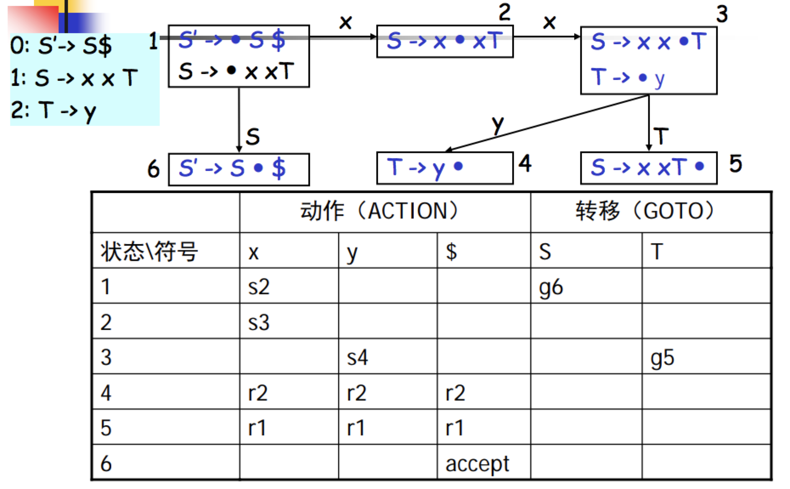
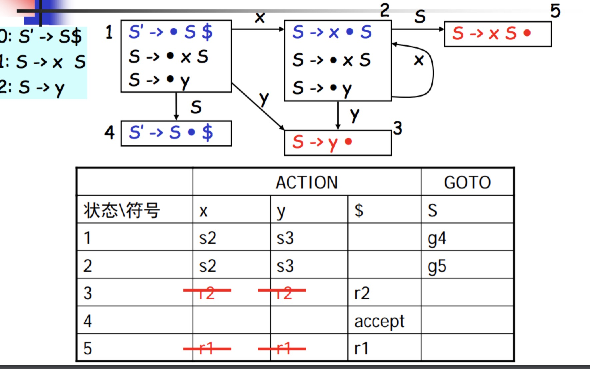

# 语法分析

> 特殊字符：α β γ δ ε ζ η θ ι κ λ μ ν ξ ο π ρ σ τ υ φ χ ψ ω
  
## 语法错误处理
```
if ((x > 5)
    y = “hello”
else
    z = 1,
```

语法分析后后报错

```
Syntax Error: line 1, missing )
Syntax Error: line 2, missing ;
Syntax Error: line 4, expecting ; but got ,
```
## 语法树的构建
```
if (x > 5)
    y = “hello”;
else
    z = 1;
```
语法分析后生成语法树


## 上下文无关文法
* 上下文无关文法G是一个四元组：`G = (T, N, P, S)`
    - T 终结符集合
    - N 是非终结符集合
    - P 是一组产生式规则
        + 每条规则的形式： X -> β1 β2 … βn, 其中X ∈ N， βi ∈ (T ∪ N)
    - S 是唯一的开始符号（非终结符）：S ∈ N

    ```
    * 例子1：（主谓宾的语法： N老虎 V吃 N羊）
        - 非终结符：N = {S, N, V}
        - 终结符：T = {s,t,g,w,e,d}
        - 开始符号：S
        - 产生式规则集合：
            S   -> N V N
            N   ->  s   代表shup
                |   t   代表tiger
                |   g   代表grass
                |   w   代表water
            V   ->  e   代表eat
                |   d   代表drink
    ```

    ```
    * 例子2： （加法，乘法）
        - 非终结符：N = {E}
        - 终结符：T = {num, id, +, *}
        - 开始符号：E
        - 产生式规则集合：
            E   ->   num
                |    id
                |    E + E
                |    E * E
    ```

* 推导

    给定文法**G**，从**G**的开始符号**S**开始，用产生式的右部替换左侧的**非终结符**，此过程不断重复，直到不出现**非终结符**为止，最终的串称为**句子**
    
    - 最左推导：每次总是选择最左侧的符号进行替换
    - 最右推导：每次总是选择最右侧的符号进行替换
      
    如以上例子1：
    ```
        S   -> N V N
        S   -> s v N
        S   -> s d N
        S   -> s d w    ------> 这里 sdw称之为 句子
    ```

## 语法分析与上下文无关文法、推导的关系

给定文法**G**和句子**s**，语法分析要回答的问题：是否存在对句子**s**的推导？

如给定以下G：
    ```
     S   -> N V N
                N   ->  s   代表shup
                    |   t   代表tiger
                    |   g   代表grass
                    |   w   代表water
                V   ->  e   代表eat
                    |   d   代表drink
    ```
    句子 `sdw`, 是否可以根据产生式规则集合推导出 sdw。如  `ssw` 就不可以   

## 推导与分析树

推导可以表达成树状结构（和推导所用的顺序无关（最左、最右、其他））

* 特点：
    - 树中的每个**内部节点**代表**非终结符**
    - 每个**叶子节**点代表**终结符**
    - 每一步推导代表如何从**双亲节点**生成它的**直接孩子节点**
    ```
    E   ->   num
         |    id
         |    E + E
         |    E * E
         
    ```           
    ```
    // 第一种推导
      E     ->   E + E
            ->   3 + E
            ->   3 + E * E
            ->   3 + 4 * E
            ->   3 + 4 * 5
    ```           
    

    ```
    // 第二种推导
      E     ->   E + E
            ->   E + E * E
            ->   3 + E * E
            ->   3 + 4 * E
            ->   3 + 4 * 5
    ```
    
* 二义性文法
    给定文法**G**，如果存在句子**s**，它有两棵不同的分析树，那么称**G**是二义性文法（以上G就是一个二义性文法）

    从编译器角度，二义性文法存在问题：
    
    - 同一个程序会有不同的含义
    - 因此程序运行的结果不是唯一的
    
    解决方案：**文法的重写**

* 表达式文法的重写

```
E    ->  E + T
    |    T
T    ->  T * F
    |    F
F    ->  num
    |    id
```

## 自顶向下算法
* 语法分析：给定文法`G`和句子`s`，回答s是否能够从`G`推导出来？
* 基本算法思想：从`G`的开始符号出发，随意推导出某个句子`t`，比较`t`和`s`
    - 若`t`==`s`，则回答“是”
    - 若`t`!=`s`，则?

因为这是从开始符号出发推出句子，因此称为**自顶向下分析**，对应于**分析树**自顶向下的构造顺序

* 针对以下示例进行算法分析

    ```
     S   -> N V N
                N   ->  s   代表shup
                    |   t   代表tiger
                    |   g   代表grass
                    |   w   代表water
                V   ->  e   代表eat
                    |   d   代表drink
    ```
    ```
    tokens[]; // holding all tokens
    i=0;
    stack = [S] // S是开始符号
    while (stack != [])
        if (stack[top] is a terminal t)
            if (t==tokens[i++])
                pop();
            else backtrack();
        else if (stack[top] is a nonterminal T)
            pop();
            push(the next right hand side of T)
    ```
* 算法的讨论
    - 算法需要用到回溯 给分析效率带来问题
    - 编译器必须高效（编译上千万行的内核等程序）
    - 因此，实际上我们需要**线性时间**的算法：
        + 避免回溯
        + **递归下降分析算法**和**LL(1)分析算法**
### 递归下降分析算法（预测分析算法）
* 好处：
    - 分析高效（线性时间）
    - 容易实现（方便手工编码）
    - 错误定位和诊断信息准确
    - 被很多开源和商业的编译器所采用
        + GCC 4.0
        + LLVM
* 基本思想
    - 每个非终结符构造一个分析函数
    - 用**前看符号**指导产生式规则的选择（前看符号就是记号流的每一个符号，依次带入分析函数进行对比）

* 针对以下示例进行算法分析

    ```
     S   -> N V N
                N   ->  s   代表shup
                    |   t   代表tiger
                    |   g   代表grass
                    |   w   代表water
                V   ->  e   代表eat
                    |   d   代表drink
    ```
    ```
    parse_S()
        parse_N()
        parse_V()
        parse_N()
    parse_N()
        token = tokens[i++]
        if (token==s||token==t||token==g||token==w)
            return;
        error(“…”);
    parse_V()
        token = tokens[i++]
         …
    ```
* 一般算法框架
    ```
    X    -> β11 … β1i
         |  β21 … β2j
         |  β31 … β3k
         | …
    ```
    ```
    parse_X()
        token = nextToken()
        switch(token)
        case …: //β11 … β1i
        case …: //β21 … β2j
        case …: //β31 … β3k
         …
        default: error (“…”);
    ```

* 针对 3 + 4 * 5 进行语法分析
```
E    -> E + T
      | T
T    -> T * F
      | F
F    -> num
```

```
// a second try
parse_E()
    parse_T()
    token = tokens[i++]
    while (token == +)
        parse_T()
        token = tokens[i++]
parse_T()
    parse_F()
    token = tokens[i++]
    while (token == *)
        parse_F()
        token = tokens[i++]
```

### 自动声明器的一些算法

#### LL(1)
* 从左（L）向右读入程序，最左（L）推导，采用一个（1）前看符号
    - 分析高效（线性时间）
    - 错误定位和诊断信息准确
    - 有很多开源或商业的生成工具: ANTLR
* 缺点：
    - 能分析的文法类型受限
    - 往往需要文法的改写（分析表冲突的时候）
* 算法基本思想： 表驱动的分析算法
.png)

* First 集

FIRST(N) = 从非终结符N开始推导得出的句子开头的所有可能终结符集合

如一下例子：
```
0: S     -> N V N {s,t,g,w}
1: N     -> s {s}
2:      | t {t}
3:      | g {g}
4:      | w {w}
5: V     -> e {e}
6:      | d {d}
```

| N/FIRST| |
| ----- | ---- |
| S | { s, t, g, w } |
| N | { s, t, g, w } |
| V | { e, d } |

* 基于上诉例子构造LL(1)分析表

|N\T| s | t | g | w | e | d |
| ----- | ---- |----- | ---- |----- | ---- | ----- |
| S | 0 | 0 | 0 | 0 | | |
| N | 1 | 2 | 3 | 4 |  | |
| V |   |   |  |    | 5 | 6|

* LL(1)分析表中的冲突

冲突检测：
    对N的两条产生式规则N->β和N->γ，要求FIRST_S(β) ∩ FIRST_S(γ) ={}。
    
如一下例子：
```
0: S     -> N V N {s,t,g,w}
1: N     -> s {s}
2:      | t {t}
3:      | g {g}
4:      | w v {w, v}
5:      | w {w}
6: V     -> e {e}
7:      | d {d}
```
|N\T| s | t | g | w | e | d |
| ----- | ---- |----- | ---- |----- | ---- | ----- |
| S | 0 | 0 | 0 | 0 | | |
| N | 1 | 2 | 3 | **_4, 5_** |  | |
| V |   |   |  |    | 6 | 7|

* LL(1)分析冲突处理
    - 消除左递归
        ```
        // 原样规则
        0: E     -> E + T
        1:       | T
        2: T     -> T * F
        3:       | F
        4: F     -> n
        // 改为如下规则
        0: E     -> T E’
        1: E’    -> + T E’
        2:        |
        3: T     -> F T’
        4: T’    -> * F T’
        5:        |
        6: F     -> n
        ```
    - 提取左公因子
        ```
        // 原样规则
        0: X     -> a Y
        1:       | a Z
        2: Y     -> b
        3: Z     -> c        
        // 改为如下规则
        0: X     -> a X’
        1: X’    -> Y
        2:       | Z
        3: Y     -> b
        4: Z     -> c
        ```

* 一般条件下的LL(1)分析表构造
    ```
    Z    -> d
        | X Y Z
    Y    -> c
        |
    X    -> Y
        | a
    ```
    - NULLABLE集合 道某个非终结符是否可以推出空串
        非终结符X属于集合NULLABLE，当且仅当：
        + 基本情况：X ->
        + 归纳情况： X -> Y1 … Yn；（Y1, …, Yn是n个非终结符，且都属于NULLABLE集）
        ```
        NULLABLE = {};
        
        while (NULLABLE is still changing)
            foreach (production p: X-> β)
                if (β==ε)
                    NULLABLE ∪= {X}
                if (β== Y1 … Yn)
                    if (Y1 ∈ NULLABLE && … && Yn ∈ NULLABLE)
                        NULLABLE ∪= {X}
        ```
    _ FOLLOW 跟随集
        ```
        foreach (nonterminal N)
            FOLLOW(N) = {}
        
        while(some set is changing)
            foreach (production p: N->β1 … βn)
                temp = FOLLOW(N)
                foreach (βi from βn downto β1) // 逆序！
                    if (βi== a …)
                        temp = {a}
                    if (βi== M …)
                        FOLLOW(M) ∪= temp
                        if (M is not NULLABLE)
                            temp = FIRST(M)
                        else temp ∪= FIRST(M)
        ```

* First集合的完整计算公式
    - 基本情况：X -> a   `FIRST (X) ∪= {a}`
    - X -> Y1 Y2 … Yn
        + FIRST (X) ∪= FIRST(Y1)
        + if Y1∈ NULLABLE, FIRST (X) ∪= FIRST(Y2)
        + if Y1,Y2 ∈ NULLABLE, FIRST(X) ∪= FIRST(Y3)
        +  …
* First集合的不动点算法
```
foreach (nonterminal N)
    FIRST(N) = {}

while(some set is changing)
    foreach (production p: N->β1 … βn)
        foreach (βi from β1 upto βn)
            if (βi== a …)
                FIRST(N) ∪= {a}
                break
            if (βi== M …)
                FIRST(N) ∪= FIRST(M)
                if (M is not in NULLABLE)
                    break;
```
### 自底向上分析算法
> 研究其中最重要也是最广泛应用的一类`LR`分析算法（这也是目前应该广泛的一类语法分析器的自动生成器中采用的算法，如YACC, bison, CUP, C#yacc, 等）

* 基本思想是最右推导的逆过程
```
0: S     -> E
1: E     -> E + T
2:       | T
3: T     -> T * F
4:       | F
5: F     -> n
针对上面的规则进行最右推导逆过程
2 + 3 * 4
F + 3 * 4
T + 3 * 4
E + 3 * 4
E + F * 4
E + T * 4
E + T * F
E + T
E
S
```

#### LR(0)分析算法（移进-归约算法）
* 优点
    - 算法高效
    - 有现成的工具可用
* 生成一个逆序的最右推导 需要两个步骤
    - 移进：将一个记号移到栈顶上
    - 归约：栈顶上的n个符号（某产生式的右部）到左部的非终结符
        > 对产生式` A -> β1 … βn`, 如果`β1 … βn`在栈顶上，就弹出`βn … β1`,然后压入`A`

* LR(0)分析表


* LR(0)分析算法
从左（L）向右读入程序，最右（L）推导，不用前看符号来决定产生式的选择0个前看符号）
    - 优点： 容易实现
    - 缺点：
        + 能分析的文法有限
        + 可能延迟错误发现时机
        + 分析表中可能包含冲突
```
stack = []
push ($) // $: end of file
push (1) // 1: initial state
while (true)
    token t = nextToken()
    state s = stack[top]
    if (ACTION[s, t] == “si”)
        push (t); push (i)
    else if (ACTION[s, t] == “rj”)
        pop (the right hand of production “j: X -> β”)
        state s = stack[top]
        push (X); push (GOTO[s, X])
    else error (…)
```
* LR(0)分析表构造算法
```
goto (C, x)
    temp = {} // a set
    foreach (C’s item i: A -> β ◎ x γ)
        temp ∪= {A -> βx ◎ γ}
    return closure (temp)

closure (C)
    while(C is still changing)
        foreach (C’s item i: A -> β ◎ B γ)
            C ∪= {B -> …}
            
C0 = closure (S’ -> ◎ S $) // the init closure
SET = {C0} // all states
Q = enQueue(C0) // a queue
while (Q is not empty)
    C = deQueue (Q)
    foreach (x ∈ (N ∪ T))
        D = goto (C, x)
        if (x ∈ T)
            ACTION[C, x] = D
        else GOTO[C, x] = D
        if (D not ∈ SET)
            SET ∪= {D}
            enQueue (D)
```
* SLR分析算法
    - 和LR(0)分析算法基本步骤相同
    - 仅区别于对归约的处理 对于状态i上的项目X -> α  ◎, 仅对`y ∈ FOLLOW(X)`添加`ACTION[i, y]`
    
    -优点：
        + 有可能减少需要归约的情况
        + 有可能去除需要移进-归约的冲突
    - 缺点：
        + 仍可能有冲突出现的可能   

#### LR(1)分析算法
其他和LR(0)相同，仅闭包的计算不同：
对项目`[X -> α  ◎ Y  β, a]`, 添加`[Y -> ◎ γ, b]`到项目集，其中`b ∈ FIRST_S(βa)`

    
#### 语法分析器的实现方法
* 手工方式
    - 递归下降分析器
* 使用语法分析器的自动生成器
    - LL(1)、LR（1）
> 自动的方式更适合快速对系统进行原型
