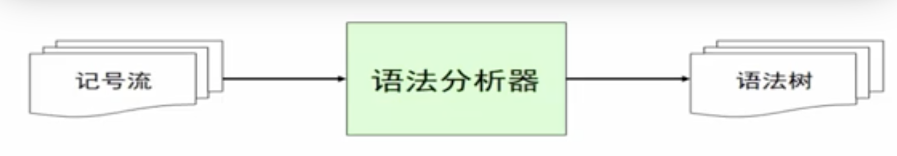
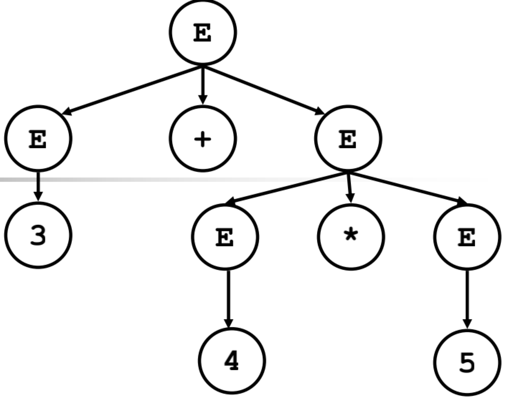
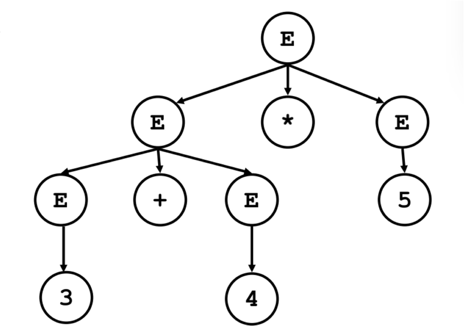

# 语法分析

## 语法错误处理
```
if ((x > 5)
    y = “hello”
else
    z = 1,
```

语法分析后后报错

```
Syntax Error: line 1, missing )
Syntax Error: line 2, missing ;
Syntax Error: line 4, expecting ; but got ,
```
## 语法树的构建
```
if (x > 5)
    y = “hello”;
else
    z = 1;
```
语法分析后生成语法树


## 上下文无关文法
* 上下文无关文法G是一个四元组：`G = (T, N, P, S)`
    - T 终结符集合
    - N 是非终结符集合
    - P 是一组产生式规则
        + 每条规则的形式： X -> β1 β2 … βn, 其中X ∈ N， βi ∈ (T ∪ N)
    - S 是唯一的开始符号（非终结符）：S ∈ N

    ```
    * 例子1：（主谓宾的语法： N老虎 V吃 N羊）
        - 非终结符：N = {S, N, V}
        - 终结符：T = {s,t,g,w,e,d}
        - 开始符号：S
        - 产生式规则集合：
            S   -> N V N
            N   ->  s   代表shup
                |   t   代表tiger
                |   g   代表grass
                |   w   代表water
            V   ->  e   代表eat
                |   d   代表drink
    ```

    ```
    * 例子2： （加法，乘法）
        - 非终结符：N = {E}
        - 终结符：T = {num, id, +, *}
        - 开始符号：E
        - 产生式规则集合：
            E   ->   num
                |    id
                |    E + E
                |    E * E
    ```

* 推导

    给定文法**G**，从**G**的开始符号**S**开始，用产生式的右部替换左侧的**非终结符**，此过程不断重复，直到不出现**非终结符**为止，最终的串称为**句子**
    
    - 最左推导：每次总是选择最左侧的符号进行替换
    - 最右推导：每次总是选择最右侧的符号进行替换
      
    如以上例子1：
    ```
        S   -> N V N
        S   -> s v N
        S   -> s d N
        S   -> s d w    ------> 这里 sdw称之为 句子
    ```

## 语法分析与上下文无关文法、推导的关系

给定文法**G**和句子**s**，语法分析要回答的问题：是否存在对句子**s**的推导？

如给定以下G：
    ```
     S   -> N V N
                N   ->  s   代表shup
                    |   t   代表tiger
                    |   g   代表grass
                    |   w   代表water
                V   ->  e   代表eat
                    |   d   代表drink
    ```
    句子 `sdw`, 是否可以根据产生式规则集合推导出 sdw。如  `ssw` 就不可以   

## 推导与分析树

推导可以表达成树状结构（和推导所用的顺序无关（最左、最右、其他））

* 特点：
    - 树中的每个**内部节点**代表**非终结符**
    - 每个**叶子节**点代表**终结符**
    - 每一步推导代表如何从**双亲节点**生成它的**直接孩子节点**
    ```
    E   ->   num
         |    id
         |    E + E
         |    E * E
         
    ```           
    ```
    // 第一种推导
      E     ->   E + E
            ->   3 + E
            ->   3 + E * E
            ->   3 + 4 * E
            ->   3 + 4 * 5
    ```           
    

    ```
    // 第二种推导
      E     ->   E + E
            ->   E + E * E
            ->   3 + E * E
            ->   3 + 4 * E
            ->   3 + 4 * 5
    ```
    
* 二义性文法
    给定文法**G**，如果存在句子**s**，它有两棵不同的分析树，那么称**G**是二义性文法（以上G就是一个二义性文法）

    从编译器角度，二义性文法存在问题：
    
    - 同一个程序会有不同的含义
    - 因此程序运行的结果不是唯一的
    
    解决方案：**文法的重写**

* 表达式文法的重写

```
E    ->  E + T
    |    T
T    ->  T * F
    |    F
F    ->  num
    |    id
```

## 自顶向下算法
* 语法分析：给定文法`G`和句子`s`，回答s是否能够从`G`推导出来？
* 基本算法思想：从`G`的开始符号出发，随意推导出某个句子`t`，比较`t`和`s`
    - 若`t`==`s`，则回答“是”
    - 若`t`!=`s`，则?

因为这是从开始符号出发推出句子，因此称为**自顶向下分析**，对应于**分析树**自顶向下的构造顺序

* 针对以下示例进行算法分析

    ```
     S   -> N V N
                N   ->  s   代表shup
                    |   t   代表tiger
                    |   g   代表grass
                    |   w   代表water
                V   ->  e   代表eat
                    |   d   代表drink
    ```
    ```
    tokens[]; // holding all tokens
    i=0;
    stack = [S] // S是开始符号
    while (stack != [])
        if (stack[top] is a terminal t)
            if (t==tokens[i++])
                pop();
            else backtrack();
        else if (stack[top] is a nonterminal T)
            pop();
            push(the next right hand side of T)
    ```
* 算法的讨论
    - 算法需要用到回溯 给分析效率带来问题
    - 编译器必须高效（编译上千万行的内核等程序）
    - 因此，实际上我们需要**线性时间**的算法：
        + 避免回溯
        + **递归下降分析算法**和**LL(1)分析算法**
### 递归下降分析算法（预测分析算法）
* 好处：
    - 分析高效（线性时间）
    - 容易实现（方便手工编码）
    - 错误定位和诊断信息准确
    - 被很多开源和商业的编译器所采用
        + GCC 4.0
        + LLVM
* 基本思想
    - 每个非终结符构造一个分析函数
    - 用**前看符号**指导产生式规则的选择（前看符号就是记号流的每一个符号，依次带入分析函数进行对比）

* 针对以下示例进行算法分析

    ```
     S   -> N V N
                N   ->  s   代表shup
                    |   t   代表tiger
                    |   g   代表grass
                    |   w   代表water
                V   ->  e   代表eat
                    |   d   代表drink
    ```
    ```
    parse_S()
        parse_N()
        parse_V()
        parse_N()
    parse_N()
        token = tokens[i++]
        if (token==s||token==t||token==g||token==w)
            return;
        error(“…”);
    parse_V()
        token = tokens[i++]
         …
    ```
* 一般算法框架
    ```
    X    -> β11 … β1i
         |  β21 … β2j
         |  β31 … β3k
         | …
    ```
    ```
    parse_X()
        token = nextToken()
        switch(token)
        case …: //β11 … β1i
        case …: //β21 … β2j
        case …: //β31 … β3k
         …
        default: error (“…”);
    ```

* 针对 3 + 4 * 5 进行语法分析
```
E    -> E + T
      | T
T    -> T * F
      | F
F    -> num
```

```
// a second try
parse_E()
    parse_T()
    token = tokens[i++]
    while (token == +)
        parse_T()
        token = tokens[i++]
parse_T()
    parse_F()
    token = tokens[i++]
    while (token == *)
        parse_F()
        token = tokens[i++]
```

### 自动声明器的一些算法
* ANTLR: LL(1)
* YACC
* PISON
* SMLYACC


