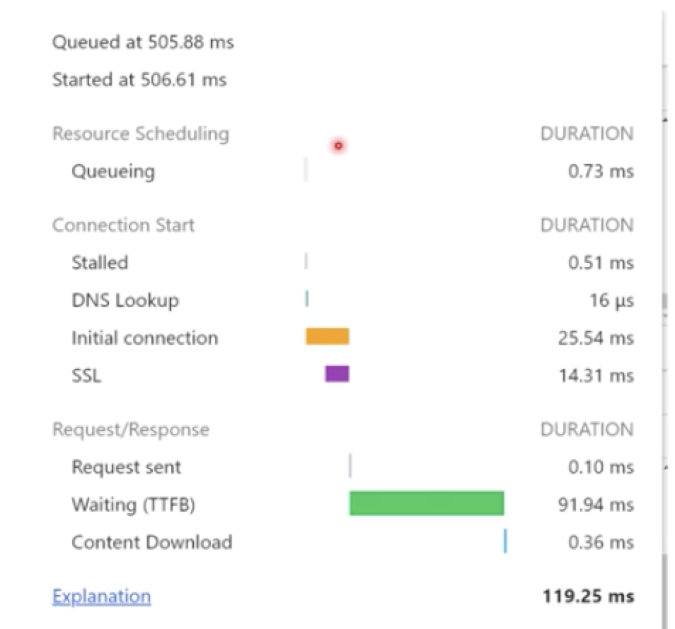
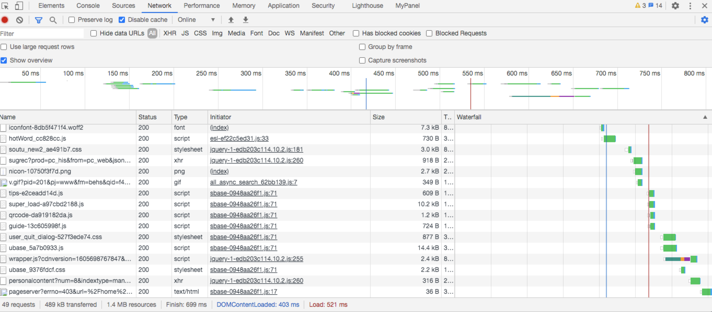
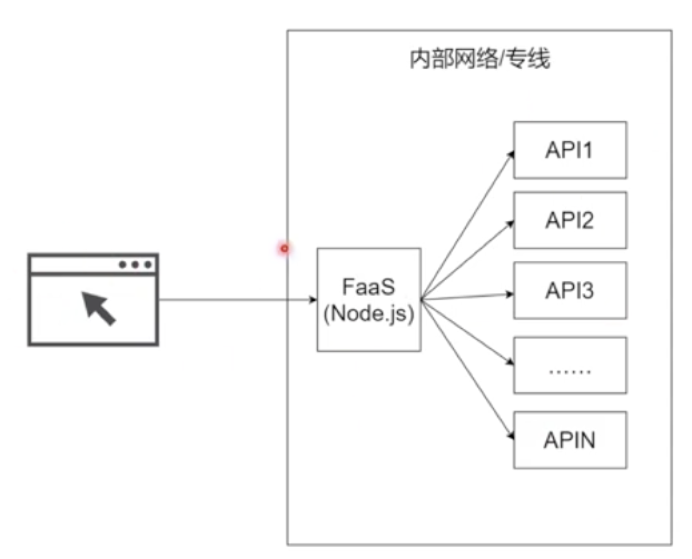

# 移动端网络优化的指标和策略

## 一个请求的事件消耗

* Resource Scheduling 资源调度花费的时间
浏览器通常在一个域名下可与同时发六个请求，如果同时有多个请求一起发送的话浏览器只会处理6个请求，其他请求都得排队等待。即使现在http2.0已经有了多路复用的功能但是，浏览器还是有一定的限制

* Connection Start 建立连接花费的时间
    + Stalled 闲置时间 等待资源等准备工作
    + DNS Lookup DNS查询时间
        > 建立连接需要查找到域名对应的ip。先查询浏览器DNS本地缓存（浏览器地址栏输入`chrome://net-internals`查看DNS），再本机DNS查询，本地运营商DNS查询等等会越来越慢
        DNS查询慢可能是运营商出问题了，那么需要联系运营商或者DNS提供商或者CDN的提供商
    + Initial connection TCP连接三次握手时间
    + SSL https SSL层在三次握手过程中建立连接花费的时间
* Request/Response
    + Request sent 发送请求花费的时间
    + Waiting（TTFB）后端处理请求到前端接收第一帧花费的时间
    + Content Download 内容下载花费的时间
    
## 网页加载

这些请求有些并没有DNS Lookup查询时间，因为http2.0有多路复用的功能，一个请求的TCP通道建立起来之后，其他请求也可以复用该通道进行传输

## 常见性能指标

* 是否显示？
    + 首次绘制时间（FP）、首次内容绘制（FCP）
        > 首次绘制 白屏也算，首次内容绘制能让用户看到一点页面内容
        - 查看html页面字节数，或者找页面关键元素渲染出来的时间 如轮播图
* 关键元素是否显示
    + 首次有效绘制（FMP）、主角元素及时
* 是否可用
    + 可交互时间（TTI）
        > input Foces事件可触发等
* 是否卡顿
    + CPU消耗（`window.performance`查看相关信息）、输入延迟等
    [window.performance相关信息和使用方式](https://blog.csdn.net/lovenjoe/article/details/80260658)

## 网络优化策略

* 缓存类
    + 本地缓存
    + 离线包
    + 预加载
    + http缓存
    + 移动端缓存（native）
    + 服务端缓存（redis ssr等）
* 压缩
    + JS压缩、CSS压缩、HTML压缩
        - uglifyjs、xxx minify
    + GZIP（web服务器提供的功能）
        - express/nginx/caddy
    + 合并
        - 雪碧图（随着http协议升级和网络发展，做雪碧图的意义没有之前那么大）
* 请求合并

[FaaS(Functions as a Service)](https://blog.csdn.net/u013970991/article/details/57482813)
在服务器所在的内部网络启动一个nodejs实现的节点（FaaS），当该节点收到客户端的一次请求时候，分次请求客户端想真正请求的api。以极快的请求速度替代客户端分次请求api所需要花费的时间

* 离线包
在打开APP期间将资源推送到APP的缓存中
> 在用户未使用一些页面的情况下下载这些页面需要的js文件或者数据等等。但是这里涉及到一些商业道德的问题：未经客户同意下载数据会消耗客户的流量，客户使用app代表信任app，但是app又在客户无感知的情况下消耗这些流量又会损害客户的权益

* 预加载
    - APP预加载完整容器（[WebView](https://www.jianshu.com/p/3e0136c9e748)）
        > 既省略了用户打开`WebView`的时间，又省略了js运行时间 效果比离线包更好
    - H5应用预加载下一个页面的数据
